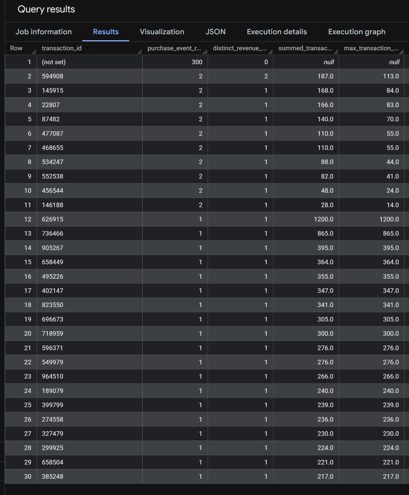

# Project Tracker — Commercial Analytics

# Project Tracker — Commercial Analytics

## Current Phase

➡️ Phase 1A — GA4 BigQuery Staging

---

# Phase 0 — Repository & Environment Setup

## Completed

* [x] Created GitHub repository
* [x] Established initial project folder structure
* [x] Added README skeleton
* [x] Configured `.gitignore`
* [x] Added `requirements.txt`
* [x] Connected local Windows Bootcamp environment using `git clone`
* [x] Refactored documentation structure
* [x] Initialized project tracking workflow

---
## Current Repository Structure

```text
commercial-analytics-bq-dbx/
│
├── bi/
│   └── screenshots/
│       └── ga4/
│
├── data/
│   ├── processed/
│   └── raw/
│       └── olist/
│
├── docs/
│   ├── decisions_log.md
│   └── project_tracker.md
│
├── sql/
│   ├── ga4/
│   │   ├── 01_data_profiling.sql
│   │   ├── 02_stg_ga4_events.sql
│   │   └── 03_fact_sessions_daily.sql
│   │
│   └── marts/
│       ├── 01_dim_date.sql
│       ├── 02_dim_channel.sql
│       ├── 03_mart_channel_daily.sql
│       ├── 04_mart_executive_daily.sql
│       └── 05_mart_executive_enhanced.sql
│
├── .gitignore
├── README.md
└── requirements.txt
```

---


## Phase 1A — GA4 (BigQuery)
- [X] Access GA4 public dataset
- [X] Explore events table
- [ ] sanity_check(01_data_profiling.sql structure)
- [ ] Create stg_ga4_events table
- [ ] Extract session-level data
- [ ] Extract purchase events
- [ ] Validate data (counts, nulls, date ranges)


````md
## GA4 Initial Data Inspection & Structure Validation

### Objective
The purpose of this initial query was to perform a structure sanity check on the GA4 ecommerce dataset before beginning transformation and KPI modeling work.  
A limited sample window (January 2021) was selected to reduce query cost and enable faster profiling of the dataset structure, event schema, and tracking implementation.

---

## Sample Query

```sql
-- A1) sample rows (structure sanity)

SELECT *
FROM `bigquery-public-data.ga4_obfuscated_sample_ecommerce.events_*`
WHERE _TABLE_SUFFIX BETWEEN '20210101' AND '20210131'
LIMIT 10;
````

---

## Key Dataset Observations

### 1. Daily Partitioned Event Tables

The GA4 dataset is stored as daily event tables using the naming convention:

```text
events_YYYYMMDD
```

The wildcard table pattern (`events_*`) combined with `_TABLE_SUFFIX` filtering allows efficient querying of a limited date range without scanning the full dataset.

---

### 2. Event-Level Behavioral Tracking Structure

The dataset follows an event-driven behavioral analytics schema where each record represents user interaction events such as:

* `page_view`
* `scroll`

This indicates that the dataset is designed primarily for digital behavior and engagement analysis rather than transactional-only reporting.

---

### 3. Nested & Repeated Event Parameters

GA4 stores many event attributes inside nested key-value parameter structures:

* `event_params.key`
* `event_params.value.*`

Observed parameters included:

* `page_location`
* `page_title`
* `ga_session_id`
* `percent_scrolled`
* `engagement_time_msec`

This structure requires parameter extraction and flattening during downstream modeling.

---

### 4. Granularity Consideration

Initial inspection showed that multiple rows may belong to the same event due to repeated event parameter structures.

As a result:

* raw row counts should not be interpreted directly as unique events
* event aggregation logic will require careful handling during transformation

This is an important consideration for session and engagement KPI calculations.

---

### 5. Session Tracking Availability

The dataset contains session-level tracking fields including:

* `ga_session_id`
* `ga_session_number`
* `session_engaged`

These fields support future analysis related to:

* session volume
* engagement rate
* session-based conversion behavior

---

### 6. Anonymous User Identification

User tracking is primarily handled through:

```text
user_pseudo_id
```

while `user_id` is mostly null in the sampled records.

This suggests that the dataset mainly represents anonymous web analytics behavior rather than authenticated customer-level tracking.

---

### 7. Traffic Acquisition Data Availability

Traffic attribution fields were observed, including:

* `traffic_source.source`
* `traffic_source.medium`
* `traffic_source.name`

Examples observed:

* Google / Organic
* Referral traffic

This enables future acquisition and channel performance analysis.

---

### 8. Device & Geographic Segmentation

The dataset includes segmentation dimensions such as:

#### Device Data

* device category
* operating system
* browser

#### Geographic Data

* country
* region
* city

These fields support future behavioral segmentation and performance comparisons across devices and locations.

---

### 9. Ecommerce Fields Exist but are Event-Specific

Ecommerce-related columns such as:

* `purchase_revenue`
* `transaction_id`
* item-level fields

were mostly null within sampled behavioral events.

This indicates that ecommerce fields are populated only for relevant transactional events (e.g. purchases) and should not be expected across all event types.

---

## Initial Data Quality Notes

Several early-stage data quality observations were identified:

* some geographic fields contain `(not set)`
* ecommerce fields are sparsely populated outside transactional events
* `user_id` coverage appears limited
* nested parameter structures require flattening before analysis

These considerations will influence downstream transformation and KPI modeling logic.

---

## Candidate KPI Areas Identified

Based on the initial inspection, the following analytical domains appear feasible within the dataset:

| KPI Area      | Example Metrics                   |
| ------------- | --------------------------------- |
| Acquisition   | Users by source/medium            |
| Engagement    | Engaged sessions, scroll activity |
| Sessions      | Session volume, sessions per user |
| Ecommerce     | Revenue, transactions, AOV        |
| User Behavior | Page views, engagement depth      |
| Segmentation  | Device and geo performance        |

---


```
```

````md id="g6y3qn"
## B1 — Date Coverage Validation

### Objective
This query was used to validate the actual date coverage and row volume available within the selected GA4 sample window before starting downstream transformations and KPI modeling.

The primary goal of this step was to confirm that:

- the selected date filter was functioning correctly
- event data existed across the full expected time range
- the sample window contained sufficient data volume for profiling and exploratory analysis

---

## Query

```sql
-- Validate GA4 sample window coverage

SELECT
    MIN(PARSE_DATE('%Y%m%d', event_date)) AS min_date,
    MAX(PARSE_DATE('%Y%m%d', event_date)) AS max_date,
    COUNT(*) AS total_rows

FROM `bigquery-public-data.ga4_obfuscated_sample_ecommerce.events_*`

WHERE _TABLE_SUFFIX BETWEEN '20210101' AND '20210131';
````

---

## Query Result

| min_date   | max_date   | total_rows |
| ---------- | ---------- | ---------- |
| 2021-01-01 | 2021-01-31 | 1,210,147  |

---

## Key Observations

### 1. Date Coverage Successfully Validated

The returned minimum and maximum dates matched the expected sample window boundaries:

* minimum date: `2021-01-01`
* maximum date: `2021-01-31`

This confirms that the wildcard table filter and `_TABLE_SUFFIX` condition correctly captured the full January 2021 event range.

---

### 2. Sample Window Contains Sufficient Data Volume

The query returned more than 1.2 million rows within the selected one-month window.

This indicates that:

* the dataset contains high-volume behavioral tracking data
* the selected sample period is sufficiently large for exploratory analysis and KPI prototyping
* downstream aggregations and transformations can be tested on realistic event-scale data

---

### 3. Initial Scalability Consideration

Even a restricted one-month sample produced over one million records.

This highlights the importance of:

* partition filtering
* selective querying
* avoiding unnecessary `SELECT *` operations during large-scale analysis

These practices are critical for controlling query cost and improving performance in cloud data warehouse environments.

---

### 4. Event Data is Stored at High Granularity

The large row count relative to a one-month window suggests highly granular event-level tracking.

This is consistent with GA4’s event-driven architecture, where:

* each user interaction generates separate events
* nested event parameters increase row complexity
* behavioral tracking produces significantly larger datasets than traditional transactional systems

---

## Analytical Implications

Based on this validation step, the dataset appears suitable for:

* session-level analysis
* acquisition analysis
* engagement KPI development
* behavioral funnel analysis
* ecommerce event tracking
* user segmentation analysis

---


```
```
````md id="l6m2vd"
## B1-b — Global Dataset Date Coverage Validation

### Objective
This query was used to validate the full historical date coverage available across the GA4 sample ecommerce dataset.

Unlike the previous sample-window validation step, this check scanned the entire dataset without applying a `_TABLE_SUFFIX` filter in order to identify the true analytical boundaries of the available event data.

This validation step helps determine:

- the earliest available event date
- the latest available event date
- the overall historical coverage period available for analysis

---

## Query

```sql
-- date coverage (global)

SELECT
    MIN(PARSE_DATE('%Y%m%d', event_date)) AS global_min_date,
    MAX(PARSE_DATE('%Y%m%d', event_date)) AS global_max_date

FROM `bigquery-public-data.ga4_obfuscated_sample_ecommerce.events_*`;
````

---

## Query Result

| global_min_date | global_max_date |
| --------------- | --------------- |
| 2020-11-01      | 2021-01-31      |

---

## Query Result Screenshot


---

## Key Observations

### 1. Dataset Historical Coverage

The dataset contains event-level tracking data between:

* `2020-11-01`
* `2021-01-31`

This indicates that the publicly available GA4 ecommerce dataset provides approximately three months of historical behavioral tracking data.

---

### 2. Limited Long-Term Historical Depth

Because the dataset spans only a relatively short historical window, certain advanced analytical use cases may be limited, including:

* long-term seasonality analysis
* year-over-year comparisons
* mature cohort retention analysis
* long-horizon forecasting

This limitation should be considered during KPI interpretation and downstream reporting design.

---

### 3. Dataset is Suitable for Behavioral & KPI Prototyping

Despite the shorter historical range, the dataset still appears highly suitable for:

* acquisition analysis
* session-level behavior analysis
* engagement KPI modeling
* ecommerce event tracking
* funnel analysis
* dashboard prototyping
* transformation pipeline development

---

### 4. Full Dataset Scan Increased Processed Data Volume

Unlike the previous filtered sample-window query, this validation scanned the entire dataset and processed a larger amount of data.

This reinforces the importance of:

* partition-aware querying
* selective filtering
* query cost awareness

when working with cloud warehouse environments such as BigQuery.

---

## Analytical Implications

The dataset boundary validation confirmed that:

* the dataset is event-driven and behavior-focused
* historical coverage is relatively short-term
* the available time range is sufficient for exploratory analytics and KPI development
* future transformations should remain optimized for large-scale event data processing

---


```
```
````md id="z8v1pt"
## C1 — Null Rate Validation for Core Tracking Identifiers

### Objective
This query was used to validate the completeness and reliability of core tracking identifiers within the January 2021 GA4 sample window.

The goal of this step was to identify whether any critical analytical fields contained missing values that could negatively impact:

- KPI calculations
- session-level analysis
- event sequencing
- user-level analysis
- downstream transformations

The validation focused specifically on foundational tracking fields required for reliable behavioral analytics.

---

## Query

```sql
-- C1) null rates for core identifiers (sample window)

SELECT
  COUNT(*) AS total_rows,

  SUM(CASE WHEN event_date IS NULL THEN 1 ELSE 0 END)
    AS null_event_date,

  SUM(CASE WHEN event_timestamp IS NULL THEN 1 ELSE 0 END)
    AS null_event_timestamp,

  SUM(CASE WHEN event_name IS NULL THEN 1 ELSE 0 END)
    AS null_event_name,

  SUM(CASE WHEN user_pseudo_id IS NULL THEN 1 ELSE 0 END)
    AS null_user_pseudo_id

FROM `bigquery-public-data.ga4_obfuscated_sample_ecommerce.events_*`

WHERE _TABLE_SUFFIX BETWEEN '20210101' AND '20210131';
````

---

## Query Result

| total_rows | null_event_date | null_event_timestamp | null_event_name | null_user_pseudo_id |
| ---------- | --------------- | -------------------- | --------------- | ------------------- |
| 1,210,147  | 0               | 0                    | 0               | 0                   |

---

## Query Result Screenshot


---

## Key Observations

### 1. No Missing Values Detected in Core Tracking Fields

The validation confirmed that all selected core identifiers contained zero null values within the sampled dataset.

The following fields showed complete coverage:

* `event_date`
* `event_timestamp`
* `event_name`
* `user_pseudo_id`

This indicates strong structural consistency within the GA4 event tracking implementation.

---

### 2. Event Tracking Structure Appears Reliable

Because all core event identifiers are fully populated, the dataset appears suitable for:

* event-level aggregation
* session construction
* user-level behavioral analysis
* engagement KPI modeling
* time-series analysis

without requiring immediate remediation for missing foundational identifiers.

---

### 3. User-Level Behavioral Analysis is Feasible

The absence of null values in `user_pseudo_id` is particularly important because this field serves as the primary anonymous user identifier within the dataset.

This supports future analysis related to:

* user activity tracking
* session behavior
* engagement analysis
* acquisition analysis
* user segmentation

---

### 4. Timestamp Integrity Appears Consistent

The complete population of `event_timestamp` confirms that event sequencing and temporal analysis can be performed reliably.

This is critical for downstream analytical tasks such as:

* session ordering
* behavioral flow analysis
* funnel analysis
* event chronology validation

---

### 5. Tracking Implementation Appears Structurally Healthy

The absence of missing values across key event metadata suggests that the GA4 tracking implementation was configured consistently within the observed sample window.

At this stage, no major structural reliability issues were identified in the core behavioral tracking fields.

---

## Analytical Implications

The validation results indicate that the dataset is structurally reliable for downstream analytics engineering and KPI modeling workflows.

Specifically:

* core identifiers are complete
* user-level tracking is available
* event sequencing is reliable
* foundational event metadata is consistently populated

This reduces the likelihood of major data completeness issues during transformation and reporting phases.

---


```
```
````md id="j4x8pw"
## C2 — Approximate Duplicate Event Validation Using Proxy Key

### Objective
This query was used to identify potential duplicate event records within the January 2021 GA4 sample window.

Because the raw GA4 export does not provide a simple single-column event primary key, an approximate proxy key was constructed using a combination of:

- `user_pseudo_id`
- `event_timestamp`
- `event_name`

The purpose of this validation step was to evaluate whether multiple rows shared the same core event identity characteristics, which could indicate possible duplicate event records.

---

## Query

```sql
-- C2) Approximate duplicate event check using proxy key
-- Proxy key: user_pseudo_id + event_timestamp + event_name

WITH base AS (

  SELECT
    user_pseudo_id,
    event_timestamp,
    event_name

  FROM `bigquery-public-data.ga4_obfuscated_sample_ecommerce.events_*`

  WHERE _TABLE_SUFFIX BETWEEN '20210101' AND '20210131'

),

counts AS (

  SELECT

    COUNT(*) AS row_count,

    COUNT(DISTINCT CONCAT(
      user_pseudo_id,
      '|',
      CAST(event_timestamp AS STRING),
      '|',
      event_name
    )) AS distinct_proxy

  FROM base

)

SELECT
  row_count,
  distinct_proxy,
  row_count - distinct_proxy AS duplicate_proxy_rows

FROM counts;
````

---

## Query Result

| row_count | distinct_proxy | duplicate_proxy_rows |
| --------- | -------------- | -------------------- |
| 1,210,147 | 1,210,147      | 0                    |

---

## Query Result Screenshot


---

## Key Observations

### 1. No Approximate Duplicate Events Detected

The validation returned zero duplicate proxy rows within the selected sample window.

This indicates that no multiple rows shared the same combination of:

* `user_pseudo_id`
* `event_timestamp`
* `event_name`

based on the selected proxy key logic.

---

### 2. Event-Level Tracking Appears Structurally Consistent

The absence of approximate duplicate events suggests that the GA4 export structure is behaving consistently at the event level within the observed sample period.

This reduces the likelihood of:

* inflated event counts
* duplicated engagement metrics
* artificial session activity inflation
* inaccurate behavioral aggregations

during downstream analysis.

---

### 3. Proxy Key Approach Used for Approximate Validation

The duplicate validation was intentionally designed as an approximate duplicate check rather than a strict event uniqueness validation.

This is important because GA4 events may contain:

* nested parameters
* repeated item records
* additional metadata fields

that are not included within the selected proxy key.

As a result, the validation should be interpreted as a structural reliability check rather than an absolute event deduplication guarantee.

---

### 4. Dataset Appears Reliable for Event Aggregation

Based on the observed results, the dataset appears suitable for:

* event-level aggregation
* engagement analysis
* session-based KPIs
* behavioral funnel analysis
* traffic attribution analysis

without requiring immediate duplicate remediation logic.

---

## Analytical Implications

The duplicate validation results indicate that the sampled GA4 dataset demonstrates strong structural consistency at the behavioral event level.

Specifically:

* no approximate duplicate event patterns were identified
* event tracking appears stable within the sampled period
* downstream KPI calculations are less likely to be artificially inflated by duplicate event activity

This increases confidence in the reliability of future transformation and reporting workflows.

---


```
```
````md id="u9v2kx"
## C3 — Invalid `event_date` Format Validation

### Objective
This query was used to validate the structural integrity and format consistency of the `event_date` field within the January 2021 GA4 sample window.

While previous validation steps confirmed that `event_date` was not null, this step focused specifically on verifying whether all values could be successfully parsed into valid date objects using the expected GA4 date format:

```text
YYYYMMDD
````

The purpose of this check was to identify any malformed or invalid date values that could negatively impact:

* time-series analysis
* date-based aggregations
* partition filtering
* KPI calculations
* downstream transformation logic

---

## Query

```sql
-- C3) invalid event_date format check

SELECT

  COUNT(*) AS total_rows,

  SUM(
    CASE
      WHEN SAFE.PARSE_DATE('%Y%m%d', event_date) IS NULL
      THEN 1
      ELSE 0
    END
  ) AS invalid_event_date_rows

FROM `bigquery-public-data.ga4_obfuscated_sample_ecommerce.events_*`

WHERE _TABLE_SUFFIX BETWEEN '20210101' AND '20210131';
```

---

## Query Result

| total_rows | invalid_event_date_rows |
| ---------- | ----------------------- |
| 1,210,147  | 0                       |

---

## Query Result Screenshot


---

## Key Observations

### 1. No Invalid `event_date` Values Detected

The validation returned zero invalid `event_date` records within the selected sample window.

All observed values were successfully parsed using:

```sql
SAFE.PARSE_DATE('%Y%m%d', event_date)
```

This indicates that the date field follows the expected GA4 formatting standard consistently across the sampled dataset.

---

### 2. Date Field Structure Appears Reliable

Because all `event_date` values were parseable into valid dates, the dataset appears structurally reliable for:

* daily aggregations
* time-series analysis
* trend analysis
* date-based filtering
* downstream transformation pipelines

without requiring additional remediation logic for malformed date values.

---

### 3. Safe Parsing Logic Used for Validation

The validation intentionally used `SAFE.PARSE_DATE()` instead of `PARSE_DATE()`.

This approach prevents query failure when encountering malformed values and is considered a safer production-style validation pattern for large-scale analytical datasets.

If invalid values had existed, the safe parsing logic would have returned `NULL` instead of terminating the query execution.

---

### 4. Event Date Standardization Appears Consistent

The successful parsing of all sampled records suggests that the GA4 export maintains strong date formatting consistency during ingestion and storage.

This increases confidence in the reliability of future:

* temporal modeling
* partition-aware querying
* KPI trend calculations
* reporting workflows

built on top of the dataset.

---

## Analytical Implications

The validation results indicate that:

* the `event_date` field is fully populated
* all observed values follow the expected GA4 date structure
* no malformed date patterns were identified
* downstream analytical workflows can safely rely on this field for time-based analysis

This reduces the likelihood of transformation or reporting issues caused by invalid date formatting.

---
````md id="r8y4kp"
## D1 — Top Event Distribution Profiling

### Objective
This query was used to identify the most frequently occurring event types within the January 2021 GA4 sample window.

The purpose of this profiling step was to better understand:

- the behavioral composition of the dataset
- dominant user interaction patterns
- ecommerce funnel event availability
- engagement tracking structure
- the overall richness of the GA4 event taxonomy

This analysis provides an early behavioral overview of how users interact with the ecommerce platform.

---

## Query

```sql
-- D1) Top event distribution (sample window)

SELECT

  event_name,

  COUNT(*) AS event_count

FROM `bigquery-public-data.ga4_obfuscated_sample_ecommerce.events_*`

WHERE _TABLE_SUFFIX BETWEEN '20210101' AND '20210131'

GROUP BY event_name

ORDER BY event_count DESC

LIMIT 20;
````

---

## Query Result Screenshot


---

## Key Observations

### 1. Page View Events Dominate the Dataset

The most frequent event observed was:

* `page_view` → 419,004 events

This indicates that the dataset is heavily behavior-oriented and contains substantial user navigation activity.

The high page view volume also suggests that the dataset is suitable for:

* behavioral analysis
* page interaction analysis
* engagement measurement
* session flow analysis

---

### 2. Strong Engagement Tracking Signals are Present

Several engagement-related events appeared among the top event types, including:

* `user_engagement`
* `scroll`
* `session_start`

This indicates that the GA4 implementation includes meaningful engagement instrumentation beyond simple page tracking.

These events support future analysis related to:

* session engagement
* interaction depth
* engagement quality
* behavioral intensity

---

### 3. Ecommerce Funnel Events are Clearly Available

The dataset includes multiple ecommerce funnel events, including:

* `view_item`
* `add_to_cart`
* `begin_checkout`
* `add_shipping_info`
* `add_payment_info`
* `purchase`

This confirms that the dataset contains sufficient ecommerce behavioral depth for:

* funnel analysis
* conversion analysis
* cart abandonment analysis
* checkout progression analysis
* ecommerce KPI modeling

---

### 4. Funnel Drop-Off Patterns are Immediately Visible

A substantial volume decrease can already be observed across the funnel stages.

For example:

* `view_item` → 86,971 events
* `add_to_cart` → 15,522 events
* `begin_checkout` → 11,034 events
* `purchase` → 1,204 events

This suggests the presence of meaningful behavioral drop-off throughout the purchase journey.

While no formal funnel calculations have been performed yet, the event distribution already indicates strong potential for downstream conversion funnel analysis.

---

### 5. Acquisition & Promotional Interaction Events Exist

Promotional and discovery-related events were also observed, including:

* `view_promotion`
* `select_promotion`
* `view_search_results`

This suggests that the dataset supports future analysis related to:

* promotional effectiveness
* product discovery behavior
* onsite search engagement
* campaign interaction analysis

---

### 6. Behavioral Tracking Structure Appears Rich & Well-Instrumented

The observed event taxonomy suggests that the GA4 implementation contains:

* behavioral tracking
* engagement tracking
* ecommerce funnel instrumentation
* promotional interaction tracking

This increases the analytical flexibility of the dataset for downstream KPI development and dashboard design.

---

## Analytical Implications

The event distribution profiling indicates that the dataset is highly suitable for:

* ecommerce funnel analysis
* behavioral segmentation
* session engagement analysis
* conversion KPI modeling
* customer journey analysis
* acquisition performance analysis

The presence of both engagement events and ecommerce progression events provides a strong foundation for realistic commercial analytics workflows.

---


```
```
````md id="t5q9wr"
## D2 — Purchase Presence & Revenue Validation

### Objective
This query was used to validate the existence and structural reliability of ecommerce purchase activity within the January 2021 GA4 sample window.

The purpose of this profiling step was to confirm:

- whether purchase events exist in the dataset
- whether purchase revenue is populated
- whether transaction identifiers are available
- whether the dataset is suitable for downstream ecommerce KPI modeling

This validation is important because purchase-related fields form the foundation of commercial analytics metrics such as:

- revenue
- transactions
- conversion rate
- average order value (AOV)
- checkout funnel analysis

---

## Query

```sql
-- D2) Purchase presence and revenue validation (sample window)

SELECT

  COUNTIF(event_name = 'purchase') AS purchase_events,

  SUM(
    CASE
      WHEN event_name = 'purchase'
      THEN COALESCE(ecommerce.purchase_revenue, 0)
      ELSE 0
    END
  ) AS total_purchase_revenue,

  COUNT(
    DISTINCT CASE
      WHEN event_name = 'purchase'
      THEN ecommerce.transaction_id
      ELSE NULL
    END
  ) AS distinct_purchase_transaction_ids

FROM `bigquery-public-data.ga4_obfuscated_sample_ecommerce.events_*`

WHERE _TABLE_SUFFIX BETWEEN '20210101' AND '20210131';
````

---

## Query Result

| purchase_events | total_purchase_revenue | distinct_purchase_transaction_ids |
| --------------- | ---------------------- | --------------------------------- |
| 1,204           | 57,350.0               | 895                               |

---

## Query Result Screenshot


---

## Key Observations

### 1. Purchase Activity Exists Within the Dataset

The validation identified:

* `1,204` purchase events

This confirms that the dataset contains real ecommerce conversion activity and is suitable for downstream commercial analytics workflows.

The presence of purchase events enables future analysis related to:

* conversion performance
* revenue generation
* checkout behavior
* customer purchase journeys

---

### 2. Purchase Revenue is Successfully Populated

The query returned:

* total purchase revenue = `57,350.0`

This indicates that ecommerce revenue tracking is functioning and that the dataset supports revenue-based KPI modeling.

The populated revenue field increases the analytical value of the dataset for:

* revenue reporting
* monetization analysis
* AOV calculations
* commercial performance dashboards

---

### 3. Transaction-Level Identifiers are Available

The dataset contains:

* `895` distinct purchase transaction IDs

This confirms that transaction-level purchase identification is available for downstream aggregation and transaction analysis.

The availability of transaction identifiers supports future work related to:

* order-level analysis
* deduplication logic
* purchase validation
* transaction-based KPI calculations

---

### 4. Purchase Events Exceed Distinct Transaction IDs

The number of purchase events (`1,204`) is greater than the number of distinct transaction IDs (`895`).

This suggests that:

* some transactions may generate multiple purchase-related records
* repeated item-level structures may exist
* certain purchase events may contain duplicated transaction references

At this stage, no remediation is required, but this behavior should be considered during downstream transaction-level modeling and aggregation design.

---

### 5. Ecommerce Tracking Implementation Appears Functional

The successful population of:

* purchase events
* revenue values
* transaction identifiers

suggests that the ecommerce instrumentation within the GA4 export is functioning consistently within the sampled period.

This increases confidence in the reliability of future ecommerce KPI development.

---

## Analytical Implications

The validation results indicate that the dataset is suitable for:

* ecommerce KPI modeling
* revenue analysis
* conversion funnel analysis
* transaction-level reporting
* checkout behavior analysis
* customer purchase analysis

The dataset appears to contain sufficient commercial depth for realistic analytics engineering and BI workflows.

---

````md id="n3x7vd"
## D3 — Item Array Population Analysis by Event Type

### Objective
This query was used to analyze item-level tracking coverage across different GA4 event types within the January 2021 sample window.

The purpose of this validation step was to better understand:

- which events contain populated `items` arrays
- which events do not use item-level structures
- how ecommerce instrumentation behaves across the event taxonomy
- whether product interaction tracking is consistently implemented

Because the `items` field in GA4 is a nested repeated array structure, this analysis is important for downstream ecommerce modeling and product-level analytics.

---

## Query

```sql
-- D3) explain items sparsity by event type (sample window)

SELECT

  event_name,

  COUNT(*) AS row_count,

  SUM(
    CASE
      WHEN ARRAY_LENGTH(items) IS NULL
           OR ARRAY_LENGTH(items) = 0
      THEN 1
      ELSE 0
    END
  ) AS no_items_row_count,

  SUM(
    CASE
      WHEN ARRAY_LENGTH(items) > 0
      THEN 1
      ELSE 0
    END
  ) AS has_items_row_count

FROM `bigquery-public-data.ga4_obfuscated_sample_ecommerce.events_*`

WHERE _TABLE_SUFFIX BETWEEN '20210101' AND '20210131'

GROUP BY event_name

ORDER BY has_items_row_count DESC, row_count DESC

LIMIT 30;
````

---

## Query Result Screenshot


---

## Key Observations

### 1. Ecommerce-Oriented Events Consistently Contain Item Arrays

Several ecommerce-related events showed strong item-level population coverage, including:

* `add_to_cart`
* `begin_checkout`
* `select_item`
* `purchase`

For these event types, all observed rows contained populated `items` arrays.

This indicates that the ecommerce instrumentation is functioning consistently for core product interaction and conversion events.

---

### 2. Purchase Events Contain Complete Item-Level Tracking

The `purchase` event returned:

* `1,204` total rows
* `1,204` rows with populated items
* `0` rows without items

This suggests that transaction-level purchase tracking includes item-level detail consistently across the sampled dataset.

This is particularly important for downstream:

* product-level revenue analysis
* basket analysis
* item performance reporting
* transaction decomposition

---

### 3. Behavioral Events Do Not Use Item Arrays

High-volume behavioral events such as:

* `page_view`
* `user_engagement`
* `scroll`
* `session_start`
* `first_visit`

showed zero populated item arrays.

This behavior is expected because these events represent general behavioral interactions rather than product-specific ecommerce activity.

The results confirm that the dataset follows semantically appropriate event instrumentation patterns.

---

### 4. Partial Item Population Exists for Some Discovery & Promotion Events

Certain event types showed mixed item-level population coverage, including:

* `view_item`
* `view_promotion`
* `select_promotion`

For example:

* `view_item`

  * 86,971 total rows
  * 60,750 rows with items
  * 26,221 rows without items

This suggests that some discovery-oriented events may not consistently populate product arrays across all interactions.

Possible explanations include:

* differences in tracking implementation
* partial instrumentation
* promotional impressions without attached item metadata
* varying frontend interaction contexts

At this stage, the behavior appears explainable and does not immediately indicate a structural issue.

---

### 5. Nested Ecommerce Structures are Present & Usable

The analysis confirms that the GA4 export includes usable nested item-level ecommerce structures for key transactional and product interaction events.

This increases confidence in the feasibility of downstream:

* item-level modeling
* ecommerce fact table design
* product performance analytics
* basket-level aggregation
* conversion funnel analysis

---

## Analytical Implications

The item population analysis indicates that:

* ecommerce-related events are strongly item-aware
* behavioral events appropriately lack item arrays
* nested product structures are available for downstream modeling
* the dataset supports realistic product-level commercial analytics workflows

The observed event behavior aligns well with expected GA4 ecommerce instrumentation patterns.

---


```
```
````md id="v7q2nk"
## D4 — Daily Event Volume Distribution Analysis

### Objective
This query was used to analyze the daily distribution of event activity across the January 2021 sample window.

The purpose of this profiling step was to validate:

- continuity of daily event ingestion
- consistency of event tracking volume
- presence of potential spikes or abnormal drops
- overall temporal reliability of the dataset

This validation is important before downstream KPI modeling because unexpected fluctuations in daily event volume can indicate:

- ingestion interruptions
- tracking inconsistencies
- abnormal behavioral spikes
- incomplete daily coverage

---

## Query

```sql
-- D4) Daily event volume distribution (sample window)

SELECT

  PARSE_DATE('%Y%m%d', event_date) AS event_dt,

  COUNT(*) AS event_count

FROM `bigquery-public-data.ga4_obfuscated_sample_ecommerce.events_*`

WHERE _TABLE_SUFFIX BETWEEN '20210101' AND '20210131'

GROUP BY event_dt

ORDER BY event_dt;
````

---

## Query Result Screenshot


---

## Key Observations

### 1. Continuous Daily Coverage Exists Across the Full Sample Window

The dataset contains event activity for every day between:

* `2021-01-01`
* `2021-01-31`

No missing dates were identified within the sampled period.

This suggests that the GA4 export maintained continuous daily event ingestion throughout the observed window.

---

### 2. Daily Event Volume Appears Structurally Stable

Daily event volume generally fluctuates between approximately:

* ~22K events/day
* ~64K events/day

The observed variation appears gradual and behaviorally plausible rather than structurally broken.

No catastrophic ingestion gaps or zero-event days were detected.

---

### 3. Weekend vs Weekday Behavioral Variation Appears Visible

Lower event counts can be observed during several weekend periods, including:

* January 1–3
* January 9–10
* January 16–17
* January 30–31

Meanwhile, higher event activity appears during several weekday periods.

This suggests that the dataset likely reflects realistic ecommerce behavioral traffic patterns rather than synthetic or unstable ingestion behavior.

---

### 4. Temporary Mid-Month Activity Increase Observed

Several higher-volume days were observed around:

* January 19–22

including a local peak of approximately:

* `64,109` events on `2021-01-20`

At this stage, the spike does not appear structurally suspicious because:

* surrounding days also show elevated activity
* event flow remains continuous
* no abnormal zero-volume recovery pattern exists

The variation may reflect normal business, promotional, or behavioral traffic fluctuations.

---

### 5. Dataset Appears Suitable for Daily KPI Modeling

Because event activity remains consistently populated across the sample window, the dataset appears suitable for downstream:

* daily KPI aggregation
* trend analysis
* rolling metrics
* time-series dashboards
* funnel trend monitoring
* behavioral time analysis

---

## Analytical Implications

The daily event distribution analysis indicates that:

* temporal event coverage is continuous
* no major ingestion interruptions were detected
* daily activity levels appear behaviorally plausible
* the dataset is suitable for time-series analytics workflows

This increases confidence in the reliability of future daily aggregation models and reporting layers.

---


```
```

````md id="q4v8nk"
## D5 — User & Session Volume Profiling

### Objective
This query was used to profile the overall behavioral scale of the GA4 dataset by measuring:

- total event activity
- unique user volume
- unique session volume

The purpose of this profiling step was to validate whether the dataset contains sufficient user-level and session-level behavioral depth for downstream analytics workflows.

This validation is particularly important because many commercial analytics KPIs depend on reliable:

- user identification
- session construction
- behavioral grouping
- engagement aggregation

---

## Query

```sql
-- D5) User and session volume profiling (sample window)

SELECT

  COUNT(*) AS total_rows,

  COUNT(DISTINCT user_pseudo_id) AS unique_users,

  COUNT(
    DISTINCT CONCAT(
      user_pseudo_id,
      '|',
      CAST((
        SELECT value.int_value
        FROM UNNEST(event_params)
        WHERE key = 'ga_session_id'
      ) AS STRING)
    )
  ) AS unique_sessions

FROM `bigquery-public-data.ga4_obfuscated_sample_ecommerce.events_*`

WHERE _TABLE_SUFFIX BETWEEN '20210101' AND '20210131';
````

---

## Query Result

| total_rows | unique_users | unique_sessions |
| ---------- | ------------ | --------------- |
| 1,210,147  | 94,790       | 118,380         |

---

## Query Result Screenshot


---

## Key Observations

### 1. Dataset Contains Significant Behavioral Activity Volume

The dataset contains:

* `1,210,147` total event rows

This confirms that the GA4 export contains substantial behavioral interaction data suitable for large-scale analytics workflows.

The event volume appears sufficient for:

* engagement analysis
* funnel analysis
* KPI modeling
* behavioral segmentation
* session-level aggregation

---

### 2. Strong User-Level Coverage Exists

The profiling identified:

* `94,790` unique users

This suggests that the dataset contains a meaningful behavioral user base rather than a small synthetic or low-activity sample.

The observed user volume supports downstream analysis related to:

* user behavior
* engagement intensity
* acquisition analysis
* customer journey analysis
* segmentation workflows

---

### 3. Session Volume Appears Structurally Plausible

The dataset contains:

* `118,380` unique sessions

The session count is reasonably proportional relative to the observed user volume, suggesting that session tracking appears structurally consistent within the sampled period.

No obviously abnormal session inflation patterns were identified during this validation step.

---

### 4. Session Extraction from Nested Event Parameters Was Successful

The query successfully extracted `ga_session_id` from the nested `event_params` structure using:

```sql
UNNEST(event_params)
```

This confirms that session identifiers are accessible within the raw GA4 export and can be used for downstream:

* sessionization
* funnel analysis
* engagement aggregation
* attribution workflows
* behavioral modeling

---

### 5. Session Construction Logic Uses Composite Session Keys

The session counting logic intentionally combined:

* `user_pseudo_id`
* `ga_session_id`

into a composite key.

This approach was used because GA4 session IDs are not globally unique across all users.

The composite session construction pattern increases reliability for downstream session-level analytics.

---

## Analytical Implications

The profiling results indicate that:

* the dataset contains substantial behavioral activity
* user-level analysis is feasible
* session-level aggregation is feasible
* nested session identifiers are accessible and usable
* the dataset supports realistic engagement and conversion analysis workflows

This increases confidence in the reliability of future session-based transformation models and KPI layers.

---


```
```
````md id="2w8xsu"
## D6 — Session ID Availability Validation

### Objective
This query was used to validate the availability and completeness of the `ga_session_id` field within the raw GA4 export.

The purpose of this profiling step was to confirm whether session identifiers are consistently populated across event records before building downstream:

- session-level aggregations
- funnel analysis
- engagement KPIs
- attribution logic
- behavioral session models

Because many GA4 analytics workflows depend on reliable session identifiers, validating session ID completeness is a critical raw data quality step.

---

## Query

```sql
-- D6) Session ID availability check (sample window)

WITH base AS (

  SELECT

    (
      SELECT value.int_value
      FROM UNNEST(event_params)
      WHERE key = 'ga_session_id'
    ) AS ga_session_id

  FROM `bigquery-public-data.ga4_obfuscated_sample_ecommerce.events_*`

  WHERE _TABLE_SUFFIX BETWEEN '20210101' AND '20210131'

)

SELECT

  COUNT(*) AS total_rows,

  SUM(
    CASE
      WHEN ga_session_id IS NULL
      THEN 1
      ELSE 0
    END
  ) AS null_ga_session_id_rows,

  SUM(
    CASE
      WHEN ga_session_id IS NOT NULL
      THEN 1
      ELSE 0
    END
  ) AS has_ga_session_id_rows

FROM base;
````

---

## Query Result

| total_rows | null_ga_session_id_rows | has_ga_session_id_rows |
| ---------- | ----------------------- | ---------------------- |
| 1,210,147  | 0                       | 1,210,147              |

---

## Query Result Screenshot


---

## Key Observations

### 1. Full Session ID Coverage Was Detected

The validation identified:

* `0` rows with missing `ga_session_id`
* `1,210,147` rows with populated `ga_session_id`

This indicates that session identifiers are consistently available across the entire sampled event dataset.

---

### 2. Session Extraction from Nested Event Parameters Was Successful

The query successfully extracted `ga_session_id` from the nested `event_params` structure using:

```sql id="n65r8j"
UNNEST(event_params)
```

This confirms that session-level metadata is accessible and usable within the raw GA4 export schema.

---

### 3. No Immediate Session Completeness Risk Was Identified

Because no missing session identifiers were observed, no immediate structural risk was identified for downstream:

* sessionization
* session KPI modeling
* engagement aggregation
* funnel analysis
* attribution workflows

This substantially increases confidence in the reliability of future session-based analytical layers.

---

### 4. Dataset Appears Structurally Suitable for Session-Level Analytics

The observed completeness level suggests that the GA4 export maintains stable session tracking coverage during the sampled period.

This is especially important because incomplete session identifiers can cause:

* broken funnel logic
* inaccurate session counts
* distorted engagement metrics
* attribution inconsistencies

No such structural issues were identified during this profiling step.

---

## Analytical Implications

The profiling results indicate that:

* session identifiers are fully populated
* nested session extraction logic is reliable
* session-based transformations are feasible
* downstream behavioral modeling can proceed with high confidence

This validation supports the reliability of future:

* staging transformations
* session-level marts
* behavioral KPIs
* funnel analytics
* acquisition attribution models

---


```
```

````md id="m8q4vn"
## D7 — Event-Level Traffic Source Distribution Profiling

### Objective
This query was used to profile acquisition and traffic source patterns across the GA4 dataset using event-level source parameters extracted from nested `event_params`.

The purpose of this profiling step was to validate:

- traffic source availability
- acquisition channel structure
- campaign parameter population
- source/medium consistency
- usability of acquisition metadata for downstream analytics

Unlike the earlier user-scoped `traffic_source` fields, this profiling step intentionally used event-level parameters (`source`, `medium`, `campaign`) extracted from `event_params` to better reflect session/event acquisition behavior.

This approach is more aligned with realistic downstream commercial analytics workflows.

---

## Query

```sql
-- D7) Event-level traffic source parameter distribution (sample window)
-- Uses event_params source / medium / campaign instead of user-scoped traffic_source fields

WITH base AS (

  SELECT

    user_pseudo_id,

    (
      SELECT value.string_value
      FROM UNNEST(event_params)
      WHERE key = 'source'
    ) AS source,

    (
      SELECT value.string_value
      FROM UNNEST(event_params)
      WHERE key = 'medium'
    ) AS medium,

    (
      SELECT value.string_value
      FROM UNNEST(event_params)
      WHERE key = 'campaign'
    ) AS campaign_name

  FROM `bigquery-public-data.ga4_obfuscated_sample_ecommerce.events_*`

  WHERE _TABLE_SUFFIX BETWEEN '20210101' AND '20210131'

)

SELECT

  COALESCE(source, '(not set)') AS source,

  COALESCE(medium, '(not set)') AS medium,

  COALESCE(campaign_name, '(not set)') AS campaign_name,

  COUNT(*) AS event_count,

  COUNT(DISTINCT user_pseudo_id) AS unique_users

FROM base

GROUP BY
  source,
  medium,
  campaign_name

ORDER BY event_count DESC

LIMIT 30;
````

---

## Query Result Screenshot


---

## Key Observations

### 1. Large Portion of Events Have Missing Acquisition Parameters

The dominant acquisition grouping was:

| source      | medium      | campaign    |
| ----------- | ----------- | ----------- |
| `(not set)` | `(not set)` | `(not set)` |

This segment generated:

* `873,805` events
* `94,757` unique users

This indicates that a substantial portion of the dataset does not contain populated event-level acquisition parameters.

This behavior is common in GA4 exports and may occur because:

* not all events inherit acquisition metadata
* certain behavioral events lack campaign context
* direct/internal navigation events may not populate source parameters

This does not necessarily indicate broken tracking.

---

### 2. Organic Google Traffic Appears as a Major Acquisition Channel

The dataset shows strong organic acquisition activity from Google:

| source   | medium    |
| -------- | --------- |
| `google` | `organic` |

with approximately:

* `83,604` events
* `32,198` unique users

This suggests that organic search traffic represents a significant behavioral acquisition source within the sampled dataset.

---

### 3. Referral Traffic Is Strongly Represented

Several referral-based traffic sources appear prominently, including:

* `shop.googlemerchandisestore.com`
* `googlemerchandisestore.com`
* `analytics.google.com`
* `creatoracademy.youtube.com`
* `facebook.com`
* `mail.google.com`

This indicates that referral-based navigation and cross-site acquisition activity are present and structurally populated.

---

### 4. Multiple Acquisition Medium Types Are Present

The dataset includes several medium categories, including:

* `organic`
* `referral`
* `email`
* `affiliate`
* `cpc`

This confirms that the acquisition structure supports downstream:

* channel segmentation
* traffic attribution analysis
* campaign performance analysis
* acquisition KPI modeling

---

### 5. Paid & Campaign Traffic Signals Exist

The profiling identified several campaign-oriented records, including:

| source                    | medium      | campaign           |
| ------------------------- | ----------- | ------------------ |
| `google`                  | `cpc`       | `<Other>`          |
| `Newsletter_January_2021` | `email`     | `NewYear_V1`       |
| `Newsletter_January_2021` | `email`     | `NewYear_V2`       |
| `Partners`                | `affiliate` | `Data Share Promo` |

This confirms that campaign-level acquisition metadata is partially available within the dataset.

---

### 6. Some Placeholder / Data Quality Categories Exist

Several values such as:

* `(not set)`
* `<Other>`
* `(data deleted)`

appear within the acquisition fields.

These patterns are common in GA4 exports and should be considered during downstream KPI interpretation and channel aggregation logic.

Future transformation layers may require:

* normalization
* mapping
* fallback attribution handling

---

## Analytical Implications

The traffic source profiling indicates that:

* acquisition metadata is available and structurally usable
* multiple channel types are represented
* campaign-level analysis is feasible
* organic and referral traffic dominate observed activity
* some acquisition sparsity and placeholder values require downstream handling

The dataset appears suitable for downstream:

* acquisition dashboards
* channel KPI modeling
* conversion-by-channel analysis
* attribution-oriented reporting workflows

---


```
```
````md
### D8 — Purchase Transaction Quality Validation

**Objective:**  
Validate the reliability of purchase-level ecommerce tracking before downstream KPI modeling and revenue analysis.

This validation focused on identifying potential ecommerce quality issues including:
- missing transaction identifiers
- missing purchase revenue
- zero-value purchases
- negative revenue anomalies

---

#### Validation Query

```sql
-- D8) Purchase transaction quality check

WITH q AS (

  SELECT
    COUNTIF(event_name = 'purchase') AS purchases,

    COUNTIF(
      event_name = 'purchase'
      AND ecommerce.transaction_id IS NULL
    ) AS missing_txn_id,

    COUNTIF(
      event_name = 'purchase'
      AND ecommerce.purchase_revenue IS NULL
    ) AS missing_revenue,

    COUNTIF(
      event_name = 'purchase'
      AND ecommerce.purchase_revenue = 0
    ) AS zero_revenue,

    COUNTIF(
      event_name = 'purchase'
      AND ecommerce.purchase_revenue < 0
    ) AS negative_revenue

  FROM `bigquery-public-data.ga4_obfuscated_sample_ecommerce.events_*`

  WHERE _TABLE_SUFFIX BETWEEN '20210101' AND '20210131'

)

SELECT
  purchases,

  missing_txn_id,

  ROUND(SAFE_DIVIDE(missing_txn_id, purchases), 4)
    AS missing_txn_rate,

  missing_revenue,

  ROUND(SAFE_DIVIDE(missing_revenue, purchases), 4)
    AS missing_rev_rate,

  zero_revenue,

  ROUND(SAFE_DIVIDE(zero_revenue, purchases), 4)
    AS zero_rev_rate,

  negative_revenue,

  ROUND(SAFE_DIVIDE(negative_revenue, purchases), 4)
    AS negative_rev_rate

FROM q;
````

---

#### Result Snapshot


---

#### Key Findings

| Metric                      | Result |
| --------------------------- | ------ |
| Total purchase events       | 1,204  |
| Missing transaction IDs     | 0      |
| Missing transaction ID rate | 0.00%  |
| Missing purchase revenue    | 300    |
| Missing revenue rate        | 24.92% |
| Zero revenue purchases      | 0      |
| Negative revenue purchases  | 0      |

---

#### Analytical Observations

* All purchase events contained valid transaction identifiers.
* No zero-value or negative-value purchase events were detected.
* Approximately 24.92% of purchase events had NULL purchase revenue values.
* This suggests that purchase event instrumentation is partially incomplete at the revenue field level.
* Revenue-based KPIs should therefore be interpreted carefully during downstream modeling.

---

#### Business Implications

The dataset appears suitable for:

* transaction-level modeling
* conversion funnel analysis
* ecommerce behavioral analytics

However:

* revenue completeness issues should be documented
* downstream revenue aggregation logic should explicitly handle NULL purchase revenue values
* KPI calculations should use defensive NULL handling (e.g., `COALESCE()`)

---

#### Status

✅ Purchase tracking structure validated
⚠ Revenue completeness issue identified and documented

```
```


---
````md id="72t9p1"
### D9 — Revenue by Transaction ID Validation

**Objective:**  
Validate transaction-level purchase integrity and identify potential duplicate purchase event risks before revenue aggregation and mart development.

This validation focused on:
- duplicate purchase event detection
- transaction-level revenue consistency
- potential revenue inflation risk
- transaction grain reliability

---

#### Validation Query

```sql
-- D9) Transaction-level duplicate and revenue validation

SELECT
  ecommerce.transaction_id,

  COUNT(*) AS purchase_event_rows,

  COUNT(DISTINCT ecommerce.purchase_revenue)
    AS distinct_revenue_values,

  SUM(ecommerce.purchase_revenue)
    AS summed_transaction_revenue,

  MAX(ecommerce.purchase_revenue)
    AS max_transaction_revenue

FROM `bigquery-public-data.ga4_obfuscated_sample_ecommerce.events_*`

WHERE _TABLE_SUFFIX BETWEEN '20210101' AND '20210131'
  AND event_name = 'purchase'
  AND ecommerce.transaction_id IS NOT NULL

GROUP BY ecommerce.transaction_id

ORDER BY
  purchase_event_rows DESC,
  summed_transaction_revenue DESC

LIMIT 30;
````

---

#### Result Snapshot



---

#### Key Findings

| Observation                                           | Result   |
| ----------------------------------------------------- | -------- |
| Transactions with duplicated purchase events detected | Yes      |
| Highest duplicated purchase event count               | 2 rows   |
| Revenue duplication pattern observed                  | Yes      |
| Revenue inflation risk present                        | Moderate |
| Purchase transactions with single-row integrity       | Majority |

---

#### Analytical Observations

* Several transaction IDs contained duplicated purchase event rows (`purchase_event_rows = 2`).
* Multiple duplicated transactions showed identical revenue values across rows.
* In these cases, `summed_transaction_revenue` was exactly double the `max_transaction_revenue`.
* This strongly suggests duplicate purchase event firing rather than legitimate multi-line transaction behavior.
* The majority of transaction IDs still maintained single-row purchase integrity.

Examples observed:

| transaction_id | summed_transaction_revenue | max_transaction_revenue |
| -------------- | -------------------------: | ----------------------: |
| 145915         |                        168 |                      84 |
| 22807          |                        166 |                      83 |
| 87482          |                        140 |                      70 |
| 477087         |                        110 |                      55 |

This pattern indicates duplicated revenue aggregation risk if raw purchase events are summed directly.

---

#### Business Implications

The dataset is suitable for:

* ecommerce funnel analysis
* purchase behavior analysis
* session-level analytics

However:

* revenue aggregation logic requires defensive transaction deduplication
* downstream marts should avoid naïve `SUM(purchase_revenue)` aggregation
* transaction-level modeling may require:

  * `MAX(purchase_revenue)`
  * transaction-level deduplication
  * row ranking logic
  * distinct transaction aggregation strategies

---

#### Recommended Modeling Approach

Future staging and mart layers should:

* treat `transaction_id` as the business grain
* validate duplicate purchase rows during transformation
* explicitly document revenue deduplication assumptions

---

#### Status

⚠ Duplicate purchase event behavior detected
⚠ Revenue inflation risk identified and documented
✅ Transaction-level validation completed

```
```

## Phase 1B — Olist Ingestion
- [ ] Load CSVs into Databricks
- [ ] Clean data types
- [ ] Create staging tables in BigQuery

---

## Phase 2 — Data Quality
- [ ] Check duplicates
- [ ] Validate keys
- [ ] Handle null values
- [ ] Document data quality issues

---

## Phase 3 — Modeling
- [ ] Create dim_customer
- [ ] Create dim_date
- [ ] Create fact_orders
- [ ] Create fact_sessions

---

## Phase 4 — Integration
- [ ] Join Olist datasets
- [ ] Build channel_to_revenue logic
- [ ] Document assumptions

---

## Phase 5 — KPIs
- [ ] Define conversion rate
- [ ] Define AOV
- [ ] Define retention

---

## Phase 6 — Dashboard
- [ ] Build Executive dashboard
- [ ] Build Funnel dashboard
- [ ] Export screenshots

---

## Phase 7 — A/B Testing
- [ ] Define experiment
- [ ] Assign groups
- [ ] Calculate metrics
- [ ] Make decision (ship / no-ship)

---

## Phase 8 — Packaging
- [ ] Final README
- [ ] Add architecture diagram
- [ ] Add business recommendation
