## Current Status

### Phase 0 — Repository & Environment Setup
✅ Completed

### Phase 1 — GA4 Foundation Layer

#### Phase 1A — GA4 Raw Data Profiling
✅ Completed

#### Phase 1B — GA4 Staging View( Construction)
✅ Completed

#### Phase 1C — GA4 Staging Validation
✅ Completed

### Phase 2 — Core Warehouse Modeling

#### Phase 2A — Session Fact Construction
✅ Completed

#### Phase 2B — Session Fact Validation
✅ Completed

#### Phase 2C — Date Dimension Construction(dim_date)
✅ Completed

#### Phase 2D — Date Dimension Validation
✅ Completed

#### Phase 2E — Channel Dimension Construction (dim_channel
✅ Completed

#### Phase 2F — Channel Dimension Validation
✅ Completed

#### Phase 2G — Channel Daily Mart Construction
✅ Completed

#### Phase 2H — Channel Daily Mart Validation
✅ Completed

➡️ Next Phase: Phase 2I — Executive KPI Mart Construction


# Project Objective

Build an end-to-end commercial analytics portfolio project using realistic data engineering, analytics engineering, BI, and experimentation workflows.

The project is designed to demonstrate:

- raw data profiling
- staging-layer design
- validation-first analytics engineering
- dimensional modeling
- commercial KPI development
- BI-ready mart construction
- executive dashboarding
- A/B testing measurement logic
- documented business decision-making

---

# Current Repository Structure

```text
commercial-analytics-bq-dbx/
│
├── bi/
│   └── screenshots/
│       ├── dashboards/
│       │   └── .gitkeep
│       │
│       ├── ga4/
│       │   ├── dim_channel_validation/
│       │   ├── dim_date_validation/
│       │   ├── mart_channel_daily_validation/
│       │   ├── profiling/
│       │   ├── session_fact/
│       │   ├── session_fact_validation/
│       │   └── staging_validation/
│       │
│       └── olist/
│           └── .gitkeep
│
├── data/
│   ├── processed/
│   └── raw/
│       └── olist/
│
├── docs/
│   ├── architecture.md
│   ├── data_dictionary.md
│   ├── decisions_log.md
│   ├── kpi_definitions.md
│   └── project_tracker.md
│
├── sql/
│   ├── ga4/
│   │   ├── 01_data_profiling.sql
│   │   ├── 02_stg_ga4_events.sql
│   │   └── 03_fact_sessions_daily.sql
│   │
│   ├── marts/
│   │   ├── 01_dim_date.sql
│   │   ├── 02_dim_channel.sql
│   │   ├── 03_mart_channel_daily.sql
│   │   ├── 04_mart_executive_daily.sql
│   │   └── 05_mart_executive_enhanced.sql
│   │
│   └── validation/
│       └── ga4/
│           ├── 02b_validate_stg_ga4_events.sql
│           ├── 03b_validate_fact_sessions_daily.sql
│           ├── 04b_validate_dim_date.sql
│           ├── 05b_validate_dim_channel.sql
│           └── 06b_validate_mart_channel_daily.sql
│
├── .gitignore
├── README.md
└── requirements.txt
```
---

# Screenshot Naming Convention

GA4 screenshots are organized by workflow area:

```text
bi/screenshots/ga4/profiling/
bi/screenshots/ga4/staging_validation/
bi/screenshots/ga4/session_fact/
bi/screenshots/ga4/session_fact_validation/
```

## Profiling

```text
ga4_profiling_<step>_<description>.png
```

## Staging Validation

```text
ga4_staging_validation_v##_description.png
```

## Session Fact Pre-Creation Checks

```text
ga4_session_fact_f##_description.png
```

## Session Fact Validation

```text
ga4_session_fact_validation_v##_description.png
```

---

# Phase 0 — Repository & Environment Setup

## Status

✅ Completed

## Completed Tasks

- [x] Created GitHub repository
- [x] Established project folder structure
- [x] Added README skeleton
- [x] Configured `.gitignore`
- [x] Added `requirements.txt`
- [x] Connected local Windows Bootcamp environment using `git clone`
- [x] Refactored documentation structure
- [x] Initialized project tracking workflow
- [x] Created GA4 profiling SQL file
- [x] Created GA4 screenshot directories
- [x] Added `.gitkeep` placeholders where needed
- [x] Added GA4 profiling screenshots
- [x] Added GA4 staging validation screenshots
- [x] Added GA4 session fact screenshots
- [x] Added GA4 session fact validation screenshots
- [x] Standardized screenshot naming conventions
- [x] Committed and pushed work to GitHub

---
# Phase 1 — GA4 Foundation Layer
# Phase 1A — GA4 Raw Data Profiling

## Status

✅ Completed

## Objective

Validate the raw GA4 ecommerce event export before building staging views, analytical marts, KPI layers, and BI-ready datasets.

The profiling phase focused on:

- raw structure validation
- date coverage
- core identifier completeness
- duplicate event risk
- event taxonomy
- session availability
- acquisition parameter structure
- ecommerce purchase quality
- transaction-level revenue integrity
- event parameter structure
- item-array behavior

## Source Table

```text
bigquery-public-data.ga4_obfuscated_sample_ecommerce.events_*
```

## Sample Window

```text
2021-01-01 to 2021-01-31
```

## Main SQL File

```text
sql/ga4/01_data_profiling.sql
```

## Screenshot Directory

```text
bi/screenshots/ga4/profiling/
```

---

## GA4 Profiling Screenshot Inventory

| Step | Topic | Screenshot |
|---|---|---|
| B1 | Sample date coverage | `ga4_profiling_b01_date_coverage_sample.png` |
| B1b | Global date coverage | `ga4_profiling_b01b_global_date_coverage.png` |
| C1 | Core null validation | `ga4_profiling_c01_core_nulls.png` |
| C2 | Duplicate proxy validation | `ga4_profiling_c02_duplicate_proxy.png` |
| D1 | Event distribution | `ga4_profiling_d01_event_distribution.png` |
| D2 | Purchase presence and revenue | `ga4_profiling_d02_purchase_presence_revenue.png` |
| D3 | Item sparsity by event | `ga4_profiling_d03_items_sparsity_by_event.png` |
| D4 | Daily event volume | `ga4_profiling_d04_daily_event_volume_distribution.png` |
| D5 | User and session volume | `ga4_profiling_d05_user_session_volume.png` |
| D6 | Session ID availability | `ga4_profiling_d06_session_id_availability.png` |
| D7 | Traffic source distribution | `ga4_profiling_d07_traffic_source_distribution.png` |
| D8 | Purchase transaction quality | `ga4_profiling_d08_purchase_transaction_quality.png` |
| D9 | Revenue transaction validation | `ga4_profiling_d09_revenue_transaction_validation.png` |
| D10 | Event parameter key frequency | `ga4_profiling_d10_event_parameter_key_frequency.png` |
| D11 | Event parameter coverage by event | `ga4_profiling_d11_event_parameter_coverage_by_event.png` |

---

## A1 — Initial Structure Validation

### Objective

Validate the raw GA4 table structure before downstream transformation and KPI modeling.

### Key Observations

- GA4 uses daily sharded event tables following the `events_YYYYMMDD` naming pattern.
- The dataset follows an event-driven behavioral schema.
- Key nested structures include `event_params`, `items`, and `ecommerce`.
- Primary anonymous user tracking relies on `user_pseudo_id`.
- Ecommerce fields are event-specific and should not be expected across all event types.

### Analytical Implications

The dataset supports behavioral analytics, session analysis, acquisition analysis, ecommerce funnel analysis, and KPI prototyping.

---

## B1 — Sample Date Coverage Validation

### Result

| min_date | max_date | total_rows |
|---|---|---:|
| 2021-01-01 | 2021-01-31 | 1,210,147 |

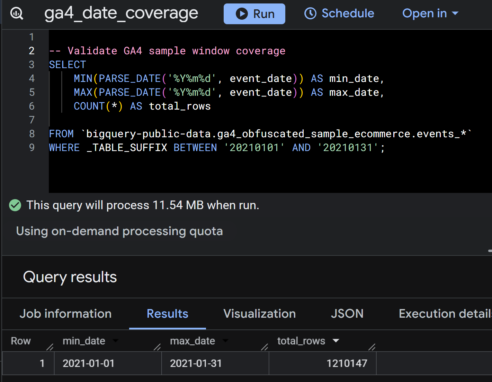

### Key Findings

- January 2021 sample window loaded successfully.
- Full 31-day event coverage confirmed.
- Event volume is sufficient for downstream profiling and KPI modeling.

---

## B1b — Global Dataset Date Coverage Validation

### Result

| global_min_date | global_max_date |
|---|---|
| 2020-11-01 | 2021-01-31 |


### Key Findings

- The public GA4 dataset contains approximately three months of historical data.
- The dataset is suitable for KPI prototyping and dashboard development.
- The dataset is limited for long-term seasonality, year-over-year comparison, mature cohort analysis, and long-horizon forecasting.

---

## C1 — Core Identifier Null Validation

### Result

| total_rows | null_event_date | null_event_timestamp | null_event_name | null_user_pseudo_id |
|---:|---:|---:|---:|---:|
| 1,210,147 | 0 | 0 | 0 | 0 |

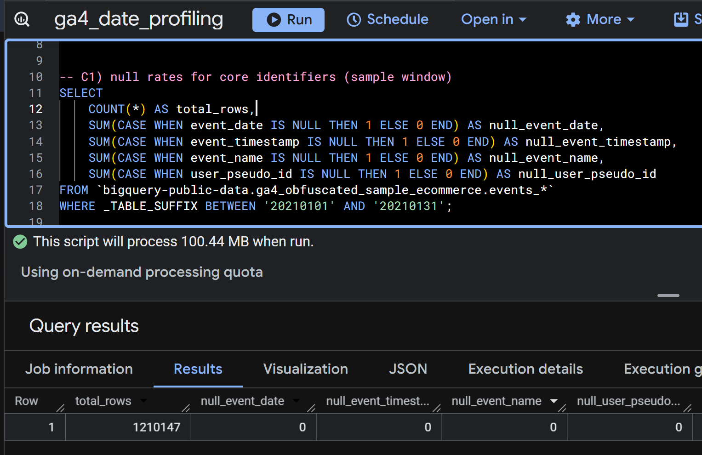

### Key Findings

- Core identifiers are fully populated.
- Event sequencing is structurally reliable.
- User-level analysis is feasible.
- No major completeness risk was detected for foundational tracking fields.

---

## C2 — Approximate Duplicate Event Validation

### Proxy Key

```text
user_pseudo_id + event_timestamp + event_name
```

### Result

| row_count | distinct_proxy | duplicate_proxy_rows |
|---:|---:|---:|
| 1,210,147 | 1,210,147 | 0 |


### Key Findings

- No approximate duplicate event patterns were detected.
- Event tracking structure appears stable at the behavioral event level.
- This reduces the risk of inflated event-level KPI calculations.

---

## C3 — Invalid Event Date Validation

### Result

| total_rows | invalid_event_date_rows |
|---:|---:|
| 1,210,147 | 0 |

### Key Findings

- All `event_date` values successfully parsed.
- No malformed date patterns were detected.
- Dataset is safe for time-series analysis and date-based aggregation.

---

## D1 — Top Event Distribution Profiling

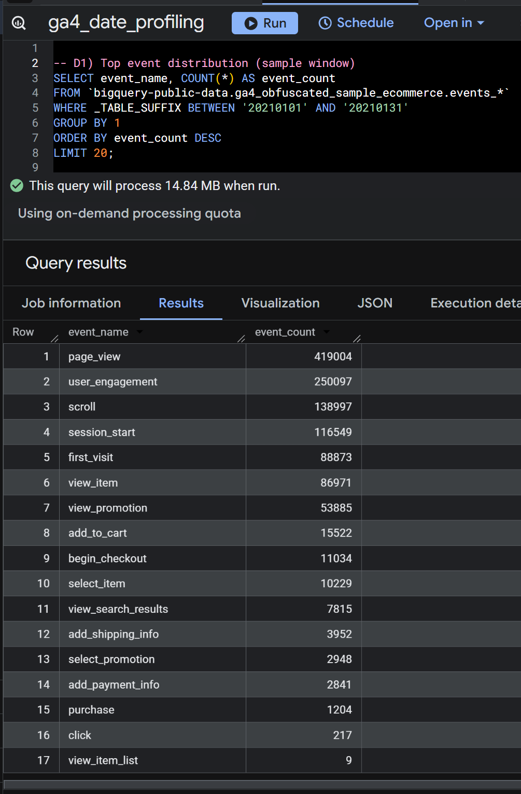

### Key Findings

Top behavioral and ecommerce events include:

- `page_view`
- `user_engagement`
- `scroll`
- `session_start`
- `first_visit`
- `view_item`
- `add_to_cart`
- `begin_checkout`
- `purchase`

### Analytical Implications

The dataset supports ecommerce funnel analysis, engagement KPI modeling, behavioral segmentation, and customer journey analysis.

---

## D2 — Purchase Presence & Revenue Validation

### Result

| Metric | Result |
|---|---:|
| Purchase events | 1,204 |
| Total purchase revenue | 57,350.0 |
| Distinct valid purchase transaction IDs | 894 |

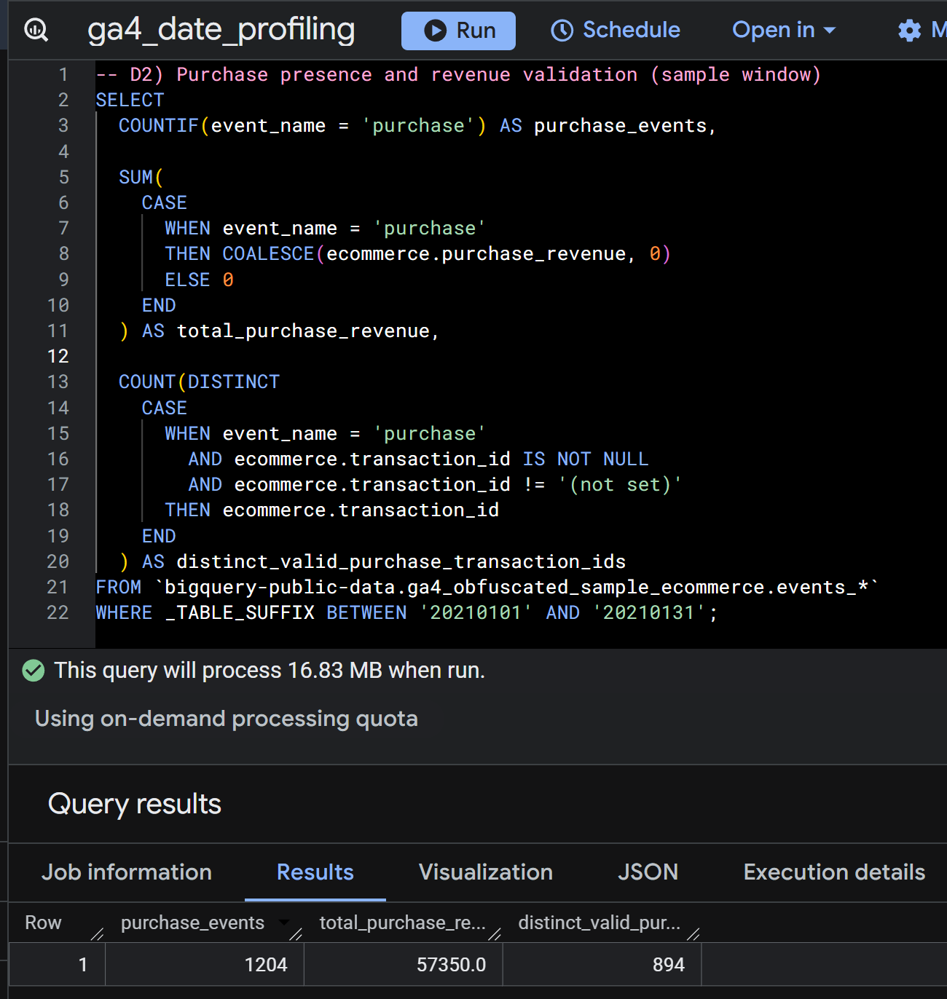

### Key Findings

- Purchase activity exists within the dataset.
- Revenue tracking is populated.
- Valid transaction-level identifiers are available.
- Purchase events exceed distinct valid transaction IDs, indicating possible duplicate or invalid purchase event behavior.

---

## D3 — Item Array Population by Event Type

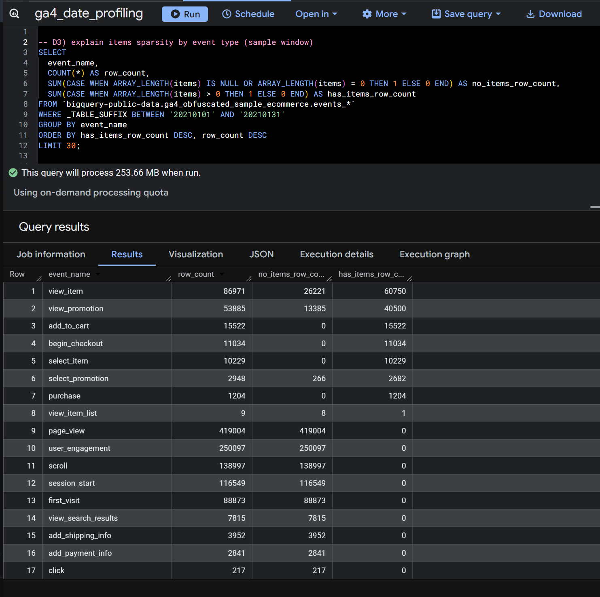

### Key Findings

- Ecommerce events consistently contain populated item arrays.
- Behavioral events correctly lack item arrays.
- Partial item population exists for some discovery and promotion events.

### Modeling Implications

Item-level extraction logic should remain event-aware. Product-level modeling should be handled separately from event-level staging to avoid row multiplication.

---

## D4 — Daily Event Volume Distribution


### Key Findings

- No missing event dates detected.
- Event flow remains continuous across January 2021.
- Daily activity levels appear behaviorally plausible.

### Modeling Implications

Dataset is suitable for daily KPI aggregation, rolling metrics, and time-series dashboarding.

---

## D5 — User & Session Volume Profiling

### Result

| total_rows | unique_users | unique_sessions |
|---:|---:|---:|
| 1,210,147 | 94,790 | 118,380 |


### Key Findings

- Strong behavioral scale detected.
- Session structure appears reliable.
- Session extraction from nested parameters succeeded.

### Modeling Implications

Session-level marts and engagement KPIs are feasible.

---

## D6 — Session ID Availability Validation

### Result

| total_rows | null_ga_session_id_rows | has_ga_session_id_rows |
|---:|---:|---:|
| 1,210,147 | 0 | 1,210,147 |

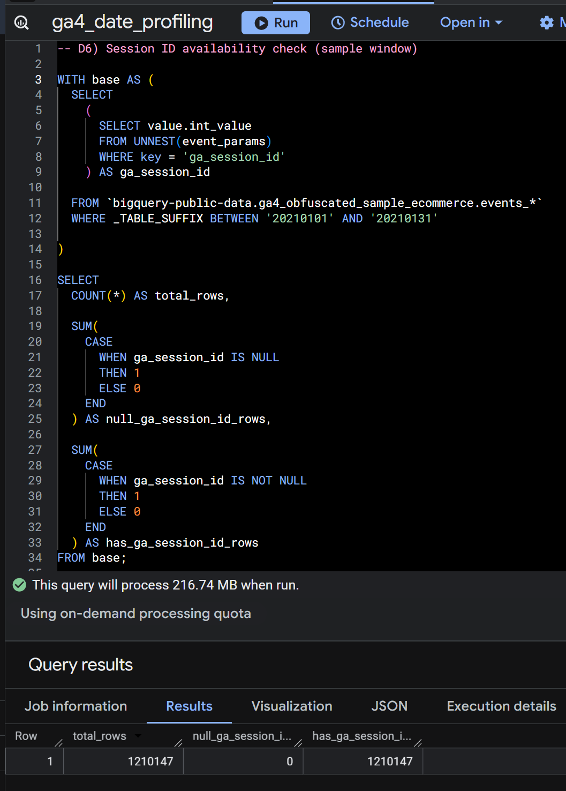

### Key Findings

- Session identifiers are fully populated.
- No immediate session completeness risk was identified.
- Dataset is suitable for downstream sessionization logic.

---

## D7 — Event-Level Traffic Source Distribution


### Key Findings

- Event-level acquisition metadata was successfully extracted.
- Major channel types observed include organic, referral, email, affiliate, and cpc.
- `(not set)` values require downstream normalization logic.

### Modeling Implications

Acquisition modeling should include fallback attribution handling and channel normalization.

---

## D8 — Purchase Transaction Quality Validation

### Result

| Metric | Result |
|---|---:|
| Purchase events | 1,204 |
| Missing or invalid transaction IDs | 300 |
| Missing or invalid transaction ID rate | 24.92% |
| Missing purchase revenue | 300 |
| Missing revenue rate | 24.92% |
| Zero revenue purchases | 0 |
| Negative revenue purchases | 0 |

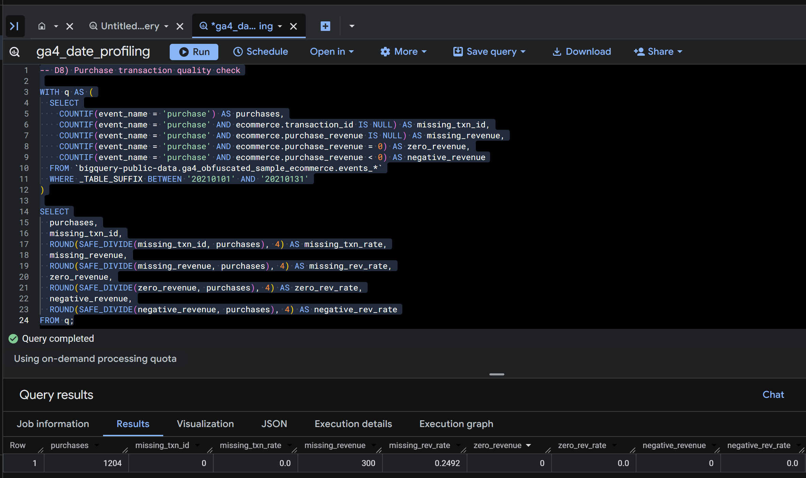

### Key Findings

- 300 purchase events contain missing or invalid transaction IDs.
- The same number of purchase events also have missing revenue.
- No zero or negative purchase revenue values were detected.
- Revenue KPIs require defensive handling.

---

## D9 — Transaction-Level Duplicate & Revenue Validation

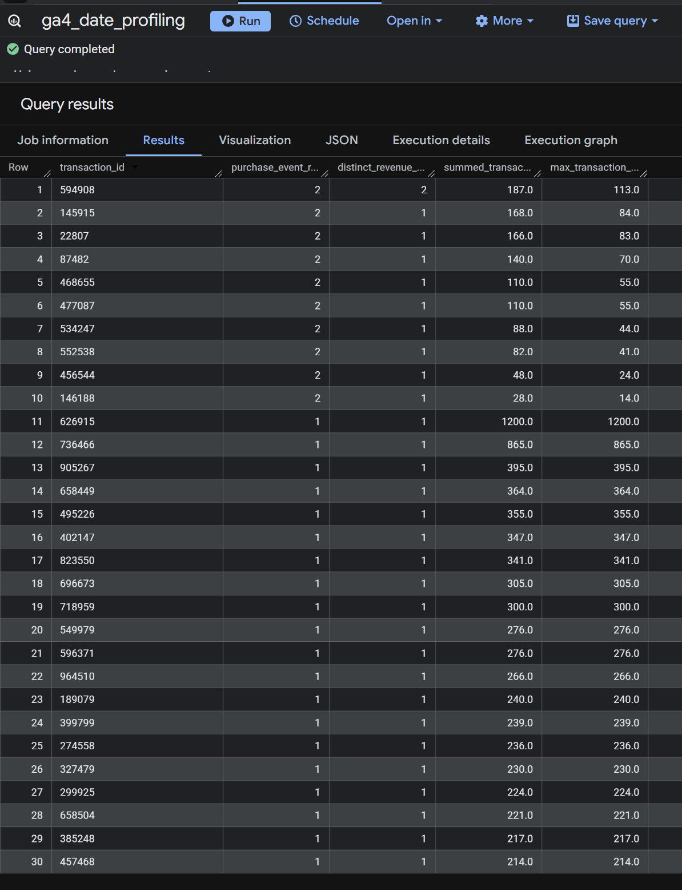

### Key Findings

- Duplicate purchase event behavior was detected.
- Revenue inflation risk exists if raw purchase rows are summed directly.
- Majority of valid transactions still maintain single-row integrity.

### Recommended Modeling Approach

Future marts should treat valid `transaction_id` as the business grain, apply transaction-level deduplication, avoid naïve raw-row revenue summation, and use defensive logic such as `MAX(purchase_revenue)` or row ranking when needed.

---

## D10 — Event Parameter Key Frequency Profiling


### Key Findings

Common reusable parameters include:

- `ga_session_id`
- `ga_session_number`
- `page_location`
- `page_title`
- `source`
- `medium`
- `campaign`

Event-specific parameters include:

- `transaction_id`
- `payment_type`
- `coupon`
- `search_term`
- `percent_scrolled`

### Modeling Implications

Future staging should selectively extract reusable high-value parameters instead of flattening every event parameter.

---

## D11 — Event Parameter Coverage by Event Type


### Key Findings

- Event schemas differ across event categories.
- Commerce events show stable parameter structures.
- Attribution fields are sparse for some ecommerce events.
- Parameter extraction logic must remain event-aware.

### Modeling Implications

Downstream staging should not assume every parameter exists for every event. Extraction logic should be based on event type and business use case.

---

## Phase 1A Summary

- [x] Raw structure inspection
- [x] Sample date coverage validation
- [x] Global date coverage validation
- [x] Core null validation
- [x] Approximate duplicate validation
- [x] Invalid date validation
- [x] Event taxonomy profiling
- [x] Purchase presence and revenue validation
- [x] Item array profiling
- [x] Daily volume validation
- [x] User and session volume profiling
- [x] Session ID availability validation
- [x] Event-level traffic source profiling
- [x] Purchase transaction quality validation
- [x] Transaction-level revenue integrity validation
- [x] Event parameter key frequency profiling
- [x] Event parameter coverage profiling

---

# Key Profiling Decisions

## Decision 1 — Use January 2021 as Profiling Window

January 2021 was selected to balance sufficient event scale, manageable BigQuery scan cost, and realistic profiling coverage.

## Decision 2 — Build Event-Aware Staging Logic

GA4 event schemas differ significantly by event type. Extraction logic should remain selective and event-aware.

## Decision 3 — Use Composite Session Keys

Session grain should use:

```text
user_pseudo_id + ga_session_id
```

because `ga_session_id` alone should not be assumed globally unique.

## Decision 4 — Treat `(not set)` Transaction IDs as Invalid

`transaction_id = '(not set)'` should not be counted as a valid transaction ID.

## Decision 5 — Apply Transaction-Level Revenue Deduplication

Revenue aggregation should avoid naïve raw-row summation due to duplicate purchase event patterns.

---

# Phase 1B — GA4 Staging View

## Status

✅ Completed

## Objective

Create a flattened GA4 event-level staging view that converts the nested raw GA4 export into a reusable analytical layer for downstream fact tables, marts, validation checks, and BI-ready KPI modeling.

The staging view preserves the raw event grain:

```text
one row per raw GA4 event
```

## Main SQL File

```text
sql/ga4/02_stg_ga4_events.sql
```

## Target View

```text
commercial-analytics-bq-dbx.commercial_analytics_us.stg_ga4_events
```

## Source Table

```text
bigquery-public-data.ga4_obfuscated_sample_ecommerce.events_*
```

## Sample Window

```text
2021-01-01 to 2021-01-31
```

---

## Completed Staging Tasks

- [x] Created `stg_ga4_events` view in BigQuery
- [x] Preserved event-level grain
- [x] Extracted core event fields
- [x] Extracted session fields from `event_params`
- [x] Created composite `session_key`
- [x] Extracted page and content parameters
- [x] Extracted engagement parameters
- [x] Extracted acquisition parameters
- [x] Preserved raw acquisition fields for debugging
- [x] Extracted selected ecommerce fields
- [x] Added item-array metadata without unnesting items
- [x] Added ecommerce funnel event flags
- [x] Added purchase event flags
- [x] Added data quality flags
- [x] Added event proxy key for duplicate validation

---

## Implemented Staging Fields

### Core Event Fields

- `event_date`
- `event_date_raw`
- `event_timestamp_utc`
- `event_timestamp_raw`
- `event_name`
- `user_pseudo_id`
- `source_table_suffix`

### Session Fields

- `ga_session_id`
- `ga_session_number`
- `session_key`

### Page & Content Fields

- `page_location`
- `page_title`
- `page_referrer`

### Engagement Fields

- `engagement_time_msec`
- `session_engaged_raw`
- `is_session_engaged`

### Acquisition Fields

- `source`
- `medium`
- `campaign`
- `source_raw`
- `medium_raw`
- `campaign_raw`

### Additional Event Parameters

- `search_term`
- `percent_scrolled`
- `coupon`
- `payment_type`

### Ecommerce Fields

- `transaction_id_raw`
- `transaction_id`
- `purchase_revenue`
- `total_item_quantity`
- `unique_items`
- `item_array_length`
- `has_items`

### Event Classification Flags

- `is_purchase_event`
- `is_ecommerce_funnel_event`

### Data Quality Flags

- `is_invalid_event_date`
- `is_missing_user_pseudo_id`
- `is_missing_ga_session_id`
- `is_missing_session_key`
- `is_invalid_purchase_transaction_id`
- `is_missing_purchase_revenue`
- `is_zero_purchase_revenue`
- `is_negative_purchase_revenue`

### Validation Key

- `event_proxy_key`

---

# Key Staging Design Decisions

## Decision 1 — Preserve Event-Level Grain

The staging view keeps one row per raw GA4 event. The `items` array is not unnested in this layer because unnesting would multiply rows and break event-level grain.

## Decision 2 — Use Selective Parameter Extraction

Only high-value GA4 parameters were extracted from `event_params`. This keeps staging readable, maintainable, and business-driven.

## Decision 3 — Build Composite Session Key

Session grain uses:

```text
user_pseudo_id + ga_session_id
```

because `ga_session_id` alone should not be assumed globally unique across users.

## Decision 4 — Normalize Acquisition Nulls Only

Acquisition fields were normalized only for null or blank values. Blank or null values are converted to:

```text
(not set)
```

Business-level channel grouping is intentionally left for the downstream `dim_channel` or mart layer.

## Decision 5 — Flag Data Quality Issues Without Filtering Rows

The staging view adds quality flags but does not remove or deduplicate records. This keeps staging transparent and auditable.

## Decision 6 — Revenue Deduplication Is Deferred

Transaction-level revenue deduplication is not performed in staging because staging should remain close to the raw event export. Revenue deduplication should happen later in fact or mart logic where the business grain is clearly defined.

---

# Initial Staging Sanity Check

## Result

| total_rows | min_event_date | max_event_date | unique_sessions | purchase_events |
|---:|---|---|---:|---:|
| 1,210,147 | 2021-01-01 | 2021-01-31 | 118,380 | 1,204 |

## Key Findings

- The staging view was created successfully.
- Row volume matches the expected January 2021 profiling window.
- Date range matches the intended sample window.
- Session extraction is working.
- Purchase event count matches the profiling result.
- The view is ready for structured validation.

---

# Phase 1C — GA4 Staging Validation

## Status

✅ Completed

## Objective

Validate that the GA4 staging view correctly preserves raw event volume, date coverage, session logic, event taxonomy, ecommerce flags, acquisition fields, engagement fields, item metadata, and data quality indicators.

## Main SQL File

```text
sql/validation/ga4/02b_validate_stg_ga4_events.sql
```

## Target View

```text
commercial-analytics-bq-dbx.commercial_analytics_us.stg_ga4_events
```

## Screenshot Directory

```text
bi/screenshots/ga4/staging_validation/
```

---

## GA4 Staging Validation Screenshot Inventory

| Step | Validation Check | Screenshot File |
|---|---|---|
| V1 | Raw vs staging row count validation | `ga4_staging_validation_v01_row_count.png` |
| V2 | Staging date range validation | `ga4_staging_validation_v02_date_range.png` |
| V3 | Core field null validation | `ga4_staging_validation_v03_core_nulls.png` |
| V4 | Session field availability validation | `ga4_staging_validation_v04_session_availability.png` |
| V5 | Session volume validation | `ga4_staging_validation_v05_session_volume.png` |
| V6 | Duplicate proxy validation | `ga4_staging_validation_v06_duplicate_proxy.png` |
| V7 | Event distribution validation | `ga4_staging_validation_v07_event_distribution.png` |
| V8 | Ecommerce funnel event validation | `ga4_staging_validation_v08_ecommerce_funnel_flags.png` |
| V9 | Purchase quality validation | `ga4_staging_validation_v09_purchase_quality.png` |
| V10 | Valid transaction and revenue validation | `ga4_staging_validation_v10_valid_transactions_revenue.png` |
| V11 | Transaction duplicate / revenue inflation risk | `ga4_staging_validation_v11_transaction_duplicate_risk.png` |
| V12 | Acquisition field validation | `ga4_staging_validation_v12_acquisition_distribution.png` |
| V13 | Not set acquisition rate | `ga4_staging_validation_v13_not_set_acquisition_rate.png` |
| V14 | Item array validation by event type | `ga4_staging_validation_v14_item_array_validation.png` |
| V15 | Engagement field validation | `ga4_staging_validation_v15_engagement_validation.png` |
| V16 | Data quality flag summary | `ga4_staging_validation_v16_quality_flag_summary.png` |
| V17 | Final staging validation status | `ga4_staging_validation_v17_final_status.png` |

---

## V1 — Raw vs Staging Row Count Validation

### Result

| raw_row_count | staging_row_count | row_count_difference | validation_status |
|---:|---:|---:|---|
| 1,210,147 | 1,210,147 | 0 | PASS |

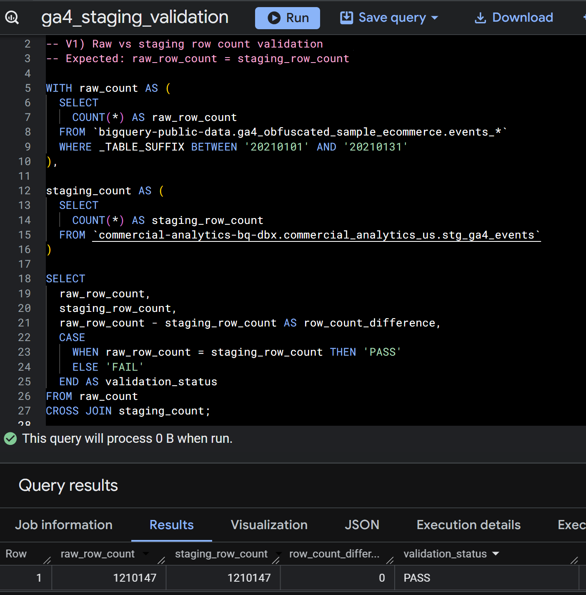

### Key Findings

- Raw GA4 row count and staging row count match exactly.
- No rows were lost during staging.
- No row multiplication occurred during parameter extraction.
- Event-level grain was preserved successfully.

### Status

```text
PASS
```

---

## V2 — Staging Date Range Validation

### Result

| min_event_date | max_event_date | distinct_event_dates | total_rows |
|---|---|---:|---:|
| 2021-01-01 | 2021-01-31 | 31 | 1,210,147 |


### Key Findings

- The staging view preserved the full intended January 2021 sample window.
- All 31 expected event dates are present.
- No missing or unexpected dates were detected.
- Event continuity remains stable after staging transformation.

### Status

```text
PASS
```

---

## V3 — Core Field Null Validation

### Result

| total_rows | null_event_date | null_event_timestamp_utc | null_event_timestamp_raw | null_event_name | null_user_pseudo_id |
|---:|---:|---:|---:|---:|---:|
| 1,210,147 | 0 | 0 | 0 | 0 | 0 |


### Key Findings

- No null values were detected in the core staging fields.
- Event date parsing did not introduce invalid or missing dates.
- Event timestamps remained fully populated after transformation.
- Event names are complete across all staged rows.
- `user_pseudo_id` is fully populated.

### Status

```text
PASS
```

---

## V4 — Session Field Availability Validation

### Result

| total_rows | null_ga_session_id | null_session_key | populated_ga_session_id | populated_session_key |
|---:|---:|---:|---:|---:|
| 1,210,147 | 0 | 0 | 1,210,147 | 1,210,147 |


### Key Findings

- All staged events contain a valid `ga_session_id`.
- All staged events contain a valid composite `session_key`.
- No session identifier loss occurred during parameter extraction.
- Session-level modeling can safely rely on these fields.

### Status

```text
PASS
```

---

## V5 — Session Volume Validation

### Result

| total_event_rows | unique_users | unique_sessions | avg_events_per_session |
|---:|---:|---:|---:|
| 1,210,147 | 94,790 | 118,380 | 10.22 |

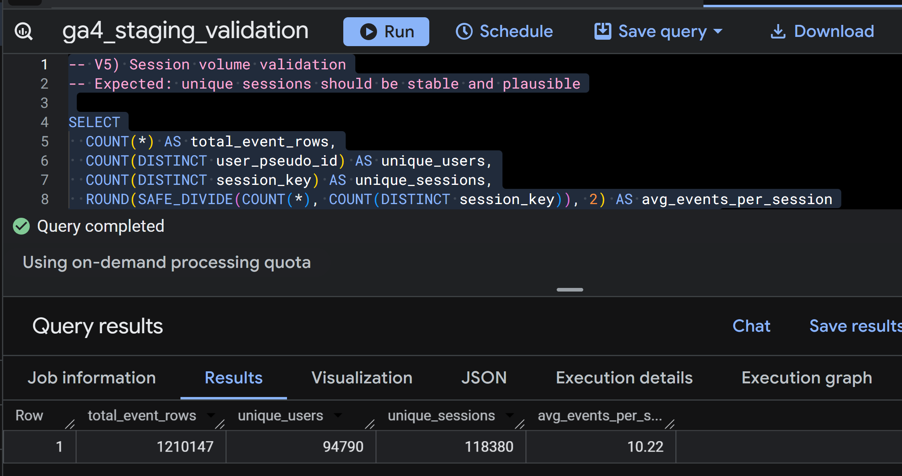

### Key Findings

- Approximately 94.8K unique users were identified.
- Approximately 118.4K unique sessions were constructed successfully.
- Average events per session is approximately 10.22.
- Session volume appears realistic and internally consistent.

### Status

```text
PASS
```

---

## V6 — Duplicate Proxy Validation

### Result

| row_count | distinct_event_proxy_keys | duplicate_proxy_rows | validation_status |
|---:|---:|---:|---|
| 1,210,147 | 1,210,147 | 0 | PASS |

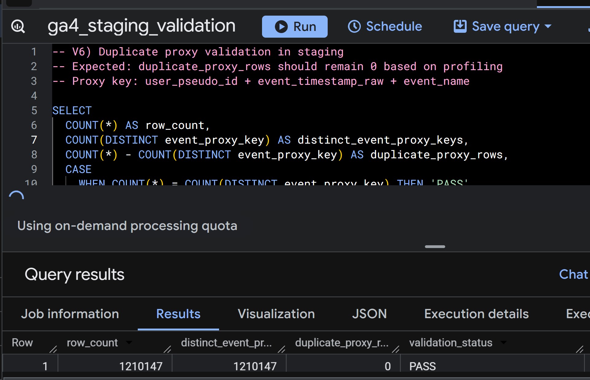

### Key Findings

- No duplicate proxy rows were detected.
- Event-level grain was preserved successfully.
- Parameter extraction logic did not multiply event rows.
- No accidental Cartesian expansion occurred.

### Status

```text
PASS
```

---

## V7 — Event Distribution Validation

### Result

| event_name | event_count | event_share |
|---|---:|---:|
| page_view | 419,004 | 0.3462 |
| user_engagement | 250,097 | 0.2067 |
| scroll | 138,997 | 0.1149 |
| session_start | 116,549 | 0.0963 |
| first_visit | 88,873 | 0.0734 |
| view_item | 86,971 | 0.0719 |
| view_promotion | 53,885 | 0.0445 |
| add_to_cart | 15,522 | 0.0128 |
| begin_checkout | 11,034 | 0.0091 |
| purchase | 1,204 | 0.0010 |


### Key Findings

- Behavioral events dominate the dataset as expected.
- Ecommerce funnel events remain visible and logically distributed.
- Event taxonomy was preserved successfully.
- The staged event distribution is consistent with earlier profiling.

### Status

```text
PASS
```

---

## V8 — Ecommerce Funnel Event Validation

### Result

| event_name | event_count | ecommerce_funnel_flagged_rows | rows_with_items | purchase_flagged_rows |
|---|---:|---:|---:|---:|
| view_item | 86,971 | 86,971 | 60,750 | 0 |
| add_to_cart | 15,522 | 15,522 | 15,522 | 0 |
| begin_checkout | 11,034 | 11,034 | 11,034 | 0 |
| purchase | 1,204 | 1,204 | 1,204 | 1,204 |


### Key Findings

- All ecommerce funnel events were correctly flagged.
- All `purchase` events were correctly identified.
- Funnel event classification remained consistent.
- Item presence is correctly associated with downstream ecommerce funnel events.

### Status

```text
PASS
```

---

## V9 — Purchase Quality Validation

### Result

| purchase_events | invalid_purchase_transaction_id_events | invalid_purchase_transaction_id_rate | missing_purchase_revenue_events | missing_purchase_revenue_rate | zero_purchase_revenue_events | negative_purchase_revenue_events |
|---:|---:|---:|---:|---:|---:|---:|
| 1,204 | 300 | 0.2492 | 300 | 0.2492 | 0 | 0 |

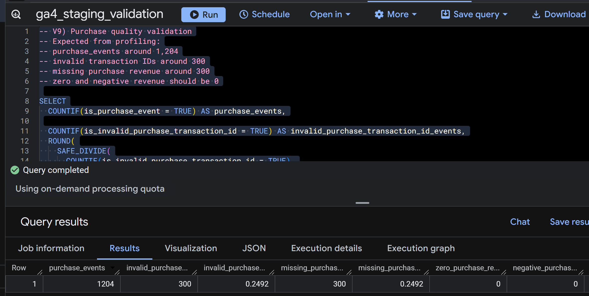

### Key Findings

- 300 purchase events have invalid or missing transaction IDs.
- 300 purchase events have missing purchase revenue.
- Invalid transaction ID rate is 24.92%.
- Missing purchase revenue rate is 24.92%.
- No zero-revenue purchase events were detected.
- No negative-revenue purchase events were detected.

### Status

```text
PASS WITH KNOWN DATA QUALITY ISSUE
```

---

## V10 — Valid Transaction and Revenue Validation

### Result

| purchase_event_rows | purchase_rows_with_valid_transaction_id | distinct_valid_transaction_ids | raw_purchase_revenue_sum |
|---:|---:|---:|---:|
| 1,204 | 904 | 894 | 57,350.0 |

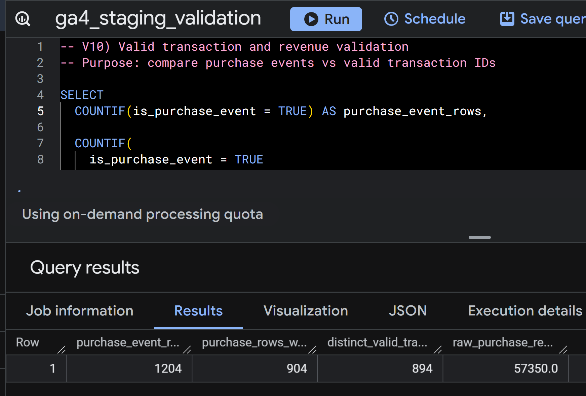

### Key Findings

- Raw purchase-event volume is larger than the number of valid transactions.
- Some purchase rows contain duplicated transaction IDs.
- Some purchase rows contain invalid or missing transaction identifiers.
- Downstream revenue logic must use transaction-level deduplication.

### Status

```text
PASS WITH KNOWN TRANSACTION QUALITY CONSTRAINTS
```

---

## V11 — Transaction Duplicate & Revenue Inflation Risk Validation

### Result

The validation identified multiple transaction IDs appearing across more than one purchase-event row.

Example duplicated transactions:

| transaction_id | purchase_event_rows | summed_transaction_revenue | max_transaction_revenue | possible_revenue_overstatement |
|---|---:|---:|---:|---:|
| 145915 | 2 | 168.0 | 84.0 | 84.0 |
| 22807 | 2 | 166.0 | 83.0 | 83.0 |
| 594908 | 2 | 187.0 | 113.0 | 74.0 |
| 87482 | 2 | 140.0 | 70.0 | 70.0 |
| 468655 | 2 | 110.0 | 55.0 | 55.0 |


### Key Findings

- Multiple transaction IDs appear across duplicated purchase-event rows.
- Some duplicated transactions repeat the exact same revenue value.
- Some duplicated transactions contain different revenue values across rows.
- Raw revenue aggregation can materially overstate actual transaction revenue.

### Status

```text
PASS WITH CONFIRMED REVENUE DEDUPLICATION REQUIREMENT
```

---

## V12 — Acquisition Field Validation

### Result

Top observed acquisition combinations:

| source | medium | campaign | event_count | unique_users | unique_sessions |
|---|---|---|---:|---:|---:|
| `(not set)` | `(not set)` | `(not set)` | 873,805 | 94,757 | 118,330 |
| `shop.googlemerchandisestore...` | `referral` | `(referral)` | 158,458 | 21,904 | 29,224 |
| `google` | `organic` | `(organic)` | 83,604 | 32,198 | 35,183 |
| `(direct)` | `(none)` | `(direct)` | 28,697 | 8,950 | 9,400 |
| `<Other>` | `<Other>` | `<Other>` | 18,065 | 6,219 | 6,293 |
| `google` | `cpc` | `<Other>` | 5,252 | 1,840 | 1,850 |


### Key Findings

- Acquisition fields were successfully extracted and normalized.
- The largest acquisition bucket is `(not set) / (not set) / (not set)`.
- Referral and organic traffic sources are clearly visible.
- Direct, CPC, affiliate, and email patterns are represented.
- Attribution sparsity is significant and must be handled downstream.

### Status

```text
PASS WITH ATTRIBUTION SPARSITY NOTE
```

---

## V13 — Not Set Acquisition Rate Validation

### Result

| total_rows | not_set_source_rows | not_set_source_rate | not_set_medium_rows | not_set_medium_rate | not_set_campaign_rows | not_set_campaign_rate |
|---:|---:|---:|---:|---:|---:|---:|
| 1,210,147 | 874,947 | 0.7230 | 873,805 | 0.7221 | 873,807 | 0.7221 |

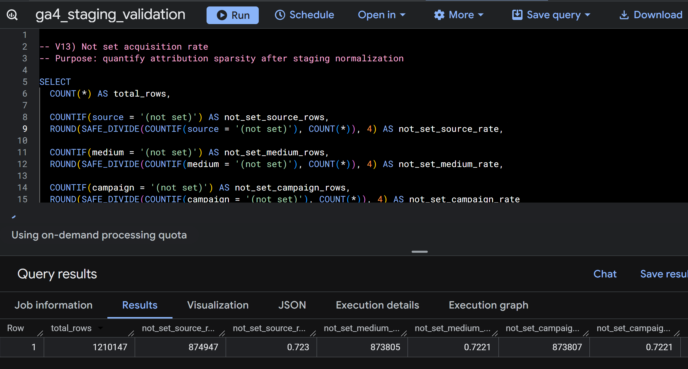

### Key Findings

- Approximately 72% of staged events contain `(not set)` acquisition values.
- Attribution sparsity is consistent across source, medium, and campaign.
- This is a source-data limitation, not a staging failure.

### Status

```text
PASS WITH HIGH ATTRIBUTION SPARSITY OBSERVED
```

---

## V14 — Item Array Validation by Event Type

### Result

| event_name | event_rows | rows_with_items | rows_without_items | item_coverage_rate |
|---|---:|---:|---:|---:|
| view_item | 86,971 | 60,750 | 26,221 | 0.6985 |
| view_promotion | 53,885 | 40,500 | 13,385 | 0.7516 |
| add_to_cart | 15,522 | 15,522 | 0 | 1.0000 |
| begin_checkout | 11,034 | 11,034 | 0 | 1.0000 |
| select_item | 10,229 | 10,229 | 0 | 1.0000 |
| purchase | 1,204 | 1,204 | 0 | 1.0000 |


### Key Findings

- Core ecommerce events have strong or full item coverage.
- Behavioral events correctly contain no item metadata.
- The staging layer preserved item-array metadata without multiplying event rows.

### Status

```text
PASS
```

---

## V15 — Engagement Field Validation

### Result

| session_engaged_raw | is_session_engaged | event_count | rows_with_engagement_time | engagement_time_coverage_rate |
|---|---|---:|---:|---:|
| 1 | TRUE | 996,282 | 738,993 | 0.7418 |
| 0 | FALSE | 117,361 | 1,028 | 0.0088 |
| NULL | NULL | 96,504 | 0 | 0.0000 |

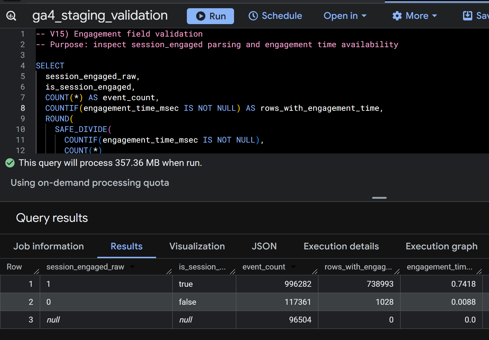

### Key Findings

- Engagement parsing logic works correctly.
- Engagement-time metadata is concentrated within engaged sessions.
- Non-engaged sessions contain minimal engagement time values.
- NULL engagement rows contain no engagement-time metadata.

### Status

```text
PASS
```

---

## V16 — Data Quality Flag Summary

### Result

| total_rows | invalid_event_date_rows | missing_user_pseudo_id_rows | missing_ga_session_id_rows | missing_session_key_rows | invalid_purchase_transaction_id_rows | missing_purchase_revenue_rows | zero_purchase_revenue_rows | negative_purchase_revenue_rows |
|---:|---:|---:|---:|---:|---:|---:|---:|---:|
| 1,210,147 | 0 | 0 | 0 | 0 | 300 | 300 | 0 | 0 |

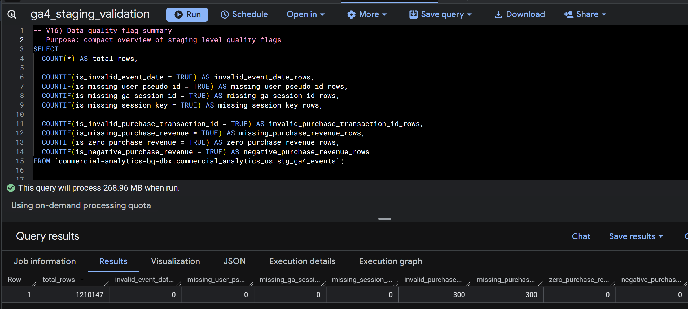

### Key Findings

- Core behavioral and session fields are clean.
- Purchase-related quality issues remain visible and documented.
- No zero or negative revenue issues were detected.
- No critical structural issues exist after staging.

### Status

```text
PASS WITH PURCHASE QUALITY FLAGS OBSERVED
```

---

## V17 — Final Staging Validation Status

### Result

| total_rows | staging_validation_status | null_event_date | null_event_timestamp_raw | null_event_name | null_user_pseudo_id | null_ga_session_id | null_session_key | duplicate_proxy_rows | negative_purchase_revenue_rows |
|---:|---|---:|---:|---:|---:|---:|---:|---:|---:|
| 1,210,147 | PASS | 0 | 0 | 0 | 0 | 0 | 0 | 0 | 0 |


### Key Findings

- No critical null issues exist in core event fields.
- No missing session identifiers were detected.
- No duplicate proxy rows were detected.
- No negative purchase revenue values were detected.
- The staging layer successfully passed all structural validation conditions.

### Status

```text
FINAL STAGING VALIDATION STATUS: PASS
```

---

## Phase 1C Summary

- [x] Created GA4 staging validation SQL file
- [x] Built 17 validation checks
- [x] Validated raw-to-staging row count consistency
- [x] Validated date coverage
- [x] Validated core null patterns
- [x] Validated session field availability
- [x] Validated session volume
- [x] Validated duplicate proxy logic
- [x] Validated event distribution
- [x] Validated ecommerce funnel flags
- [x] Validated purchase quality
- [x] Validated valid transaction logic
- [x] Confirmed transaction duplicate / revenue inflation risk
- [x] Validated acquisition fields
- [x] Quantified attribution sparsity
- [x] Validated item-array behavior
- [x] Validated engagement fields
- [x] Summarized data quality flags
- [x] Produced final staging validation status
- [x] Saved all validation screenshots
- [x] Pushed validation outputs to GitHub

---

# Known Data Quality Notes

| Area | Issue | Impact | Handling |
|---|---|---|---|
| Historical coverage | Dataset limited to 2020-11-01 through 2021-01-31 | Limited long-term seasonality and YoY analysis | Use for KPI prototyping and short-range behavioral analysis |
| Acquisition fields | High `(not set)` rate around 72% at event grain and 77% at session grain | Channel attribution is incomplete | Preserve `(not set)` and handle explicitly in channel mart |
| Revenue completeness | 300 purchase events have missing revenue | Revenue KPIs require caution | Flag and exclude from trusted transaction revenue logic |
| Transaction IDs | 300 purchase events have missing or invalid transaction IDs | Invalid transactions should not count as valid orders | Use cleaned `transaction_id` and validity flags |
| Purchase duplication | Some transaction IDs appear in multiple purchase rows | Raw revenue summation can inflate revenue | Deduplicate at transaction grain downstream |
| Item arrays | Item coverage varies by event type | Product analytics requires separate grain | Do not unnest items in event-level staging |
| Engagement fields | Engagement time is not available on all events | Event-level engagement coverage is sparse | Aggregate carefully at session/event type level |

---

# Modeling Rules Going Forward

## Rule 1 — Preserve Grain Discipline

Do not mix event-level, session-level, item-level, and transaction-level logic in the same table unless the grain is clearly documented.

## Rule 2 — Do Not Sum Raw Purchase Rows Naively

Revenue should not be calculated directly from raw purchase rows without transaction-level deduplication.

## Rule 3 — Keep `(not set)` Visible

Do not silently drop unattributed events. Attribution gaps should remain visible in downstream BI.

## Rule 4 — Separate Event and Item Modeling

The event-level staging view should not unnest `items`. If product-level analysis is needed, create a separate item-level fact table.

## Rule 5 — Build Channel Logic Outside Staging

Channel grouping should be implemented in `dim_channel` or downstream marts, not inside staging.

## Rule 6 — Use Validation Before Modeling

Every downstream table should have at least one validation step before it is considered complete.

---
# Phase 2 — Core Warehouse Modeling
# Phase 2A — Session Fact Construction

## Status

✅ Completed

## Objective

Build a daily session-level fact table from the validated GA4 staging layer.

The purpose of this phase is to convert event-level GA4 data into a stable session-level analytical table that supports downstream commercial KPIs, acquisition analysis, funnel reporting, engagement metrics, and revenue-safe reporting.

## Main SQL File

```text
sql/ga4/03_fact_sessions_daily.sql
```

## Target Table

```text
commercial-analytics-bq-dbx.commercial_analytics_us.fact_sessions_daily
```

## Source View

```text
commercial-analytics-bq-dbx.commercial_analytics_us.stg_ga4_events
```

## Grain

```text
one row per event_date + session_key
```

## Screenshot Directory

```text
bi/screenshots/ga4/session_fact/
```

---

## Modeling Logic Implemented

The session fact table includes:

- session identifiers
- user identifier
- session start and end timestamps
- session duration
- session-level acquisition fields
- event counts
- engagement metrics
- ecommerce funnel indicators
- purchase event indicators
- valid transaction count
- deduplicated revenue
- purchase quality flags

---

## Key Modeling Decisions

### Session Grain

The table is modeled at:

```text
event_date + session_key
```

This supports daily reporting while preserving session-level analytical logic.

### Acquisition Rollup

Session-level acquisition fields are selected from the first available event within the session:

```text
session_source
session_medium
session_campaign
```

### Revenue Deduplication

Revenue is not calculated by naïvely summing raw purchase rows.

Instead, purchase revenue is deduplicated at transaction level using:

```text
event_date + session_key + transaction_id
```

and:

```sql
MAX(purchase_revenue)
```

This avoids revenue inflation caused by duplicated purchase event rows.

---

## Session Fact Pre-Creation Checks

### F1 — Session Base Summary Check

| session_rows | distinct_sessions | min_event_date | max_event_date | avg_events_per_session |
|---:|---:|---|---|---:|
| 118,618 | 118,380 | 2021-01-01 | 2021-01-31 | 10.20 |

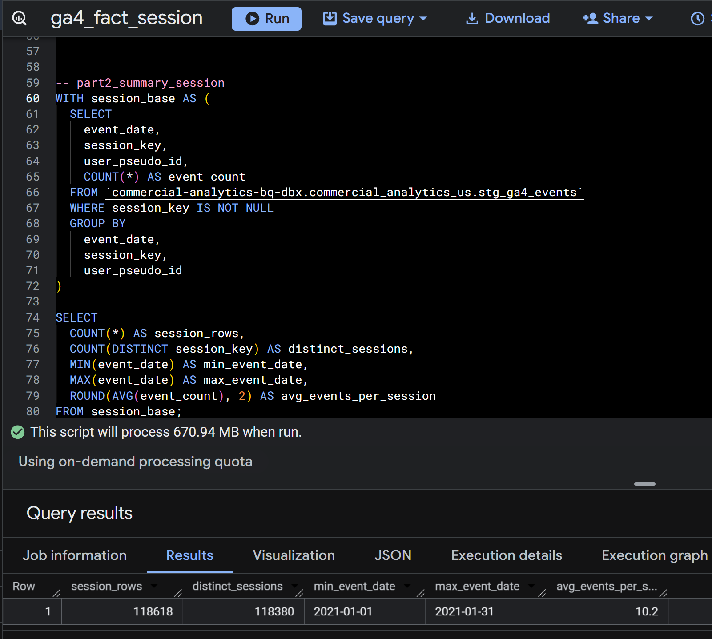

#### Key Findings

- Session-level aggregation was successfully created from staging.
- Date coverage remains aligned with the January 2021 development window.
- Average events per session remains consistent with staging validation.
- A small difference exists between `session_rows` and `distinct_sessions`, indicating some sessions may span multiple dates or contain cross-date behavior.

#### Status

```text
PASS
```

---

### F2 — Transaction Revenue Deduplication Check

| transaction_rows | distinct_transaction_ids | deduplicated_revenue |
|---:|---:|---:|
| 895 | 894 | 56,880.0 |

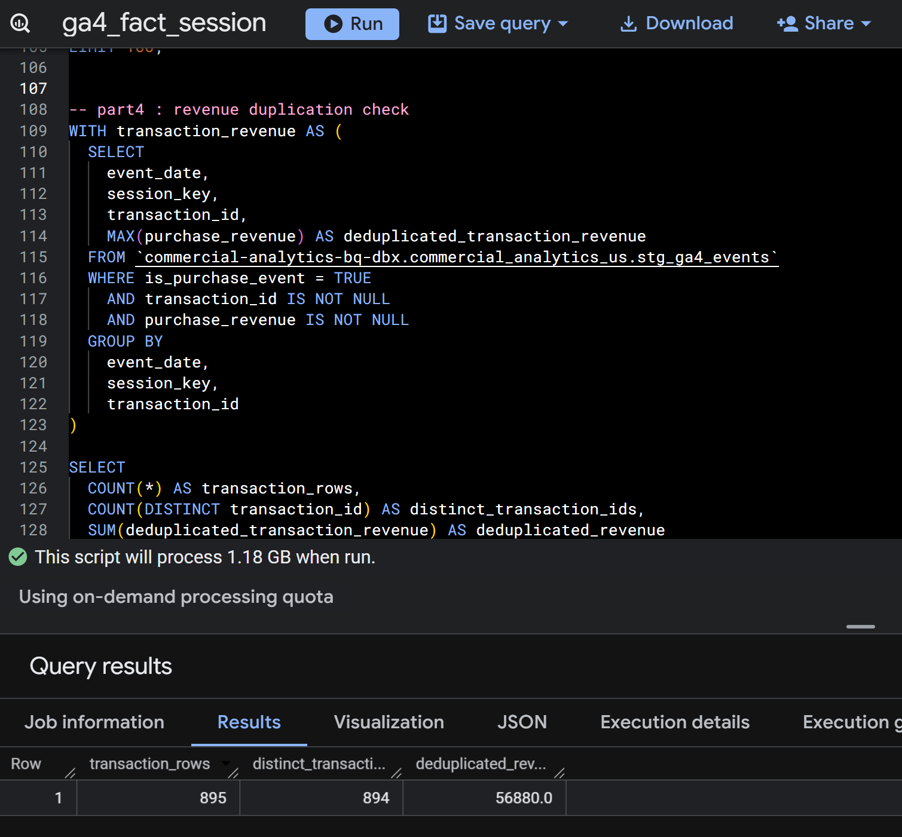

#### Key Findings

- Valid transaction rows were successfully identified.
- Distinct valid transaction IDs remain aligned with earlier staging validation.
- Deduplicated revenue equals 56,880.0.
- This differs from raw purchase revenue because duplicated transaction rows were controlled.

#### Status

```text
PASS
```

---

## Final Table Creation

## Status

✅ Completed

The final `fact_sessions_daily` table was created after the session aggregation and revenue deduplication checks passed.

## Final Modeling Outcome

The table is ready for downstream session KPI validation, channel marts, executive daily marts, conversion analysis, revenue-safe KPI modeling, and BI-ready reporting layers.

---

## Phase 2A Summary

- [x] Reviewed old `fact_sessions_daily` logic
- [x] Replaced outdated project references
- [x] Rebuilt the fact model using validated staging fields
- [x] Added session-level grain logic
- [x] Added acquisition rollup logic
- [x] Added engagement metrics
- [x] Added ecommerce funnel metrics
- [x] Added purchase quality flags
- [x] Added transaction-level revenue deduplication
- [x] Tested `session_base`
- [x] Tested session summary output
- [x] Tested transaction revenue logic
- [x] Tested revenue deduplication output
- [x] Tested final model output before table creation
- [x] Created `fact_sessions_daily`

---

# Phase 2B — Session Fact Validation

## Status

✅ Completed

## Objective

Validate the `fact_sessions_daily` table after session-level modeling.

This validation phase confirms that the session fact table has the correct grain, expected date coverage, no critical nulls, controlled revenue logic, documented attribution sparsity, and sufficient quality for downstream mart development.

## Validation SQL File

```text
sql/validation/ga4/03b_validate_fact_sessions_daily.sql
```

## Target Table

```text
commercial-analytics-bq-dbx.commercial_analytics_us.fact_sessions_daily
```

## Screenshot Directory

```text
bi/screenshots/ga4/session_fact_validation/
```

---

## Session Fact Validation Screenshot Inventory

| Step | Validation Check | Screenshot File | Stored |
|---|---|---|---|
| FSV1 | Fact table row count | Not stored | No |
| FSV2 | Session grain uniqueness | `ga4_session_fact_validation_v02_grain_uniqueness.png` | Yes |
| FSV3 | Date coverage | `ga4_session_fact_validation_v03_date_coverage.png` | Yes |
| FSV4 | Null critical fields | Not stored | No |
| FSV5 | Session duration distribution | Not stored | No |
| FSV6 | Event count distribution | Not stored | No |
| FSV7 | Acquisition distribution | `ga4_session_fact_validation_v07_acquisition_distribution.png` | Yes |
| FSV8 | Not set acquisition rate | `ga4_session_fact_validation_v08_not_set_acquisition_rate.png` | Yes |
| FSV9 | Engagement coverage | Not stored | No |
| FSV10 | Funnel event validation | `ga4_session_fact_validation_v10_funnel_validation.png` | Yes |
| FSV11 | Purchase session behavior | Not stored | No |
| FSV12 | Revenue integrity | `ga4_session_fact_validation_v12_revenue_integrity.png` | Yes |
| FSV13 | Revenue outlier inspection | Not stored | No |
| FSV14 | Purchase quality flags | Not stored | No |
| FSV15 | Daily session trend | `ga4_session_fact_validation_v15_daily_session_trend.png` | Yes |
| FSV16 | Final validation status | `ga4_session_fact_validation_v16_final_status.png` | Yes |

---

## FSV1 — Fact Table Row Count

### Result

| total_fact_rows |
|---:|
| 118,618 |

### Key Findings

- The fact table was created successfully.
- The table contains 118,618 session-level rows.
- Row volume is consistent with the expected January 2021 session aggregation output.

### Screenshot

```text
Not stored. This was a basic row-count sanity check.
```

### Status

```text
PASS
```

---

## FSV2 — Session Grain Uniqueness Validation

### Result

| total_rows | distinct_session_grain | duplicate_session_grain_rows |
|---:|---:|---:|
| 118,618 | 118,618 | 0 |

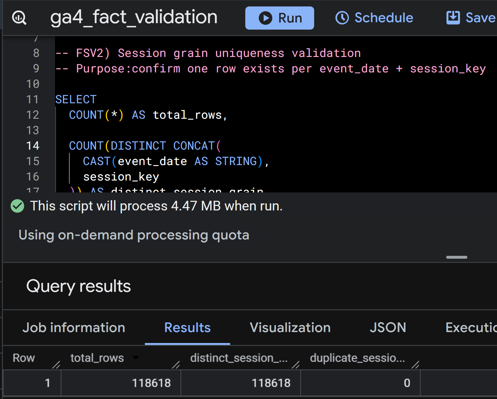

### Key Findings

- Total rows match the distinct session grain count.
- No duplicate rows exist at the intended grain.
- The table preserves the intended daily session-level grain.

### Status

```text
PASS
```

---

## FSV3 — Date Coverage Validation

### Result

| min_event_date | max_event_date | distinct_dates |
|---|---|---:|
| 2021-01-01 | 2021-01-31 | 31 |

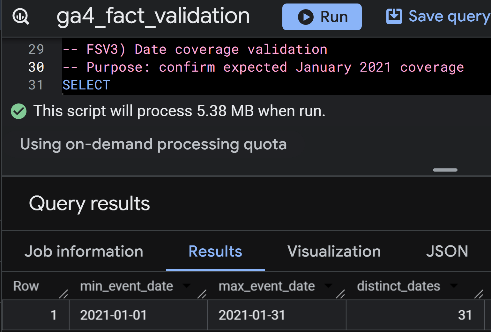

### Key Findings

- The session fact table covers the full January 2021 window.
- All 31 expected dates are present.
- Date coverage remains consistent with the staging layer and raw profiling window.

### Status

```text
PASS
```

---

## FSV4 — Null Critical Field Validation

### Result

| total_rows | null_event_date | null_session_key | null_user_pseudo_id | null_session_start | null_session_end | null_session_source | null_session_medium | null_session_campaign |
|---:|---:|---:|---:|---:|---:|---:|---:|---:|
| 118,618 | 0 | 0 | 0 | 0 | 0 | 0 | 0 | 0 |

### Key Findings

- No null values exist in critical session identifiers.
- Session start and end timestamps are fully populated.
- Acquisition fields are fully populated after `(not set)` normalization.
- The table is structurally safe for downstream KPI modeling.

### Screenshot

```text
Not stored. This was a basic structural null check.
```

### Status

```text
PASS
```

---

## FSV5 — Session Duration Validation

### Result

| min_session_duration | max_session_duration | avg_session_duration | negative_duration_sessions | zero_duration_sessions |
|---:|---:|---:|---:|---:|
| 0 | 72,560 | 164.66 | 0 | 14,098 |

### Key Findings

- No negative session durations were detected.
- Some sessions have zero duration, which is expected in GA4-style behavioral data.
- Average session duration is 164.66 seconds.
- The maximum session duration is high and should be treated as possible long-session/outlier behavior, not as a modeling failure.

### Screenshot

```text
Not stored. This was a supporting distribution check.
```

### Status

```text
PASS
```

---

## FSV6 — Event Count Validation

### Result

| min_events_per_session | max_events_per_session | avg_events_per_session | zero_event_sessions |
|---:|---:|---:|---:|
| 1 | 1,007 | 10.20 | 0 |

### Key Findings

- Every session contains at least one event.
- No zero-event sessions were detected.
- Average events per session remains consistent with earlier staging validation.
- The maximum event count indicates possible high-activity sessions, but does not break the model.

### Screenshot

```text
Not stored. This was a supporting distribution check.
```

### Status

```text
PASS
```

---

## FSV7 — Acquisition Distribution Validation

### Result

Top acquisition combinations:

| session_source | session_medium | session_campaign | sessions | session_share |
|---|---|---|---:|---:|
| `(not set)` | `(not set)` | `(not set)` | 91,291 | 0.7696 |
| `google` | `organic` | `(organic)` | 12,430 | 0.1048 |
| `shop.googlemerchandisestore...` | `referral` | `(referral)` | 3,712 | 0.0313 |
| `(direct)` | `(none)` | `(direct)` | 3,175 | 0.0268 |
| `<Other>` | `<Other>` | `<Other>` | 2,011 | 0.0170 |

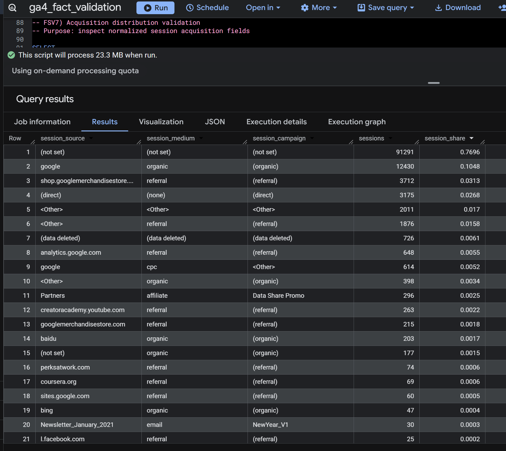

### Key Findings

- Session-level acquisition rollup works correctly.
- `(not set)` remains the dominant acquisition bucket.
- Organic Google traffic is the largest identifiable acquisition source.
- Referral, direct, CPC, affiliate, and email traffic are visible in the session fact layer.
- Attribution sparsity remains a source-data limitation and should stay visible in downstream marts.

### Status

```text
PASS WITH ATTRIBUTION SPARSITY OBSERVED
```

---

## FSV8 — Not Set Acquisition Rate Validation

### Result

| total_sessions | not_set_source_sessions | not_set_source_rate | not_set_medium_sessions | not_set_medium_rate | not_set_campaign_sessions | not_set_campaign_rate |
|---:|---:|---:|---:|---:|---:|---:|
| 118,618 | 91,472 | 0.7711 | 91,291 | 0.7696 | 91,292 | 0.7696 |

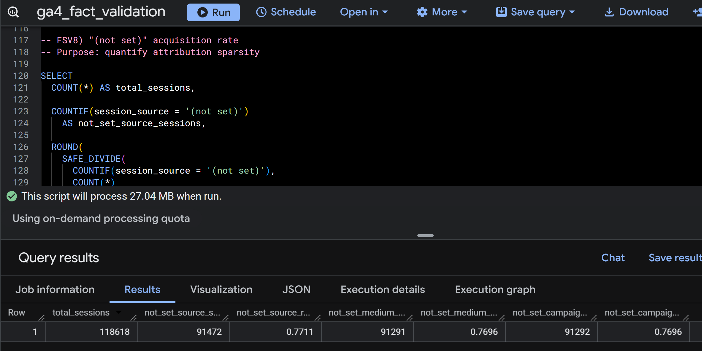

### Key Findings

- Around 77% of sessions have `(not set)` source values.
- Around 77% of sessions have `(not set)` medium and campaign values.
- Attribution sparsity increased slightly at session grain compared with event-grain staging validation.
- Downstream channel reporting must include an explicit unattributed/unknown bucket.

### Status

```text
PASS WITH HIGH ATTRIBUTION SPARSITY OBSERVED
```

---

## FSV9 — Engagement Validation

### Result

| total_sessions | engaged_sessions | engaged_session_rate | avg_engagement_time_msec | max_engagement_time_msec |
|---:|---:|---:|---:|---:|
| 118,618 | 111,357 | 0.9388 | 49,413.60 | 53,156,838 |

### Key Findings

- 93.88% of sessions are marked as engaged.
- Engagement fields were successfully carried from staging into the session fact table.
- Average engagement time is populated and usable for downstream session engagement KPIs.
- The maximum engagement time is high and should be treated as potential long-session/outlier behavior, not a table failure.

### Screenshot

```text
Not stored. This was a supporting engagement coverage check.
```

### Status

```text
PASS
```

---

## FSV10 — Funnel Event Validation

### Result

| total_view_item_events | total_add_to_cart_events | total_begin_checkout_events | total_purchase_events |
|---:|---:|---:|---:|
| 86,971 | 15,522 | 11,034 | 1,204 |

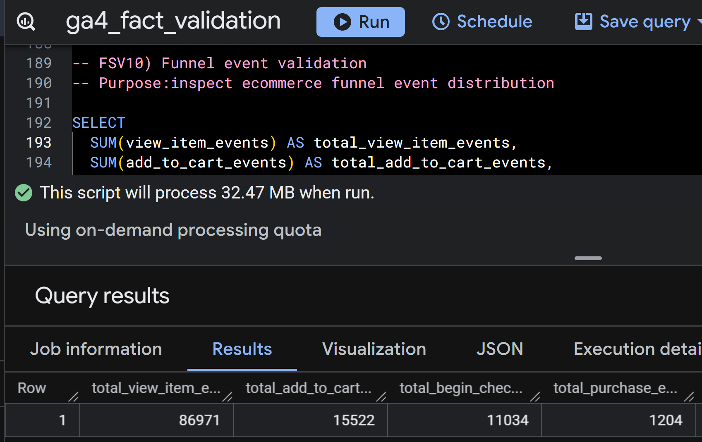

### Key Findings

- Funnel event totals match the staging-level validation outputs.
- `view_item`, `add_to_cart`, `begin_checkout`, and `purchase` counts were preserved.
- Session-level aggregation did not lose ecommerce funnel events.
- The fact table is safe for downstream funnel KPI modeling.

### Status

```text
PASS
```

---

## FSV11 — Purchase Session Validation

### Result

| purchase_sessions | avg_transactions_per_purchase_session | avg_purchase_session_revenue | max_purchase_session_revenue |
|---:|---:|---:|---:|
| 1,116 | 0.80 | 50.97 | 1,200.0 |

### Key Findings

- 1,116 sessions contained at least one purchase event.
- Average valid transactions per purchase session is below 1 because some purchase sessions contain invalid transaction IDs or missing revenue.
- Average purchase-session revenue is 50.97.
- The maximum purchase-session revenue is 1,200.0.

### Screenshot

```text
Not stored. This was a supporting purchase-session behavior check.
```

### Status

```text
PASS WITH KNOWN PURCHASE QUALITY LIMITATIONS
```

---

## FSV12 — Revenue Integrity Validation

### Result

| total_valid_transactions | total_deduplicated_revenue | negative_revenue_sessions | zero_revenue_purchase_sessions |
|---:|---:|---:|---:|
| 895 | 56,880.0 | 0 | 270 |

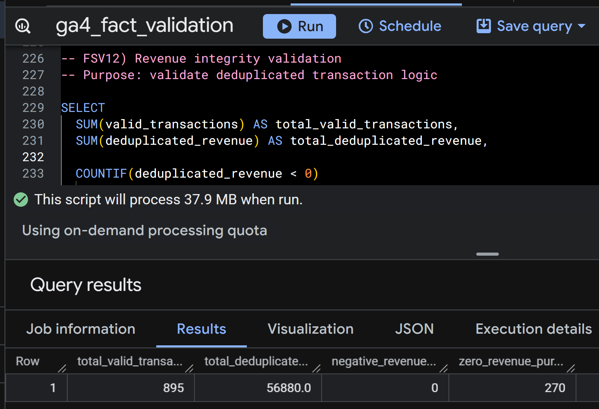

### Key Findings

- Total valid transactions equal 895 after session-level aggregation.
- Deduplicated revenue equals 56,880.0.
- No negative revenue sessions were detected.
- 270 purchase sessions have purchase activity but zero deduplicated revenue, aligned with the invalid transaction ID / missing revenue issue identified during staging validation.
- Revenue inflation risk is controlled by transaction-level deduplication.

### Status

```text
PASS WITH KNOWN PURCHASE QUALITY LIMITATIONS
```

---

## FSV13 — Revenue Outlier Inspection

### Key Findings

- Highest revenue session is 1,200.0.
- High-revenue sessions are visible and traceable by `event_date`, `session_key`, `session_source`, and `session_medium`.
- No negative or structurally invalid revenue values were observed in the outlier inspection.
- This check supports revenue QA but does not require a stored screenshot.

### Screenshot

```text
Not stored. This was a supporting revenue outlier inspection.
```

### Status

```text
PASS
```

---

## FSV14 — Purchase Quality Flag Validation

### Result

| invalid_transaction_id_events | missing_purchase_revenue_events | zero_purchase_revenue_events | negative_purchase_revenue_events |
|---:|---:|---:|---:|
| 300 | 300 | 0 | 0 |

### Key Findings

- 300 purchase events have invalid transaction IDs.
- 300 purchase events have missing purchase revenue.
- No zero-revenue purchase events were detected.
- No negative-revenue purchase events were detected.
- These values match the known purchase-quality issues identified during staging validation.

### Screenshot

```text
Not stored. This was a supporting purchase quality flag check.
```

### Status

```text
PASS WITH KNOWN PURCHASE QUALITY LIMITATIONS
```

---

## FSV15 — Daily Session Trend Validation

### Result

The daily trend output contains 31 rows, covering each date from 2021-01-01 to 2021-01-31.

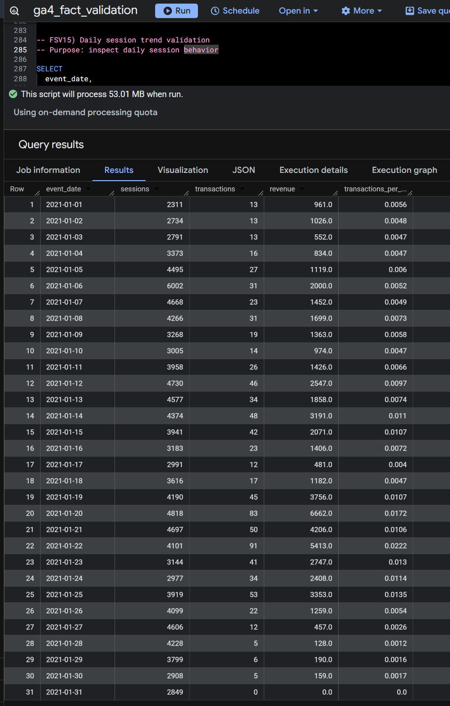

### Key Findings

- All 31 dates are present in the daily session trend.
- Daily sessions, transactions, revenue, and transactions-per-session are populated.
- Revenue and transaction activity vary by day, which is expected for ecommerce behavior.
- 2021-01-31 shows zero transactions and zero revenue, which should be monitored but does not break validation.

### Status

```text
PASS
```

---

## FSV16 — Final Fact Validation Status

### Result

| total_rows | fact_validation_status | null_event_date | null_session_key | null_user_pseudo_id | duplicate_session_grain_rows | negative_revenue_sessions |
|---:|---|---:|---:|---:|---:|---:|
| 118,618 | PASS | 0 | 0 | 0 | 0 | 0 |

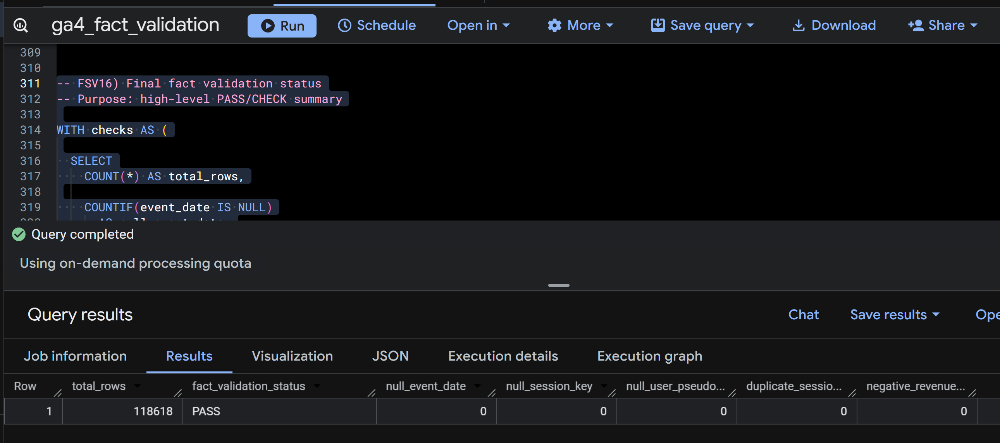

### Key Findings

- Final validation status is `PASS`.
- No null values exist in critical grain fields.
- No duplicate session-grain rows were detected.
- No negative revenue sessions were detected.
- The session fact table is validated and ready for downstream mart construction.

### Status

```text
FINAL SESSION FACT VALIDATION STATUS: PASS
```

---

## Phase 2B Summary

- [x] Created session fact validation SQL file
- [x] Validated fact table row count
- [x] Validated session grain uniqueness
- [x] Validated date coverage
- [x] Validated critical null fields
- [x] Validated session duration behavior
- [x] Validated event count behavior
- [x] Validated acquisition distribution
- [x] Quantified session-level attribution sparsity
- [x] Validated engagement coverage
- [x] Validated ecommerce funnel event totals
- [x] Validated purchase session behavior
- [x] Validated revenue integrity
- [x] Inspected revenue outliers
- [x] Validated purchase quality flags
- [x] Validated daily session trend
- [x] Produced final session fact validation status
- [x] Saved selected validation screenshots
- [x] Pushed validation outputs to GitHub

---

# Full Data Expansion Plan

## Current Scope

```text
2021-01-01 to 2021-01-31
```

## Reason

The one-month sample window is used as a controlled development sandbox to reduce query cost, simplify debugging, stabilize business logic, validate transformations faster, and build reliable modeling patterns before expanding scope.

## When to Expand

Expand from the one-month sample window to the full available GA4 range only after:

- staging logic is stable
- session fact table passes validation
- mart logic is stable
- KPI definitions are validated
- revenue deduplication logic is implemented
- attribution handling is documented

## Full Available GA4 Range

```text
2020-11-01 to 2021-01-31
```

---


````markdown
---

# Phase 2C — Date Dimension Construction (dim_date)

## Status

✅ Completed

## Objective

Create a reusable date dimension table to support consistent calendar-based reporting across downstream marts and BI dashboards.

## Main SQL File

```text
sql/marts/01_dim_date.sql
````

## Validation SQL File

```text
sql/validation/ga4/04b_validate_dim_date.sql
```

## Target Table

```text
commercial-analytics-bq-dbx.commercial_analytics_us.dim_date
```

## Grain

```text
one row per date_day
```

## Key Fields Created

* `date_day`
* `calendar_year`
* `calendar_quarter`
* `calendar_month`
* `calendar_week`
* `day_of_month`
* `day_name`
* `day_name_short`
* `month_name`
* `month_name_short`
* `year_month`
* `date_label`
* `is_weekend`
* `is_weekday`
* `is_month_start`
* `is_month_end`
* `is_quarter_start`
* `is_quarter_end`
* `is_year_start`
* `is_year_end`


#### Phase 2D — Date Dimension Validation
## Status

✅ Completed

## Validation SQL File

```text
sql/validation/ga4/04b_validate_dim_date.sql
```

## Target Table

```text
commercial-analytics-bq-dbx.commercial_analytics_us.dim_date
```

## Screenshot Directory

```text
bi/screenshots/ga4/dim_date_validation/
```

---

## DV1 — Date Range Validation

### Purpose

Confirm that `dim_date` covers the expected January 2021 development window.

### Result

| total_dates | min_date   | max_date   | distinct_dates |
| ----------: | ---------- | ---------- | -------------: |
|          31 | 2021-01-01 | 2021-01-31 |             31 |

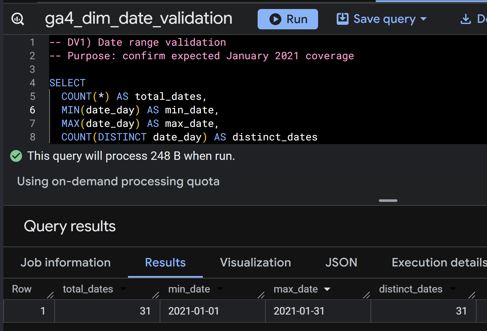

### Key Findings

* The table contains 31 calendar dates.
* Minimum date is 2021-01-01.
* Maximum date is 2021-01-31.
* Distinct date count equals total row count.

### Status

```text
PASS
```

---

## DV2 — Date Grain Uniqueness Validation

### Purpose

Confirm that `dim_date` contains exactly one row per `date_day`.

### Result

| total_rows | distinct_date_days | duplicate_date_rows |
| ---------: | -----------------: | ------------------: |
|         31 |                 31 |                   0 |

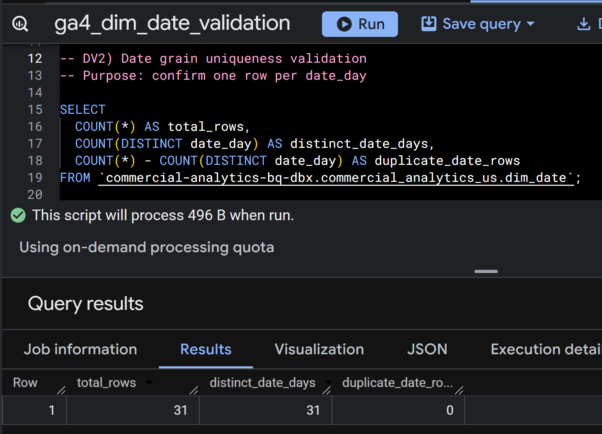

### Key Findings

* Each `date_day` appears only once.
* No duplicate date rows exist.
* The dimension grain is valid and safe for joins.

### Status

```text
PASS
```

---

## DV3 — Null Critical Field Validation

### Purpose

Confirm that required date attributes are fully populated.

### Result

| total_rows | null_date_day | null_calendar_year | null_calendar_quarter | null_calendar_month | null_day_of_month | null_day_name | null_month_name | null_year_month |
| ---------: | ------------: | -----------------: | --------------------: | ------------------: | ----------------: | ------------: | --------------: | --------------: |
|         31 |             0 |                  0 |                     0 |                   0 |                 0 |             0 |               0 |               0 |

### Key Findings

* No null values exist in critical date fields.
* Calendar, month, day, and reporting label attributes are fully populated.

### Screenshot

```text
Not stored. This was a supporting structural null check.
```

### Status

```text
PASS
```

---

## DV4 — Weekend / Weekday Logic Validation

### Purpose

Confirm that weekend and weekday flags are mutually consistent.

### Result

| total_rows | weekend_days | weekday_days | conflicting_weekend_weekday_rows | unclassified_days |
| ---------: | -----------: | -----------: | -------------------------------: | ----------------: |
|         31 |           10 |           21 |                                0 |                 0 |

### Key Findings

* January 2021 contains 10 weekend days and 21 weekdays.
* No date is marked as both weekend and weekday.
* No date is left unclassified.

### Screenshot

```text
Not stored. This was a supporting calendar logic check.
```

### Status

```text
PASS
```

---

## DV5 — Period Boundary Validation

### Purpose

Inspect month, quarter, and year boundary flags.

### Result

| month_start_days | month_end_days | quarter_start_days | quarter_end_days | year_start_days | year_end_days |
| ---------------: | -------------: | -----------------: | ---------------: | --------------: | ------------: |
|                1 |              1 |                  1 |                0 |               1 |             0 |

### Key Findings

* January 1 is correctly flagged as month start, quarter start, and year start.
* January 31 is correctly flagged as month end.
* Quarter-end and year-end flags are zero because the January 2021 window does not include quarter-end or year-end dates.

### Screenshot

```text
Not stored. This was a supporting period-boundary check.
```

### Status

```text
PASS
```

---

## DV6 — Final dim_date Validation Status

### Purpose

Provide a high-level PASS/CHECK summary for the `dim_date` table.

### Result

| total_rows | distinct_date_days | min_date   | max_date   | dim_date_validation_status | null_date_day | conflicting_weekend_weekday_rows | unclassified_days |
| ---------: | -----------------: | ---------- | ---------- | -------------------------- | ------------: | -------------------------------: | ----------------: |
|         31 |                 31 | 2021-01-01 | 2021-01-31 | PASS                       |             0 |                                0 |                 0 |

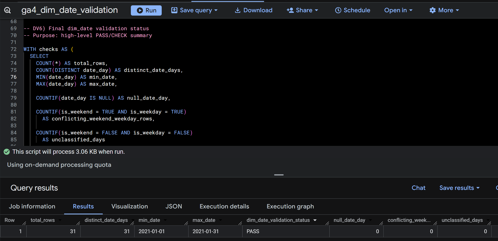

### Key Findings

* Final validation status is `PASS`.
* Date range is complete.
* Date grain is unique.
* No critical nulls were detected.
* Weekend and weekday flags are consistent.
* `dim_date` is validated and ready for downstream mart joins.

### Status

```text
FINAL DIM_DATE VALIDATION STATUS: PASS
```

---


## Validation Summary

| Check                   | Result |
| ----------------------- | ------ |
| Date range coverage     | PASS   |
| Date grain uniqueness   | PASS   |
| Critical null fields    | PASS   |
| Weekend / weekday logic | PASS   |
| Period boundary logic   | PASS   |
| Final validation status | PASS   |

## Evidence Screenshots Stored

```text
bi/screenshots/ga4/dim_date_validation/ga4_dim_date_validation_v01_date_range.png
bi/screenshots/ga4/dim_date_validation/ga4_dim_date_validation_v02_grain_uniqueness.png
bi/screenshots/ga4/dim_date_validation/ga4_dim_date_validation_v06_final_status.png
```

## Key Findings

* `dim_date` contains 31 calendar dates from 2021-01-01 to 2021-01-31.
* The table has one row per `date_day`.
* No duplicate date rows were detected.
* No critical date attributes are missing.
* Weekend and weekday logic is consistent.
* Final validation status is `PASS`.

---

# Phase 2E — Channel Dimension Construction (dim_channel)

## Status

✅ Completed

## Objective

Create a reusable acquisition channel dimension from session-level GA4 source, medium, and campaign fields.

## Main SQL File

```text
sql/marts/02_dim_channel.sql
```

## Validation SQL File

```text
sql/validation/ga4/05b_validate_dim_channel.sql
```

## Target Table

```text
commercial-analytics-bq-dbx.commercial_analytics_us.dim_channel
```

## Grain

```text
one row per source + medium + campaign combination
```

## Key Fields Created

* `channel_key`
* `source`
* `medium`
* `campaign`
* `channel_group`
* `has_not_set_value`
* `has_data_deleted_value`
* `has_other_value`

## Modeling Decision

Channel classification is handled in a dedicated dimension table instead of being repeated inside each mart.

The logic prioritizes `Data Deleted` before `Other`, because privacy/data-deletion values are more important data-quality signals than generic `<Other>` buckets.


# Phase 2F — Channel Dimension Validation

## Status

✅ Completed

## Validation SQL File

```text
sql/validation/ga4/05b_validate_dim_channel.sql
```

## Target Table

```text
commercial-analytics-bq-dbx.commercial_analytics_us.dim_channel
```

## Screenshot Directory

```text
bi/screenshots/ga4/dim_channel_validation/
```

---

## CV1 — Channel Row Count Validation

### Purpose

Confirm that `dim_channel` was created successfully and contains rows.

### Result

| total_channel_rows |
| -----------------: |
|                 66 |

### Key Findings

* The channel dimension contains 66 distinct acquisition combinations.
* The table was created successfully.

### Screenshot

```text
Not stored. This was a basic row-count sanity check.
```

### Status

```text
PASS
```

---

## CV2 — Channel Grain Uniqueness Validation

### Purpose

Confirm that `dim_channel` contains one row per `channel_key`.

### Result

| total_rows | distinct_channel_keys | duplicate_channel_key_rows |
| ---------: | --------------------: | -------------------------: |
|         66 |                    66 |                          0 |

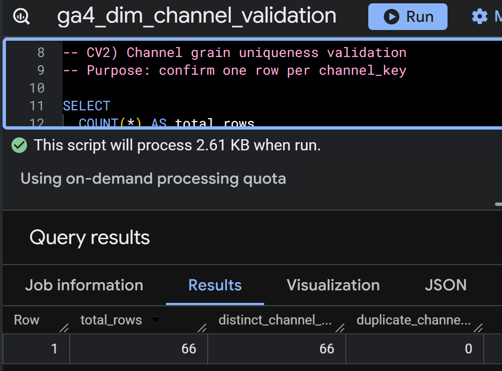

### Key Findings

* Each `channel_key` appears only once.
* No duplicate channel keys were detected.
* The dimension grain is valid and safe for downstream joins.

### Status

```text
PASS
```

---

## CV3 — Source / Medium / Campaign Uniqueness Validation

### Purpose

Confirm that the source + medium + campaign combination is unique.

### Result

| total_rows | distinct_source_medium_campaign | duplicate_source_medium_campaign_rows |
| ---------: | ------------------------------: | ------------------------------------: |
|         66 |                              66 |                                     0 |

### Key Findings

* The natural acquisition grain is unique.
* No duplicate source / medium / campaign combinations exist.
* `channel_key` correctly represents the intended dimension grain.

### Screenshot

```text
Not stored. This was a supporting grain validation check.
```

### Status

```text
PASS
```

---

## CV4 — Null Critical Field Validation

### Purpose

Confirm that required channel fields are populated.

### Result

| total_rows | null_channel_key | null_source | null_medium | null_campaign | null_channel_group |
| ---------: | ---------------: | ----------: | ----------: | ------------: | -----------------: |
|         66 |                0 |           0 |           0 |             0 |                  0 |

### Key Findings

* No null values exist in critical channel fields.
* Source, medium, campaign, and channel group are fully populated.
* The dimension is structurally safe for BI and mart joins.

### Screenshot

```text
Not stored. This was a supporting null check.
```

### Status

```text
PASS
```

---

## CV5 — Channel Group Distribution Validation

### Purpose

Inspect assigned channel groups inside `dim_channel`.

### Result

| channel_group  | channel_combinations | channel_combination_share |
| -------------- | -------------------: | ------------------------: |
| Referral       |                   48 |                    0.7273 |
| Organic Search |                    7 |                    0.1061 |
| Data Deleted   |                    3 |                    0.0455 |
| Email          |                    2 |                    0.0303 |
| Paid Search    |                    2 |                    0.0303 |
| Affiliate      |                    1 |                    0.0152 |
| Direct         |                    1 |                    0.0152 |
| Other          |                    1 |                    0.0152 |
| Unattributed   |                    1 |                    0.0152 |

### Key Findings

* Referral has the largest number of distinct channel combinations.
* `Data Deleted` is correctly classified as its own channel group.
* Unattributed, Direct, Other, Affiliate, and Email channels are present.
* Classification coverage is complete.

### Screenshot

```text
Not stored. This was a supporting channel-combination distribution check.
```

### Status

```text
PASS
```

---

## CV6 — Join Coverage Validation Against fact_sessions_daily

### Purpose

Confirm that every session fact row can map to one `dim_channel` row.

### Result

| fact_rows | matched_channel_rows | unmatched_fact_rows | match_rate |
| --------: | -------------------: | ------------------: | ---------: |
|   118,618 |              118,618 |                   0 |        1.0 |

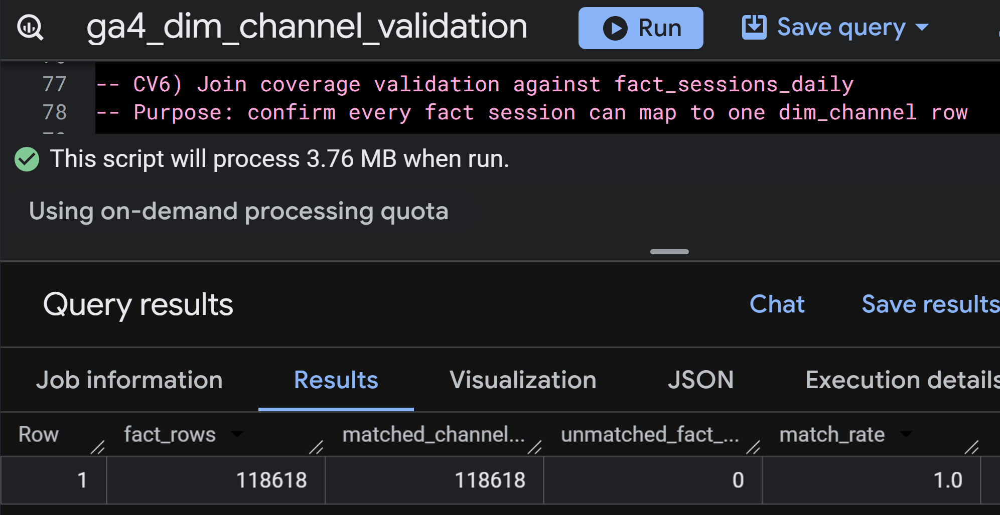

### Key Findings

* All fact session rows successfully match to `dim_channel`.
* No unmatched fact rows were detected.
* Join coverage is 100%.
* The channel dimension is ready for downstream mart construction.

### Status

```text
PASS
```

---

## CV7 — Session Distribution by Channel Group

### Purpose

Inspect session volume after joining `fact_sessions_daily` to `dim_channel`.

### Result

| channel_group  | sessions | session_share |
| -------------- | -------: | ------------: |
| Unattributed   |   91,291 |        0.7696 |
| Organic Search |   13,273 |        0.1119 |
| Referral       |    7,158 |        0.0603 |
| Direct         |    3,175 |        0.0268 |
| Other          |    2,011 |        0.0170 |
| Data Deleted   |      753 |        0.0063 |
| Paid Search    |      615 |        0.0052 |
| Affiliate      |      296 |        0.0025 |
| Email          |       46 |        0.0004 |

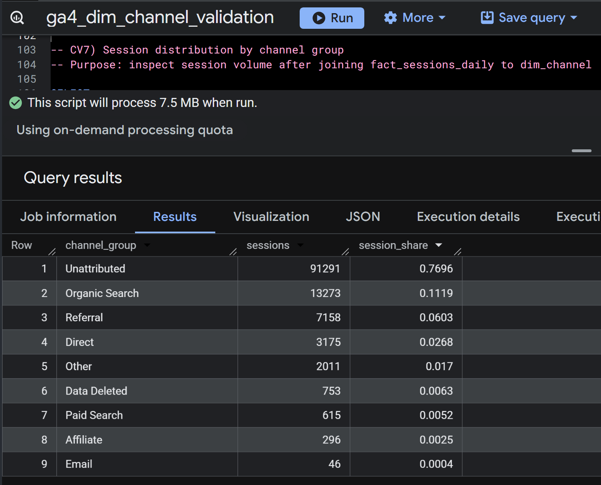

### Key Findings

* Unattributed sessions dominate the dataset at 76.96%.
* Organic Search is the largest identifiable channel group.
* Referral, Direct, Paid Search, Affiliate, Email, Other, and Data Deleted are all represented.
* High unattributed volume is a source-data limitation, not a modeling failure.

### Status

```text
PASS WITH HIGH ATTRIBUTION SPARSITY OBSERVED
```

---

## CV8 — Final dim_channel Validation Status

### Purpose

Provide a high-level PASS/CHECK summary for the `dim_channel` table.

### Result

| total_rows | distinct_channel_keys | dim_channel_validation_status | null_channel_key | null_source | null_medium | null_campaign | null_channel_group | unmatched_fact_rows |
| ---------: | --------------------: | ----------------------------- | ---------------: | ----------: | ----------: | ------------: | -----------------: | ------------------: |
|         66 |                    66 | PASS                          |                0 |           0 |           0 |             0 |                  0 |                   0 |

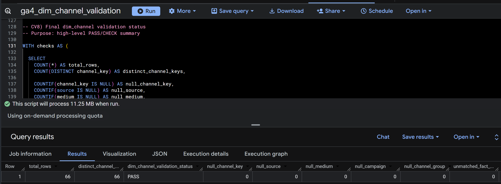

### Key Findings

* Final validation status is `PASS`.
* Channel grain is unique.
* No critical nulls were detected.
* All fact rows successfully join to the channel dimension.
* `dim_channel` is validated and ready for `mart_channel_daily`.

### Status

```text
FINAL DIM_CHANNEL VALIDATION STATUS: PASS
```

---


````markdown
---

## Validation Summary

| Check                                  | Result                                  |
| -------------------------------------- | --------------------------------------- |
| Channel row count                      | PASS                                    |
| Channel grain uniqueness               | PASS                                    |
| Source / medium / campaign uniqueness  | PASS                                    |
| Critical null fields                   | PASS                                    |
| Channel group distribution             | PASS                                    |
| Join coverage to `fact_sessions_daily` | PASS                                    |
| Session distribution by channel group  | PASS with attribution sparsity observed |
| Final validation status                | PASS                                    |

## Evidence Screenshots Stored

```text
bi/screenshots/ga4/dim_channel_validation/ga4_dim_channel_validation_v02_grain_uniqueness.png
bi/screenshots/ga4/dim_channel_validation/ga4_dim_channel_validation_v06_join_coverage.png
bi/screenshots/ga4/dim_channel_validation/ga4_dim_channel_validation_v07_channel_distribution.png
bi/screenshots/ga4/dim_channel_validation/ga4_dim_channel_validation_v08_final_status.png
```

## Key Findings

* `dim_channel` contains 66 distinct acquisition combinations.
* Channel grain is unique.
* No critical nulls were detected.
* Join coverage from `fact_sessions_daily` to `dim_channel` is 100%.
* Unattributed traffic dominates session volume, which is a source-data limitation rather than a modeling issue.
* Final validation status is `PASS`.

---

# Phase 2G — Channel Daily Mart Construction

## Status

✅ Completed

## Objective

Create a BI-ready daily channel performance mart by combining validated session-level facts with reusable channel and date dimensions.

## Main SQL File

```text
sql/marts/03_mart_channel_daily.sql
```

## Validation SQL File

```text
sql/validation/ga4/06b_validate_mart_channel_daily.sql
```

## Target Table

```text
commercial-analytics-bq-dbx.commercial_analytics_us.mart_channel_daily
```

## Source Tables

```text
commercial-analytics-bq-dbx.commercial_analytics_us.fact_sessions_daily
commercial-analytics-bq-dbx.commercial_analytics_us.dim_channel
commercial-analytics-bq-dbx.commercial_analytics_us.dim_date
```

## Grain

```text
one row per event_date + channel_key
```

## Key Metrics Created

* `sessions`
* `users`
* `total_events`
* `page_view_events`
* `user_engagement_events`
* `scroll_events`
* `ecommerce_funnel_events`
* `view_item_events`
* `add_to_cart_events`
* `begin_checkout_events`
* `purchase_event_rows`
* `transactions`
* `revenue`
* `engaged_sessions`
* `engaged_event_rows`
* `total_engagement_time_msec`

## KPI Fields Created

* `users_per_session`
* `events_per_session`
* `page_views_per_session`
* `engaged_session_rate`
* `avg_engagement_time_msec_per_session`
* `view_item_rate_per_session`
* `add_to_cart_rate_per_session`
* `begin_checkout_rate_per_session`
* `purchase_event_rate_per_session`
* `session_conversion_rate`
* `user_conversion_rate`
* `revenue_per_session`
* `revenue_per_user`
* `average_order_value`
* `view_to_cart_rate`
* `cart_to_checkout_rate`
* `checkout_to_purchase_rate`
* `view_to_purchase_rate`


## Modeling Notes

* The mart uses `fact_sessions_daily` as the metric base.
* `dim_channel` provides reusable channel classification.
* `dim_date` provides calendar attributes for daily reporting.
* Revenue uses deduplicated transaction logic inherited from `fact_sessions_daily`.
* User totals are not reconciled by summing mart-level users because users can appear across multiple channels or dates.

## Status

```text
MART_CHANNEL_DAILY BUILD STATUS: COMPLETED
```

---

#  Phase 2H — Channel Daily Mart Validation

## Status

✅ Completed

## Validation SQL File

```text
sql/validation/ga4/06b_validate_mart_channel_daily.sql
```

## Target Table

```text
commercial-analytics-bq-dbx.commercial_analytics_us.mart_channel_daily
```

## Screenshot Directory

```text
bi/screenshots/ga4/mart_channel_daily_validation/
```

---

## MCV1 — Mart Row Count Validation

### Purpose

Confirm that `mart_channel_daily` was created successfully and contains rows.

### Result

| total_mart_rows |
| --------------: |
|             688 |

### Key Findings

* The mart contains 688 channel-date rows.
* The table was created successfully.

### Screenshot

```text
Not stored. This was a basic row-count sanity check.
```

### Status

```text
PASS
```

---

## MCV2 — Mart Grain Uniqueness Validation

### Purpose

Confirm that the mart contains one row per `event_date + channel_key`.

### Result

| total_rows | distinct_date_channel_keys | duplicate_date_channel_rows |
| ---------: | -------------------------: | --------------------------: |
|        688 |                        688 |                           0 |

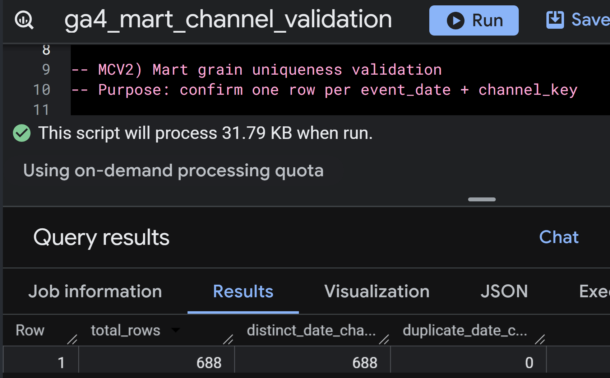

### Key Findings

* The mart grain is valid.
* No duplicate date-channel rows were detected.
* The table is safe for downstream BI aggregation.

### Status

```text
PASS
```

---

## MCV3 — Date Coverage Validation

### Purpose

Confirm expected January 2021 date coverage.

### Result

| min_event_date | max_event_date | distinct_dates |
| -------------- | -------------- | -------------: |
| 2021-01-01     | 2021-01-31     |             31 |

### Key Findings

* The mart covers the full expected January 2021 range.
* All 31 dates are represented.

### Screenshot

```text
Not stored. This was a supporting date coverage check.
```

### Status

```text
PASS
```

---

## MCV4 — Critical Null Validation

### Purpose

Confirm required mart fields are populated.

### Result

| total_rows | null_event_date | null_channel_key | null_channel_group | null_source | null_medium | null_campaign | null_calendar_year | null_calendar_month | null_year_month | null_sessions | null_users | null_transactions | null_revenue |
| ---------: | --------------: | ---------------: | -----------------: | ----------: | ----------: | ------------: | -----------------: | ------------------: | --------------: | ------------: | ---------: | ----------------: | -----------: |
|        688 |               0 |                0 |                  0 |           0 |           0 |             0 |                  0 |                   0 |               0 |             0 |          0 |                 0 |            0 |

### Key Findings

* No nulls exist in required mart fields.
* Channel, date, and KPI fields are fully populated.
* The mart is structurally ready for dashboarding.

### Screenshot

```text
Not stored. This was a supporting null validation check.
```

### Status

```text
PASS
```

---

## MCV5 — Fact-to-Mart Reconciliation

### Purpose

Confirm key totals reconcile back to `fact_sessions_daily`.

### Result

| fact_sessions | mart_sessions | session_difference | fact_total_events | mart_total_events | event_difference | fact_transactions | mart_transactions | transaction_difference | fact_revenue | mart_revenue | revenue_difference |
| ------------: | ------------: | -----------------: | ----------------: | ----------------: | ---------------: | ----------------: | ----------------: | ---------------------: | -----------: | -----------: | -----------------: |
|       118,618 |       118,618 |                  0 |         1,210,147 |         1,210,147 |                0 |               895 |               895 |                      0 |     56,880.0 |     56,880.0 |                0.0 |

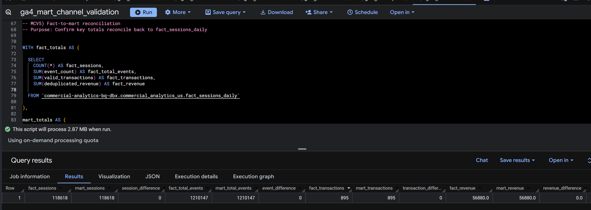

### Key Findings

* Sessions reconcile exactly to the fact table.
* Total events reconcile exactly to the fact table.
* Transactions reconcile exactly to the fact table.
* Revenue reconciles exactly to the fact table.
* User totals were intentionally not reconciled by summing mart users because users can appear across multiple dates or channels.

### Status

```text
PASS
```

---

## MCV6 — Channel Distribution Validation

### Purpose

Inspect sessions, transactions, revenue, conversion, and AOV by channel group.

### Result

| channel_group  | sessions | session_share | transactions |  revenue | session_conversion_rate | average_order_value |
| -------------- | -------: | ------------: | -----------: | -------: | ----------------------: | ------------------: |
| Unattributed   |   91,291 |        0.7696 |          621 | 39,701.0 |                  0.0068 |               63.93 |
| Organic Search |   13,273 |        0.1119 |          104 |  6,532.0 |                  0.0078 |               62.81 |
| Referral       |    7,158 |        0.0603 |          129 |  8,164.0 |                  0.0180 |               63.29 |
| Direct         |    3,175 |        0.0268 |           17 |  1,002.0 |                  0.0054 |               58.94 |
| Other          |    2,011 |        0.0170 |            7 |    262.0 |                  0.0035 |               37.43 |
| Data Deleted   |      753 |        0.0063 |           14 |  1,102.0 |                  0.0186 |               78.71 |
| Paid Search    |      615 |        0.0052 |            2 |     94.0 |                  0.0033 |               47.00 |
| Affiliate      |      296 |        0.0025 |            1 |     23.0 |                  0.0034 |               23.00 |
| Email          |       46 |        0.0004 |            0 |      0.0 |                  0.0000 |                null |

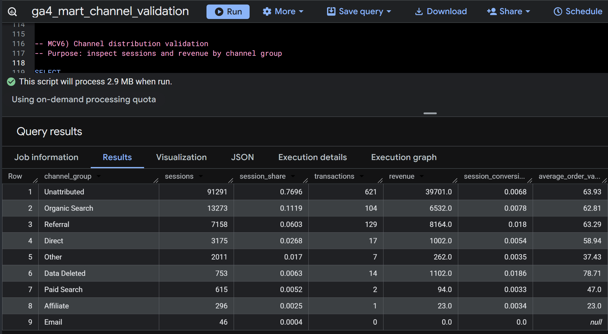

### Key Findings

* Unattributed sessions dominate the dataset at 76.96%.
* Organic Search is the largest identifiable traffic channel.
* Referral has stronger conversion than several larger channels.
* Email has sessions but no transactions in the selected period.
* High unattributed traffic is a source-data limitation and should be disclosed in final reporting.

### Status

```text
PASS WITH HIGH ATTRIBUTION SPARSITY OBSERVED
```

---

## MCV7 — KPI Boundary Validation

### Purpose

Confirm calculated KPI rates are within reasonable bounds.

### Result

| total_rows | negative_session_conversion_rate_rows | negative_user_conversion_rate_rows | invalid_engaged_session_rate_rows | negative_view_to_cart_rate_rows | negative_cart_to_checkout_rate_rows | negative_checkout_to_purchase_rate_rows | negative_revenue_rows |
| ---------: | ------------------------------------: | ---------------------------------: | --------------------------------: | ------------------------------: | ----------------------------------: | --------------------------------------: | --------------------: |
|        688 |                                     0 |                                  0 |                                 0 |                               0 |                                   0 |                                       0 |                     0 |

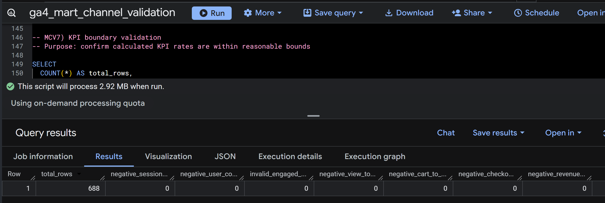

### Key Findings

* No negative conversion rates were detected.
* No invalid engagement rates were detected.
* No negative funnel rates were detected.
* No negative revenue rows were detected.
* KPI calculations are safe for BI use.

### Status

```text
PASS
```

---

## MCV8 — Daily Trend Validation

### Purpose

Inspect daily sessions, transactions, revenue, conversion rate, and revenue per session.

### Result Summary

| date_range               | distinct_days | notes                                                                           |
| ------------------------ | ------------: | ------------------------------------------------------------------------------- |
| 2021-01-01 to 2021-01-31 |            31 | Daily sessions, transactions, and revenue were populated across the full month. |

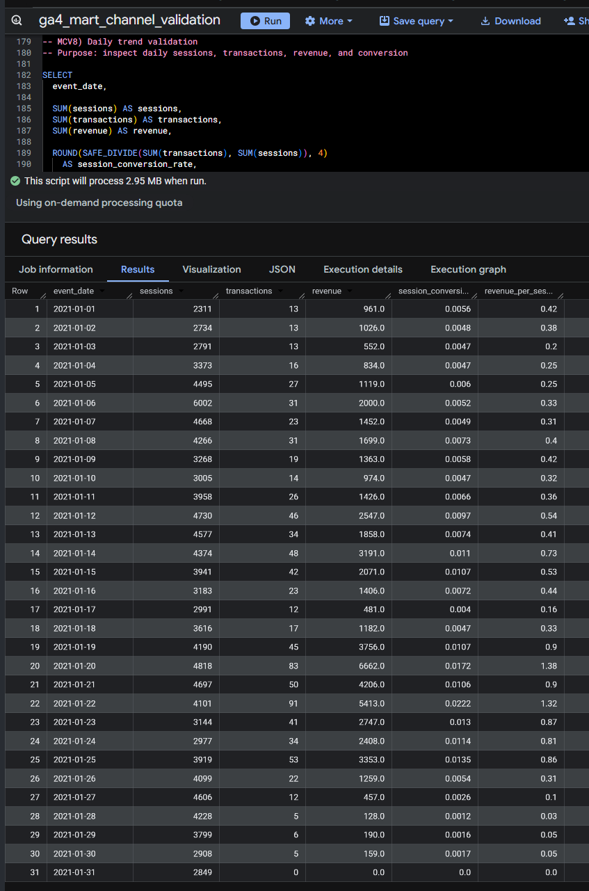

### Key Findings

* Daily trend output covers all 31 days in January 2021.
* Sessions, transactions, revenue, conversion rate, and revenue per session are available for daily reporting.
* January 31 has zero transactions and zero revenue, which should be treated as an observed daily pattern rather than a pipeline failure.

### Status

```text
PASS
```

---

## MCV9 — High Revenue Channel-Date Inspection

### Purpose

Inspect highest revenue channel-date rows.

### Result Summary

The highest revenue rows are concentrated mostly in the `Unattributed` channel group, with selected identifiable Organic Search and Referral rows also appearing.

### Key Findings

* Highest revenue channel-date row: `2021-01-20`, `Unattributed`, revenue `5,288.0`.
* Several high-revenue rows belong to `(not set)` acquisition fields.
* This reinforces the attribution sparsity already observed in earlier validation checks.
* The output is useful for analyst inspection but is not included as a core project screenshot to avoid overloading the portfolio with diagnostic tables.

### Screenshot

```text
Not stored in the project evidence set. Used for analyst inspection only.
```

### Status

```text
REVIEWED
```

---

## MCV10 — Final mart_channel_daily Validation Status

### Purpose

Provide a high-level PASS/CHECK summary for `mart_channel_daily`.

### Result

| total_rows | distinct_date_channel_keys | min_event_date | max_event_date | mart_channel_daily_validation_status | null_event_date | null_channel_key | null_channel_group | invalid_sessions_rows | negative_revenue_rows | invalid_engaged_session_rate_rows | session_difference | transaction_difference | revenue_difference |
| ---------: | -------------------------: | -------------- | -------------- | ------------------------------------ | --------------: | ---------------: | -----------------: | --------------------: | --------------------: | --------------------------------: | -----------------: | ---------------------: | -----------------: |
|        688 |                        688 | 2021-01-01     | 2021-01-31     | PASS                                 |               0 |                0 |                  0 |                     0 |                     0 |                                 0 |                  0 |                      0 |                0.0 |

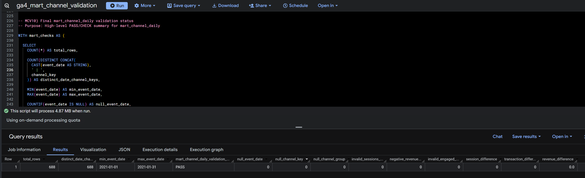

### Key Findings

* Final validation status is `PASS`.
* Mart grain is unique.
* Date coverage is complete for January 2021.
* No critical nulls were detected.
* No invalid session rows were detected.
* No negative revenue rows were detected.
* Fact-to-mart reconciliation passes for sessions, transactions, and revenue.

### Status

```text
FINAL MART_CHANNEL_DAILY VALIDATION STATUS: PASS
```

---


## Validation Summary

| Check                                | Result                                  |
| ------------------------------------ | --------------------------------------- |
| Mart row count                       | PASS                                    |
| Mart grain uniqueness                | PASS                                    |
| Date coverage                        | PASS                                    |
| Critical null fields                 | PASS                                    |
| Fact-to-mart reconciliation          | PASS                                    |
| Channel distribution                 | PASS with attribution sparsity observed |
| KPI boundary validation              | PASS                                    |
| Daily trend validation               | PASS                                    |
| High-revenue channel-date inspection | Reviewed                                |
| Final validation status              | PASS                                    |

## Evidence Screenshots Stored

```text
bi/screenshots/ga4/mart_channel_daily_validation/ga4_mart_channel_daily_validation_v02_grain_uniqueness.png
bi/screenshots/ga4/mart_channel_daily_validation/ga4_mart_channel_daily_validation_v05_fact_reconciliation.png
bi/screenshots/ga4/mart_channel_daily_validation/ga4_mart_channel_daily_validation_v06_channel_distribution.png
bi/screenshots/ga4/mart_channel_daily_validation/ga4_mart_channel_daily_validation_v07_kpi_boundary.png
bi/screenshots/ga4/mart_channel_daily_validation/ga4_mart_channel_daily_validation_v08_daily_trend.png
bi/screenshots/ga4/mart_channel_daily_validation/ga4_mart_channel_daily_validation_v10_final_status.png
```

## Key Findings

* `mart_channel_daily` contains 688 channel-date rows.
* The mart has one row per `event_date + channel_key`.
* No duplicate date-channel rows were detected.
* The mart reconciles exactly back to `fact_sessions_daily` for sessions, events, transactions, and revenue.
* Revenue uses deduplicated transaction logic inherited from the session fact table.
* Unattributed sessions represent 76.96% of session volume.
* KPI boundary checks passed.
* Final validation status is `PASS`.

---


````markdown
---

# Phase 2I — Executive KPI Mart Construction

## Status

✅ Completed

## Objective

Build a daily executive-level commercial analytics mart that summarizes commercial, traffic, engagement, funnel, revenue, and data quality metrics for BI reporting.

## Main SQL File

```text
sql/marts/04_mart_executive_daily.sql
````

## Target Table

```text
commercial-analytics-bq-dbx.commercial_analytics_us.mart_executive_daily
```

## Sources

```text
commercial-analytics-bq-dbx.commercial_analytics_us.mart_channel_daily
commercial-analytics-bq-dbx.commercial_analytics_us.fact_sessions_daily
```

## Grain

```text
one row per event_date
```

## Key Modeling Decision

Most executive metrics are additive and are aggregated from the validated `mart_channel_daily`.

However, `users` is a non-additive metric across channel-level rows. To avoid overcounting users, daily users are calculated directly from `fact_sessions_daily` using:

```sql
COUNT(DISTINCT user_pseudo_id)
```

This prevents inflated executive user counts when the same user appears across multiple channels on the same day.

## Metrics Created

### Traffic Metrics

* `sessions`
* `users`

### Engagement Metrics

* `total_events`
* `page_view_events`
* `user_engagement_events`
* `scroll_events`
* `engaged_sessions`
* `engaged_event_rows`
* `total_engagement_time_msec`

### Ecommerce Funnel Metrics

* `ecommerce_funnel_events`
* `view_item_events`
* `add_to_cart_events`
* `begin_checkout_events`
* `purchase_event_rows`

### Commercial Outcome Metrics

* `transactions`
* `revenue`

### Data Quality Metrics

* `invalid_purchase_transaction_id_events`
* `missing_purchase_revenue_events`
* `zero_purchase_revenue_events`
* `negative_purchase_revenue_events`

### Executive KPIs

* `users_per_session`
* `events_per_session`
* `page_views_per_session`
* `engaged_session_rate`
* `avg_engagement_time_msec_per_session`
* `view_item_rate_per_session`
* `add_to_cart_rate_per_session`
* `begin_checkout_rate_per_session`
* `purchase_event_rate_per_session`
* `session_conversion_rate`
* `user_conversion_rate`
* `revenue_per_session`
* `revenue_per_user`
* `average_order_value`
* `view_to_cart_rate`
* `cart_to_checkout_rate`
* `checkout_to_purchase_rate`
* `view_to_purchase_rate`

### Executive Flags

* `has_sessions`
* `has_transactions`
* `has_revenue`
* `has_purchase_quality_issue`

## Phase 2I Summary

* [x] Created `mart_executive_daily`
* [x] Aggregated additive executive metrics from `mart_channel_daily`
* [x] Calculated true daily users from `fact_sessions_daily`
* [x] Avoided channel-level user overcounting
* [x] Added executive traffic, engagement, funnel, conversion, and revenue KPIs
* [x] Added purchase quality indicators
* [x] Prepared the table for executive BI reporting and enhanced KPI modeling

---

# Phase 2J — Executive KPI Mart Validation

## Status

✅ Completed

## Objective

Validate the `mart_executive_daily` table for grain integrity, date coverage, source reconciliation, true user logic, KPI calculation accuracy, impossible values, and BI readiness.

## Validation SQL File

```text
sql/validation/ga4/07b_validate_mart_executive_daily.sql
```

## Target Table

```text
commercial-analytics-bq-dbx.commercial_analytics_us.mart_executive_daily
```

## Screenshot Directory

```text
bi/screenshots/ga4/mart_executive_daily_validation/
```

---

## Executive Daily Validation Screenshot Inventory

| Step | Validation Check                          | Screenshot File                                                              | Stored |
| ---- | ----------------------------------------- | ---------------------------------------------------------------------------- | ------ |
| EV1  | Row count and date range validation       | `ga4_mart_executive_daily_validation_v01_row_count_date_range.png`           | Yes    |
| EV2  | Grain uniqueness validation               | `ga4_mart_executive_daily_validation_v02_grain_uniqueness.png`               | Yes    |
| EV3  | Critical null validation                  | Not stored                                                                   | No     |
| EV4  | Date coverage validation against dim_date | Not stored                                                                   | No     |
| EV5  | Additive metric reconciliation            | `ga4_mart_executive_daily_validation_v05_additive_metric_reconciliation.png` | Yes    |
| EV6  | True daily users reconciliation           | Not stored                                                                   | No     |
| EV7  | Daily additive metric reconciliation      | Not stored                                                                   | No     |
| EV8  | KPI recalculation validation              | `ga4_mart_executive_daily_validation_v08_kpi_recalculation.png`              | Yes    |
| EV9  | Impossible value validation               | Not stored                                                                   | No     |
| EV10 | Daily trend inspection                    | `ga4_mart_executive_daily_validation_v10_daily_trend.png`                    | Yes    |
| EV11 | Final validation status                   | `ga4_mart_executive_daily_validation_v11_final_status.png`                   | Yes    |

---

## EV1 — Row Count and Date Range Validation

### Result

| total_rows | min_event_date | max_event_date | distinct_dates |
| ---------: | -------------- | -------------- | -------------: |
|         31 | 2021-01-01     | 2021-01-31     |             31 |

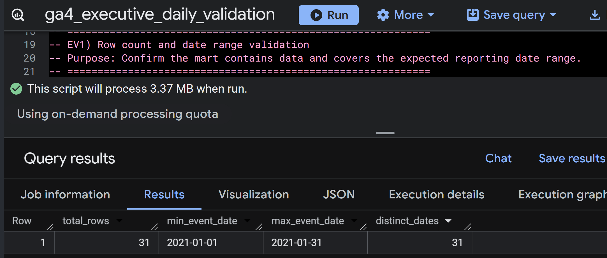

### Key Findings

* The executive mart contains 31 daily rows.
* The date range covers the full January 2021 reporting window.
* The number of distinct dates matches the total row count.

### Status

```text
PASS
```

---

## EV2 — Grain Uniqueness Validation

### Result

| total_rows | distinct_event_dates | duplicate_event_date_rows | grain_validation_status |
| ---------: | -------------------: | ------------------------: | ----------------------- |
|         31 |                   31 |                         0 | PASS                    |

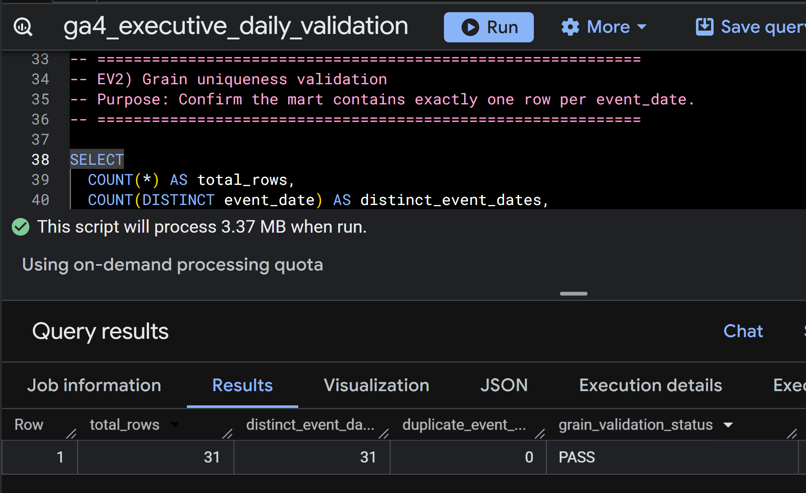

### Key Findings

* The executive mart contains exactly one row per `event_date`.
* No duplicate daily rows were detected.
* The table grain is valid for daily executive reporting.

### Status

```text
PASS
```

---

## EV3 — Critical Null Validation

### Key Findings

* No null values were detected in critical fields.
* Required base metrics and KPI fields are populated.
* Conditional KPI null checks passed for sessions, users, revenue, and transactions.

### Screenshot

```text
Not stored. This was a supporting structural validation check.
```

### Status

```text
PASS
```

---

## EV4 — Date Coverage Validation Against dim_date

### Result

| expected_dates_from_dim_date | dates_found_in_executive_mart | missing_dates_from_executive_mart | date_coverage_status |
| ---------------------------: | ----------------------------: | --------------------------------: | -------------------- |
|                           31 |                            31 |                                 0 | PASS                 |

### Key Findings

* All expected calendar dates from `dim_date` exist in `mart_executive_daily`.
* No reporting dates are missing.
* The executive mart aligns with the project calendar spine.

### Screenshot

```text
Not stored. This was a supporting calendar coverage check.
```

### Status

```text
PASS
```

---

## EV5 — Additive Metric Reconciliation With mart_channel_daily

### Result

Selected reconciliation outputs:

| Metric       | Executive Total | Channel Mart Total | Difference |
| ------------ | --------------: | -----------------: | ---------: |
| Sessions     |         118,618 |            118,618 |          0 |
| Total Events |       1,210,147 |          1,210,147 |          0 |
| Transactions |             895 |                895 |          0 |
| Revenue      |        56,880.0 |           56,880.0 |        0.0 |

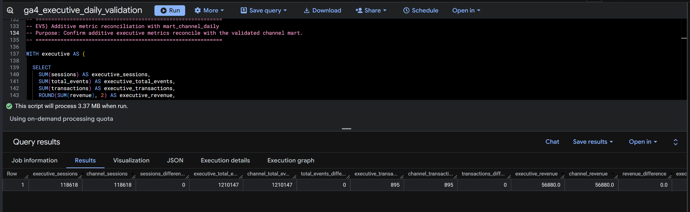

### Key Findings

* Additive executive metrics reconcile with `mart_channel_daily`.
* Sessions, total events, transactions, and revenue match exactly.
* Revenue remains consistent with the deduplicated upstream revenue logic.
* Users were intentionally excluded from this reconciliation because distinct users are not safely additive across channel-level rows.

### Status

```text
PASS
```

---

## EV6 — True Daily Users Reconciliation With fact_sessions_daily

### Key Findings

* Executive daily users were validated against `COUNT(DISTINCT user_pseudo_id)` from `fact_sessions_daily`.
* No mismatches were returned.
* This confirms that `mart_executive_daily` avoids channel-level user overcounting.

### Screenshot

```text
Not stored. The query returned zero discrepancy rows.
```

### Status

```text
PASS
```

---

## EV7 — Daily Additive Metric Reconciliation With mart_channel_daily

### Key Findings

* Each executive daily row was reconciled against the daily aggregation of `mart_channel_daily`.
* No daily mismatch rows were returned.
* Additive metrics remain consistent at both total and daily levels.

### Screenshot

```text
Not stored. The query returned zero discrepancy rows.
```

### Status

```text
PASS
```

---

## EV8 — KPI Recalculation Validation

### Result

The validation recalculated selected KPI fields from stored base metrics and compared them with the KPI values stored in `mart_executive_daily`.

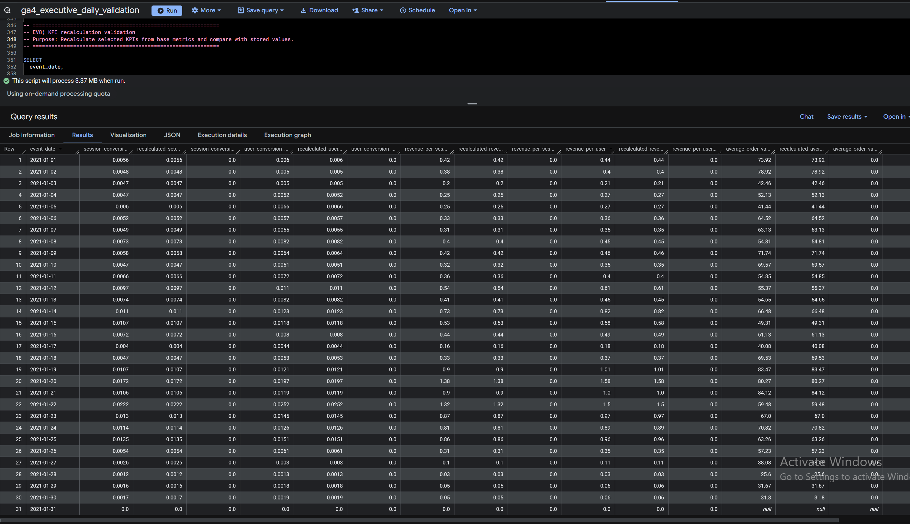

### Key Findings

* Recalculated KPI values matched stored KPI fields.
* Difference columns returned zero across the inspected daily rows.
* Conversion, revenue efficiency, and AOV calculations are internally consistent.

### Status

```text
PASS
```

---

## EV9 — Impossible Value Validation

### Key Findings

* Negative metric checks did not identify core metric issues.
* Funnel rate outputs were reviewed as a supporting anomaly inspection step.
* Event-count-based funnel ratios can exceed 1 when multiple downstream events occur relative to upstream event counts at daily aggregate grain.

### Screenshot

```text
Not stored. This was a supporting anomaly inspection check.
```

### Status

```text
PASS WITH FUNNEL-RATE INTERPRETATION NOTE
```

---

## EV10 — Daily Trend Inspection

### Result

The output contains daily executive KPI movement across the January 2021 reporting window.

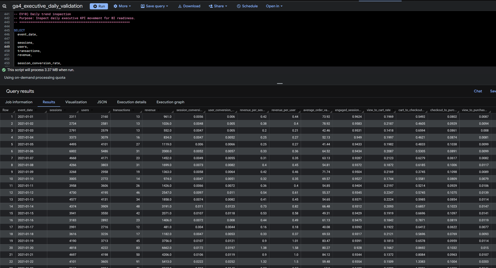

### Key Findings

* Daily sessions, users, transactions, and revenue are populated.
* Conversion and revenue KPIs are available for executive monitoring.
* January 31 shows zero transactions and zero revenue, which is consistent with the downstream KPI output.
* The table is ready for BI dashboard development and enhanced executive trend metrics.

### Status

```text
PASS
```

---

## EV11 — Final Validation Status

### Result

| total_rows | distinct_event_dates | duplicate_event_date_rows | null_event_date | null_sessions | null_users | null_transactions | null_revenue | executive_mart_validation_status |
| ---------: | -------------------: | ------------------------: | --------------: | ------------: | ---------: | ----------------: | -----------: | -------------------------------- |
|         31 |                   31 |                         0 |               0 |             0 |          0 |                 0 |            0 | PASS                             |

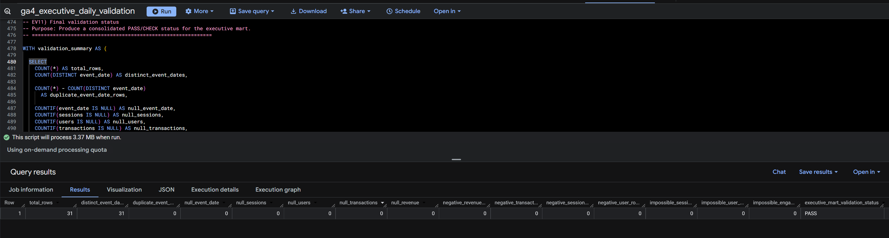

### Key Findings

* Final validation status is `PASS`.
* Date grain is unique.
* No critical nulls were detected.
* No negative session, user, transaction, or revenue values were detected.
* Core executive KPI fields are structurally ready for BI and enhanced mart development.

### Status

```text
FINAL EXECUTIVE MART VALIDATION STATUS: PASS
```

---

## Phase 2J Summary

* [x] Created executive daily validation SQL file
* [x] Validated row count and date range
* [x] Validated one-row-per-date grain
* [x] Checked critical null fields
* [x] Validated date coverage against `dim_date`
* [x] Reconciled additive executive metrics with `mart_channel_daily`
* [x] Validated true daily users against `fact_sessions_daily`
* [x] Reconciled daily additive metrics with channel daily aggregation
* [x] Recalculated selected KPI fields
* [x] Inspected impossible values and KPI anomalies
* [x] Inspected daily KPI trend for BI readiness
* [x] Produced final executive mart validation status
* [x] Saved selected evidence screenshots

## Evidence Screenshots Stored

```text
bi/screenshots/ga4/mart_executive_daily_validation/ga4_mart_executive_daily_validation_v01_row_count_date_range.png
bi/screenshots/ga4/mart_executive_daily_validation/ga4_mart_executive_daily_validation_v02_grain_uniqueness.png
bi/screenshots/ga4/mart_executive_daily_validation/ga4_mart_executive_daily_validation_v05_additive_metric_reconciliation.png
bi/screenshots/ga4/mart_executive_daily_validation/ga4_mart_executive_daily_validation_v08_kpi_recalculation.png
bi/screenshots/ga4/mart_executive_daily_validation/ga4_mart_executive_daily_validation_v10_daily_trend.png
bi/screenshots/ga4/mart_executive_daily_validation/ga4_mart_executive_daily_validation_v11_final_status.png
```

## Key Modeling Validation Notes

* `users` was intentionally calculated from `fact_sessions_daily`, not summed from `mart_channel_daily`.
* Additive metrics such as sessions, events, transactions, and revenue reconcile with the validated channel mart.
* Revenue remains aligned with upstream deduplicated transaction logic.
* Funnel step KPIs are event-count-based and should be interpreted as daily funnel activity ratios, not strict user-level funnel progression.
* The executive mart is validated and ready for enhanced executive KPI modeling.

---


---

# Phase 2K — Executive Enhanced Mart Construction

## Status

✅ Completed

## Objective

Build an enhanced executive KPI mart that extends the validated daily executive mart with rolling 7-day metrics, week-over-week comparison fields, and BI-ready trend indicators.

## Main SQL File

```text
sql/marts/05_mart_executive_enhanced.sql
````

## Target Table

```text
commercial-analytics-bq-dbx.commercial_analytics_us.mart_executive_enhanced
```

## Sources

```text
commercial-analytics-bq-dbx.commercial_analytics_us.mart_executive_daily
commercial-analytics-bq-dbx.commercial_analytics_us.dim_date
```

## Grain

```text
one row per event_date
```

## Key Modeling Decisions

The enhanced executive mart keeps the same daily grain as `mart_executive_daily` and adds time-series features for executive reporting.

Rolling metrics are calculated only for additive metrics such as sessions, transactions, and revenue. Daily users are not summed across the rolling window because distinct users are not safely additive across days.

Instead, the mart includes:

```text
rolling_7d_avg_daily_users
```

This represents the average daily user count across the rolling window, not true 7-day unique users.

## Metrics Added

### Rolling 7-Day Metrics

* `rolling_7d_days`
* `rolling_7d_sessions`
* `rolling_7d_transactions`
* `rolling_7d_revenue`
* `rolling_7d_avg_daily_users`
* `rolling_7d_session_conversion_rate`
* `rolling_7d_revenue_per_session`
* `rolling_7d_average_order_value`

### Week-over-Week Reference Metrics

* `sessions_7d_ago`
* `users_7d_ago`
* `transactions_7d_ago`
* `revenue_7d_ago`
* `session_conversion_rate_7d_ago`
* `revenue_per_session_7d_ago`

### Week-over-Week Change Metrics

* `wow_sessions_change`
* `wow_sessions_change_rate`
* `wow_users_change`
* `wow_users_change_rate`
* `wow_transactions_change`
* `wow_transactions_change_rate`
* `wow_revenue_change`
* `wow_revenue_change_rate`
* `wow_session_conversion_rate_change`
* `wow_revenue_per_session_change`

### Validation Flags

* `has_complete_rolling_7d_window`
* `has_wow_comparison`

## Phase 2K Summary

* [x] Created `mart_executive_enhanced`
* [x] Joined executive daily mart with `dim_date`
* [x] Preserved one-row-per-date grain
* [x] Added rolling 7-day sessions, transactions, and revenue
* [x] Added rolling 7-day conversion and revenue-efficiency KPIs
* [x] Added average daily users across the rolling window
* [x] Added same-weekday week-over-week comparison logic
* [x] Added rolling-window and WoW availability flags
* [x] Prepared enhanced executive outputs for BI trend reporting

---

# Phase 2L — Executive Enhanced Mart Validation

## Status

✅ Completed

## Objective

Validate the `mart_executive_enhanced` table for grain integrity, date attributes, base metric preservation, rolling 7-day logic, week-over-week logic, and BI readiness.

## Validation SQL File

```text
sql/validation/ga4/08b_validate_mart_executive_enhanced.sql
```

## Target Table

```text
commercial-analytics-bq-dbx.commercial_analytics_us.mart_executive_enhanced
```

## Screenshot Directory

```text
bi/screenshots/ga4/mart_executive_enhanced_validation/
```

---

## Executive Enhanced Validation Screenshot Inventory

| Step  | Validation Check                                     | Screenshot File                                                               | Stored |
| ----- | ---------------------------------------------------- | ----------------------------------------------------------------------------- | ------ |
| EEV1  | Row count and date range validation                  | `ga4_mart_executive_enhanced_validation_v01_row_count_date_range.png`         | Yes    |
| EEV2  | Grain uniqueness validation                          | `ga4_mart_executive_enhanced_validation_v02_grain_uniqueness.png`             | Yes    |
| EEV3  | Critical null validation                             | Not stored                                                                    | No     |
| EEV4  | Date attribute reconciliation with dim_date          | Not stored                                                                    | No     |
| EEV5  | Base metric reconciliation with mart_executive_daily | Not stored                                                                    | No     |
| EEV6  | Rolling 7-day window structure validation            | `ga4_mart_executive_enhanced_validation_v06_rolling_window_structure.png`     | Yes    |
| EEV7  | Rolling 7-day metric recalculation validation        | `ga4_mart_executive_enhanced_validation_v07_rolling_metric_recalculation.png` | Yes    |
| EEV8  | Week-over-week availability validation               | `ga4_mart_executive_enhanced_validation_v08_wow_availability.png`             | Yes    |
| EEV9  | Week-over-week metric recalculation validation       | Not stored                                                                    | No     |
| EEV10 | Impossible value validation                          | Not stored                                                                    | No     |
| EEV11 | Enhanced daily trend inspection                      | `ga4_mart_executive_enhanced_validation_v11_enhanced_daily_trend.png`         | Yes    |
| EEV12 | Final enhanced mart validation status                | `ga4_mart_executive_enhanced_validation_v12_final_status.png`                 | Yes    |

---

## EEV1 — Row Count and Date Range Validation

### Result

| total_rows | min_event_date | max_event_date | distinct_dates |
| ---------: | -------------- | -------------- | -------------: |
|         31 | 2021-01-01     | 2021-01-31     |             31 |


### Key Findings

* The enhanced executive mart contains 31 daily rows.
* The table covers the full January 2021 reporting window.
* Distinct dates match the total row count.

### Status

```text
PASS
```

---

## EEV2 — Grain Uniqueness Validation

### Result

| total_rows | distinct_event_dates | duplicate_event_date_rows | grain_validation_status |
| ---------: | -------------------: | ------------------------: | ----------------------- |
|         31 |                   31 |                         0 | PASS                    |


### Key Findings

* The enhanced mart contains exactly one row per `event_date`.
* No duplicate daily rows were detected.
* The table grain is valid for enhanced executive reporting.

### Status

```text
PASS
```

---

## EEV3 — Critical Null Validation

### Key Findings

* No unexpected nulls were detected in required base metrics.
* Date attributes are populated.
* Rolling 7-day base fields are populated.
* Conditional KPI null checks passed for sessions, users, transactions, and revenue.

### Screenshot

```text
Not stored. This was a supporting structural validation check.
```

### Status

```text
PASS
```

---

## EEV4 — Date Attribute Reconciliation With dim_date

### Key Findings

* Enhanced mart date attributes were reconciled against `dim_date`.
* No mismatched date attribute rows were returned.
* Calendar fields, weekday/weekend flags, and reporting labels remain aligned with the validated date dimension.

### Screenshot

```text
Not stored. The query returned zero mismatch rows.
```

### Status

```text
PASS
```

---

## EEV5 — Base Metric Reconciliation With mart_executive_daily

### Key Findings

* Base daily metrics were reconciled against `mart_executive_daily`.
* No mismatch rows were returned.
* The enhanced mart preserves base executive metrics before adding rolling and WoW logic.

### Screenshot

```text
Not stored. The query returned zero mismatch rows.
```

### Status

```text
PASS
```

---

## EEV6 — Rolling 7-Day Window Structure Validation

### Result

| total_rows | partial_rolling_7d_window_rows | complete_rolling_7d_window_rows | flagged_complete_rolling_7d_window_rows | complete_window_flag_mismatch_rows | min_rolling_7d_days | max_rolling_7d_days |
| ---------: | -----------------------------: | ------------------------------: | --------------------------------------: | ---------------------------------: | ------------------: | ------------------: |
|         31 |                              6 |                              25 |                                      25 |                                  0 |                   1 |                   7 |

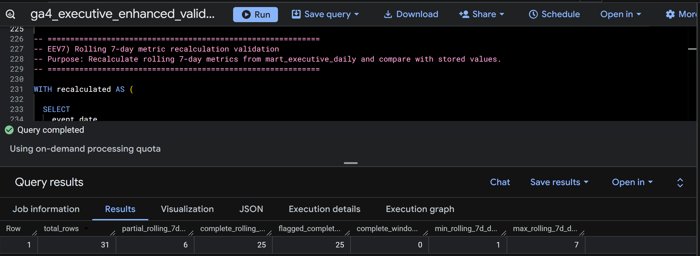

### Key Findings

* The first 6 days correctly have partial rolling windows.
* 25 rows have complete 7-day rolling windows.
* `has_complete_rolling_7d_window` correctly flags complete windows.
* Rolling window length ranges from 1 to 7 days as expected.

### Status

```text
PASS
```

---

## EEV7 — Rolling 7-Day Metric Recalculation Validation

### Result

Rolling metrics were recalculated from `mart_executive_daily` and compared against stored enhanced mart values.

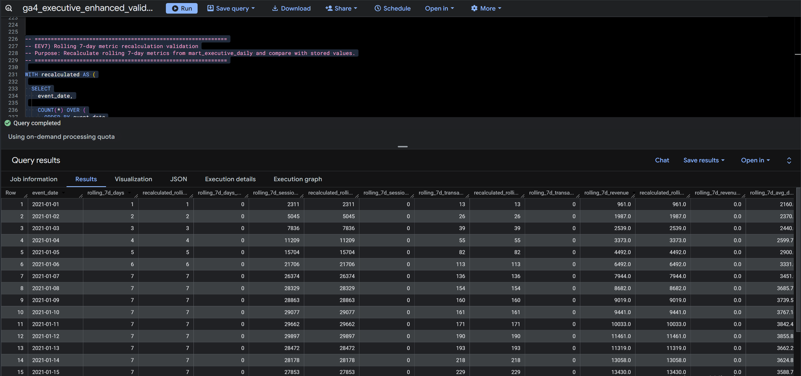

### Key Findings

* Recalculated rolling 7-day values match the stored enhanced mart fields.
* Rolling sessions, transactions, revenue, and average daily users are internally consistent.
* Difference columns return zero across inspected rows.
* Rolling KPI calculations are suitable for executive trend analysis.

### Status

```text
PASS
```

---

## EEV8 — Week-over-Week Availability Validation

### Result

| total_rows | rows_without_wow_comparison | rows_with_wow_comparison | flagged_wow_comparison_rows | missing_wow_flag_rows | incorrect_wow_flag_rows |
| ---------: | --------------------------: | -----------------------: | --------------------------: | --------------------: | ----------------------: |
|         31 |                           7 |                       24 |                          24 |                     0 |                       0 |

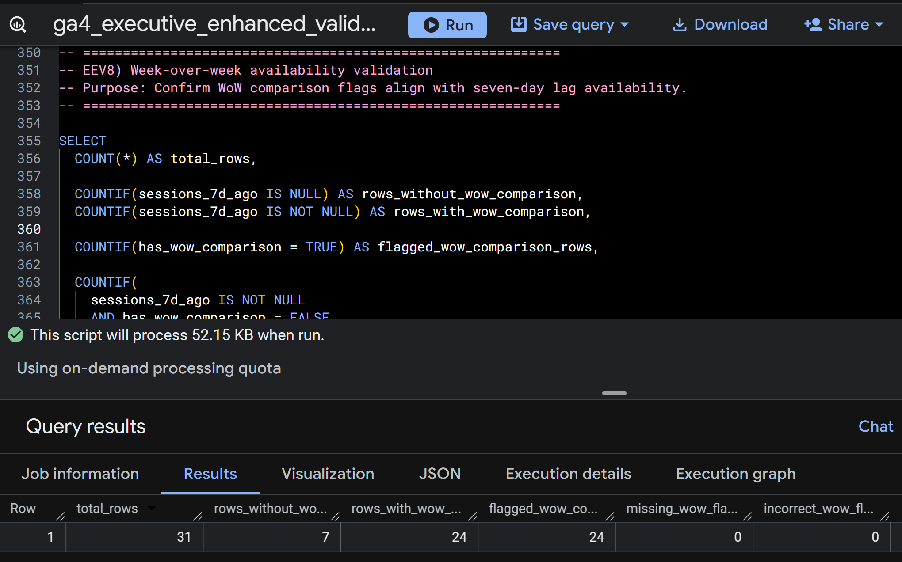

### Key Findings

* The first 7 days correctly have no WoW comparison.
* 24 rows correctly have week-over-week comparison values.
* `has_wow_comparison` correctly matches seven-day lag availability.
* No missing or incorrect WoW flags were detected.

### Status

```text
PASS
```

---

## EEV9 — Week-over-Week Metric Recalculation Validation

### Key Findings

* Seven-day lag values were recalculated from `mart_executive_daily`.
* No mismatch rows were returned.
* WoW sessions, users, transactions, revenue, conversion, and revenue-per-session calculations are consistent with the source daily mart.

### Screenshot

```text
Not stored. The query returned zero mismatch rows.
```

### Status

```text
PASS
```

---

## EEV10 — Impossible Value Validation

### Key Findings

* No negative base metric issues were returned.
* No invalid rolling-window flag issues were returned.
* No invalid WoW flag issues were returned.
* Core conversion and rolling conversion rates remained within valid bounds.

### Screenshot

```text
Not stored. The query returned zero anomaly rows.
```

### Status

```text
PASS
```

---

## EEV11 — Enhanced Daily Trend Inspection

### Result

The output contains base daily, rolling 7-day, and week-over-week KPI movement across the January 2021 reporting window.

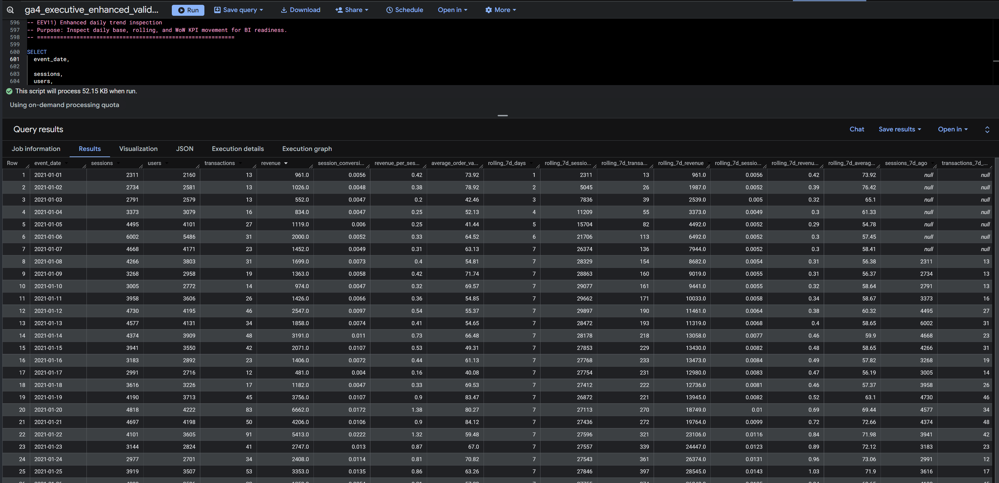

### Key Findings

* Base daily executive metrics are present.
* Rolling 7-day metrics are populated and interpretable.
* First 7 days correctly lack WoW comparison fields.
* From January 8 onward, WoW comparison fields are populated.
* The enhanced mart is ready for BI dashboarding and executive trend reporting.

### Status

```text
PASS
```

---

## EEV12 — Final Enhanced Mart Validation Status

### Result

| total_rows | distinct_event_dates | duplicate_event_date_rows | null_event_date | null_sessions | null_users | null_transactions | null_revenue |
| ---------: | -------------------: | ------------------------: | --------------: | ------------: | ---------: | ----------------: | -----------: |
|         31 |                   31 |                         0 |               0 |             0 |          0 |                 0 |            0 |

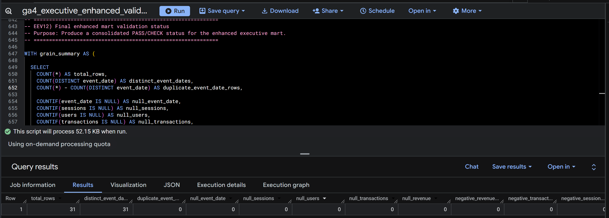

### Key Findings

* Final validation status is `PASS`.
* Date grain is unique.
* No critical nulls were detected.
* No negative base metric issues were detected.
* No rolling-window flag issues were detected.
* No WoW availability flag issues were detected.
* No date, base metric, rolling, or WoW reconciliation mismatches were detected.

### Status

```text
FINAL EXECUTIVE ENHANCED MART VALIDATION STATUS: PASS
```

---

## Phase 2L Summary

* [x] Created enhanced executive validation SQL file
* [x] Validated row count and date range
* [x] Validated one-row-per-date grain
* [x] Checked critical null fields
* [x] Reconciled date attributes with `dim_date`
* [x] Reconciled base metrics with `mart_executive_daily`
* [x] Validated rolling 7-day window structure
* [x] Recalculated rolling 7-day metrics
* [x] Validated week-over-week availability logic
* [x] Recalculated week-over-week metrics
* [x] Checked impossible values and invalid flags
* [x] Inspected enhanced daily trend output
* [x] Produced final enhanced mart validation status
* [x] Saved selected evidence screenshots

## Evidence Screenshots Stored

```text
bi/screenshots/ga4/mart_executive_enhanced_validation/ga4_mart_executive_enhanced_validation_v01_row_count_date_range.png
bi/screenshots/ga4/mart_executive_enhanced_validation/ga4_mart_executive_enhanced_validation_v02_grain_uniqueness.png
bi/screenshots/ga4/mart_executive_enhanced_validation/ga4_mart_executive_enhanced_validation_v06_rolling_window_structure.png
bi/screenshots/ga4/mart_executive_enhanced_validation/ga4_mart_executive_enhanced_validation_v07_rolling_metric_recalculation.png
bi/screenshots/ga4/mart_executive_enhanced_validation/ga4_mart_executive_enhanced_validation_v08_wow_availability.png
bi/screenshots/ga4/mart_executive_enhanced_validation/ga4_mart_executive_enhanced_validation_v11_enhanced_daily_trend.png
bi/screenshots/ga4/mart_executive_enhanced_validation/ga4_mart_executive_enhanced_validation_v12_final_status.png
```

## Key Modeling Validation Notes

* Rolling sessions, transactions, and revenue are additive rolling metrics.
* Rolling users are represented as average daily users, not true 7-day distinct users.
* The first 6 rows correctly have partial rolling windows.
* The first 7 rows correctly have no WoW comparison.
* WoW comparison starts from the eighth reporting day.
* Base metrics are preserved from `mart_executive_daily`.
* The enhanced mart is validated and ready for BI dashboard development.

---

# Future Expansion Work

* [ ] Replace hardcoded January 2021 development window with configurable date ranges
* [ ] Re-run staging on the full available GA4 range
* [ ] Re-run validation suites on the full available range
* [ ] Compare one-month metrics against full-range metrics
* [ ] Confirm whether new data quality patterns appear outside January 2021
* [ ] Update documentation if full-range findings differ

---

# Next Phase

```text
Next Phase: Phase 3 — Olist Ingestion
```

### Phase 3A — Olist Raw Data Ingestion & Profiling

**Status:** Completed
**Environment:** Databricks
**Layer:** Raw ingestion / profiling layer
**Source:** Olist Brazilian E-Commerce CSV files
**Output:** Parquet files stored in Databricks Volume

#### Purpose

Ingest the raw Olist ecommerce datasets into Databricks, validate file availability, inspect raw data structure, perform initial data quality profiling, and convert the raw CSV files into Parquet format for downstream modeling.

#### Implementation Summary

The Olist raw data ingestion process was completed in Databricks using PySpark. The pipeline validated the availability of all expected source files, loaded the raw CSV datasets into Spark DataFrames, inspected the schema of the core orders table, generated profiling outputs across all raw datasets, and wrote each dataset to a Parquet landing layer.

The following Olist datasets were included:

* `olist_customers_dataset.csv`
* `olist_orders_dataset.csv`
* `olist_order_items_dataset.csv`
* `olist_order_payments_dataset.csv`
* `olist_order_reviews_dataset.csv`
* `olist_products_dataset.csv`
* `olist_sellers_dataset.csv`
* `olist_geolocation_dataset.csv`
* `product_category_name_translation.csv`

#### Key Activities Completed

* Defined the Olist raw ingestion notebook in Databricks.
* Validated that all 9 expected Olist raw CSV files were available.
* Loaded all raw CSV files into Spark DataFrames.
* Previewed the core `orders` dataset.
* Inspected the schema of the `orders` dataset.
* Created a raw profiling summary for all Olist datasets.
* Checked row counts, column counts, distinct row counts, and duplicate row counts.
* Created a null profiling summary across all raw datasets.
* Performed key uniqueness checks for important entity keys.
* Wrote all raw Olist datasets to Parquet format.
* Validated row count consistency between CSV source files and Parquet outputs.
* Confirmed successful completion of Phase 3A.

#### Data Quality Notes

* All 9 expected Olist source files were successfully available and loaded.
* CSV-to-Parquet row counts matched for all datasets.
* The `geolocation` dataset contains duplicate rows, which is expected due to repeated geographic ZIP/city/state-level records.
* The `order_reviews` dataset contains duplicate `review_id` values, which should be handled carefully in downstream modeling.
* Null values were identified mainly in review comments, delivery timestamps, and product attribute fields. These are expected raw-data quality issues and will be addressed during modeling and transformation phases where required.

#### Evidence Screenshots

| Evidence                            | Screenshot                                                                                          |
| ----------------------------------- | --------------------------------------------------------------------------------------------------- |
| Raw file availability validation    | `../bi/screenshots/olist/phase_3a_raw_ingestion_profiling/01b_olist_raw_file_availability_pass.png` |
| Orders sample preview               | `../bi/screenshots/olist/phase_3a_raw_ingestion_profiling/02_orders_sample_preview.png`             |
| Orders schema inspection            | `../bi/screenshots/olist/phase_3a_raw_ingestion_profiling/03_orders_schema.png`                     |
| Raw profiling summary               | `../bi/screenshots/olist/phase_3a_raw_ingestion_profiling/04_olist_raw_profiling_summary.png`       |
| Null profiling summary              | `../bi/screenshots/olist/phase_3a_raw_ingestion_profiling/05_olist_null_profile.png`                |
| Key quality checks                  | `../bi/screenshots/olist/phase_3a_raw_ingestion_profiling/06_olist_key_quality_checks.png`          |
| Parquet output validation           | `../bi/screenshots/olist/phase_3a_raw_ingestion_profiling/07_olist_parquet_outputs.png`             |
| CSV-to-Parquet row count validation | `../bi/screenshots/olist/phase_3a_raw_ingestion_profiling/08_csv_to_parquet_count_validation.png`   |
| Phase 3A completion status          | `../bi/screenshots/olist/phase_3a_raw_ingestion_profiling/09_phase_3a_completion_status.png`        |

#### Completion Criteria

Phase 3A is complete because:

* All expected raw Olist files were available.
* All raw datasets were loaded successfully into Spark.
* Raw profiling and data quality checks were completed.
* All datasets were written to Parquet.
* CSV and Parquet row counts matched for all datasets.
* Final Databricks status returned PASS.

**Phase 3A Result:** PASS

---

### Next Phase

### Phase 3B — Olist Raw Layer Validation

**Status:** Not Started

#### Purpose

Validate the Olist raw Parquet landing layer more formally before building staging or mart-level transformations. This phase will confirm table availability, row count stability, schema consistency, key behavior, and known raw-data quality issues.
__
__________________________________________________________________________________________________

### Phase 3B — Olist Raw Layer Validation & Data Modeling Discovery

#### Objective

Validate the Parquet raw layer created in Phase 3A and document the foundational modeling characteristics required for downstream dimensional modeling.

---

#### Activities Completed

##### 1. Raw Layer Availability Validation

Validated successful loading of all Parquet datasets generated during Phase 3A.

Datasets validated:

- customers
- geolocation
- orders
- order_items
- order_payments
- order_reviews
- products
- sellers
- product_category_name_translation

---

##### 2. Row Count Validation

Validated row counts and column counts for all datasets.

| Dataset | Row Count |
|----------|----------:|
| customers | 99,441 |
| geolocation | 1,000,163 |
| orders | 99,441 |
| order_items | 112,650 |
| order_payments | 103,886 |
| order_reviews | 99,224 |
| products | 32,951 |
| sellers | 3,095 |
| product_category_name_translation | 71 |

Result:

- All datasets successfully loaded.
- No row count inconsistencies detected.

---

##### 3. Business Key Validation

Validated uniqueness of primary business identifiers.

Results:

| Table | Business Key | Result |
|---------|---------|---------|
| customers | customer_id | Unique |
| orders | order_id | Unique |
| products | product_id | Unique |
| sellers | seller_id | Unique |
| order_reviews | review_id | Duplicate values detected |

Observation:

- order_reviews contains 814 duplicate review_id values.
- This is a known characteristic of the Olist dataset and will be handled during downstream modeling.

---

##### 4. Grain Documentation

Documented table-level grain definitions.

| Table | Grain |
|---------|---------|
| customers | 1 row per customer |
| orders | 1 row per order |
| products | 1 row per product |
| sellers | 1 row per seller |
| order_items | 1 row per order line item |
| order_payments | 1 row per payment transaction |
| order_reviews | 1 row per review |
| geolocation | Geographic lookup grain |
| product_category_name_translation | Category translation lookup grain |

---

##### 5. Fact vs Dimension Classification

Classified datasets for future dimensional modeling.

Dimension Tables:

- customers
- products
- sellers
- geolocation
- product_category_name_translation

Fact Tables:

- orders
- order_items
- order_payments
- order_reviews

---

##### 6. Relationship Discovery

Documented expected relationships between Olist entities.

Validated relationships:

- orders → customers
- order_items → orders
- order_items → products
- order_items → sellers
- order_payments → orders
- order_reviews → orders
- products → product_category_name_translation

---

##### 7. Relationship Coverage Validation

Performed anti-join relationship testing.

Results:

| Relationship | Match Rate |
|-------------|------------:|
| orders → customers | 100.00% |
| order_items → orders | 100.00% |
| order_items → products | 100.00% |
| order_items → sellers | 100.00% |
| order_payments → orders | 100.00% |
| order_reviews → orders | 100.00% |
| products → category translation | 98.11% |

Observation:

- 623 product categories do not have a matching translation record.
- This is a known Olist data quality limitation.
- Future joins should use LEFT JOIN logic to avoid record loss.

---

#### Data Quality Observations

1. geolocation contains duplicate rows by design and represents repeated geographic ZIP/city/state combinations.

2. order_reviews contains duplicate review_id values (814 records).

3. products contains category values that do not exist in the translation lookup table.

4. No critical relationship integrity issues were detected.

5. Core business entities maintain expected referential integrity.

---

#### Screenshots

| Validation Step | Screenshot |
|-----------------|------------|
| Business key validation | ../bi/screenshots/olist/phase_3b_raw_validation/01_primary_key_validation.png |
| Grain documentation | ../bi/screenshots/olist/phase_3b_raw_validation/02_grain_definition.png |
| Fact vs Dimension classification | ../bi/screenshots/olist/phase_3b_raw_validation/03_fact_dimension_classification.png |
| Expected relationships | ../bi/screenshots/olist/phase_3b_raw_validation/04_expected_relationships.png |
| Relationship coverage validation | ../bi/screenshots/olist/phase_3b_raw_validation/05_relationship_validation.png |
| Phase 3B completion status | ../bi/screenshots/olist/phase_3b_raw_validation/06_phase_3b_completion_status.png |

---

#### Completion Criteria

Phase 3B is complete because:

- All Parquet datasets were successfully validated.
- Business keys were documented and checked.
- Table grain was documented.
- Fact and Dimension classifications were documented.
- Inter-table relationships were identified and validated.
- Referential integrity checks were completed.
- Raw layer is ready for dimensional modeling.

---

### Status

✅ Phase 3B Completed

### Next Phase

Phase 3C — Olist Data Model Documentation
______________________________________________________________________________________________
### Phase 3C — Olist Source Documentation

**Status:** Completed  
**Environment:** Databricks  
**Layer:** Source documentation / modeling preparation  
**Notebook:** `03_olist_source_documentation.ipynb`

#### Purpose

Document the Olist raw Parquet source layer to prepare for downstream dimensional modeling, star schema design, KPI development, and BI reporting.

This phase focuses on understanding and documenting the structure, purpose, and modeling role of each Olist dataset before building transformation logic.

#### Key Activities Completed

- Loaded the Olist Parquet datasets from the raw landing layer.
- Created a schema inventory across all Olist tables.
- Documented column names and inferred data types.
- Counted columns by source table.
- Documented the business purpose of each dataset.
- Identified candidate dimension tables.
- Identified candidate fact tables.
- Confirmed readiness for Phase 3D.

#### Source Tables Documented

| Table | Business Purpose |
|---|---|
| `customers` | Customer master data |
| `orders` | Order lifecycle information |
| `order_items` | Order line items |
| `order_payments` | Payment transactions |
| `order_reviews` | Customer reviews |
| `products` | Product catalog |
| `sellers` | Seller master data |
| `geolocation` | Geographic lookup table |
| `product_category_name_translation` | Portuguese to English category mapping |

#### Column Summary

| Table | Column Count |
|---|---:|
| `customers` | 5 |
| `geolocation` | 5 |
| `order_items` | 7 |
| `order_payments` | 5 |
| `order_reviews` | 7 |
| `orders` | 8 |
| `product_category_name_translation` | 2 |
| `products` | 9 |
| `sellers` | 4 |

#### Candidate Dimensions

| Source Table | Future Dimension |
|---|---|
| `customers` | Customer Dimension |
| `products` | Product Dimension |
| `sellers` | Seller Dimension |
| `geolocation` | Geography Dimension |

#### Candidate Facts

| Source Table | Future Fact |
|---|---|
| `orders` | Order Fact |
| `order_items` | Sales Fact |
| `order_payments` | Payment Fact |
| `order_reviews` | Review Fact |

#### Evidence Screenshots

| Evidence | Screenshot |
|---|---|
| Schema inventory | `../bi/screenshots/olist/phase_3c_source_documentation/01_schema_inventory.png` |
| Column summary | `../bi/screenshots/olist/phase_3c_source_documentation/02_column_summary.png` |
| Table purpose documentation | `../bi/screenshots/olist/phase_3c_source_documentation/03_table_purpose_documentation.png` |
| Candidate dimensions | `../bi/screenshots/olist/phase_3c_source_documentation/04_candidate_dimensions.png` |
| Candidate facts | `../bi/screenshots/olist/phase_3c_source_documentation/05_candidate_facts.png` |
| Phase 3C completion status | `../bi/screenshots/olist/phase_3c_source_documentation/06_phase_3c_completion.png` |

#### Completion Criteria

Phase 3C is complete because:

- Source schema was documented.
- Column inventory was documented.
- Table purposes were documented.
- Candidate dimensions were identified.
- Candidate facts were identified.
- The Olist raw layer is ready for dimensional design.

**Phase 3C Result:** PASS

---

### Next Phase

### Phase 3D — Olist Star Schema Design

**Status:** Not Started

#### Purpose

Design the Olist dimensional model, including target fact and dimension tables, table grain, primary business keys, and join paths required for mart construction.
__________________________________________________________________
# Phase 3D — Olist Star Schema Design

## Objective

Design the target dimensional model for the Olist commercial analytics layer before physical mart construction.

The goal of this phase was to:

- Define target fact tables
- Define target dimension tables
- Establish business grain for each analytical table
- Document fact-to-dimension join paths
- Design the initial star schema architecture
- Identify the primary commercial fact table for downstream KPI development

---

## Source Inputs

Validated Olist source tables from previous phases:

| Source Table | Status |
|-------------|---------|
| customers | Validated |
| orders | Validated |
| order_items | Validated |
| order_payments | Validated |
| order_reviews | Validated |
| products | Validated |
| sellers | Validated |
| geolocation | Validated |
| product_category_name_translation | Validated |

All source relationships were previously validated during Phase 3B.

---

## Target Fact Table Design

The following fact tables were identified for analytical modeling.

| Fact Table | Grain | Business Key | Purpose |
|------------|---------|-------------|----------|
| fact_orders | 1 row per order | order_id | Order lifecycle analytics |
| fact_order_items | 1 row per order item | order_id + order_item_id | Revenue and sales analytics |
| fact_payments | 1 row per payment transaction | order_id + payment_sequential | Payment analytics |
| fact_reviews | 1 row per review | review_id | Customer satisfaction analytics |

### Key Design Decision

`fact_order_items` was selected as the primary commercial fact table because it contains:

- Revenue metrics
- Product relationships
- Seller relationships
- Order-level commercial activity

This table provides the most detailed sales grain available within the Olist dataset.

---

## Target Dimension Table Design

The following dimensions were identified.

| Dimension Table | Business Key | Purpose |
|----------------|-------------|----------|
| dim_customers | customer_id | Customer attributes |
| dim_products | product_id | Product attributes |
| dim_sellers | seller_id | Seller attributes |
| dim_geography | zip_code_prefix | Geographic attributes |

### Supporting Lookup Table

| Lookup Table | Purpose |
|-------------|----------|
| product_category_name_translation | Portuguese to English category mapping |

---

## Star Schema Join Paths

The following analytical relationships were defined.

| Fact Table | Fact Key | Dimension Table | Dimension Key |
|------------|----------|------------------|---------------|
| fact_orders | customer_id | dim_customers | customer_id |
| fact_order_items | product_id | dim_products | product_id |
| fact_order_items | seller_id | dim_sellers | seller_id |

### Additional Future Enhancement

A geography dimension may later be connected through customer geographic attributes if additional regional analysis is required.

---

## Proposed Star Schema

### Dimensions

- dim_customers
- dim_products
- dim_sellers
- dim_geography

### Facts

- fact_orders
- fact_order_items
- fact_payments
- fact_reviews

### Primary Commercial Fact

- fact_order_items

---

## Validation Results

Star schema design completed successfully.

### Validation Checklist

| Check | Result |
|---------|---------|
| Fact tables identified | PASS |
| Dimension tables identified | PASS |
| Business grain documented | PASS |
| Business keys documented | PASS |
| Join paths documented | PASS |
| Primary commercial fact selected | PASS |
| Initial star schema documented | PASS |

---

## Observations

### Observation 1

The Olist dataset naturally supports a dimensional model structure.

Core dimensions:

- Customers
- Products
- Sellers
- Geography

Core facts:

- Orders
- Order Items
- Payments
- Reviews

### Observation 2

The commercial center of the model is `fact_order_items`.

This table provides the most detailed revenue grain and will serve as the foundation for:

- Revenue KPIs
- Product performance
- Seller performance
- Commercial dashboards

### Observation 3

The star schema design confirms that the Olist dataset is suitable for downstream dimensional modeling and BI reporting.

---

## Evidence Retention

### Keep

1. Star schema fact table design

```text
phase_3d_star_schema_design/01_fact_design.png
```

Reason:
Documents final fact table structure and grain decisions.

2. Star schema dimension table design

```text
phase_3d_star_schema_design/02_dimension_design.png
```

Reason:
Documents final dimension structure.

3. Join path design

```text
phase_3d_star_schema_design/03_join_paths.png
```

Reason:
Documents fact-to-dimension relationships.

4. Phase completion evidence

```text
phase_3d_star_schema_design/05_phase_3d_complete.png
```

Reason:
Formal completion checkpoint.

### Do Not Retain

```text
04_star_schema_summary.png
```

Reason:

This screenshot contains information already documented by:

- Fact Design
- Dimension Design
- Join Path Design

and therefore provides no additional audit value.

---

## Deliverables Produced

- Star schema blueprint
- Fact table definitions
- Dimension table definitions
- Business grain definitions
- Join path definitions
- Primary commercial fact selection
- Modeling design documentation

---

## Phase Status

PASS

Phase 3D completed successfully.

Next Phase:

Phase 4A — Dimension Mart Construction
________________________________________________________________
### Phase 4A — Olist Dimension Construction

**Status:** Completed  
**Environment:** Databricks  
**Layer:** Dimension construction  
**Notebook:** `05_olist_dimension_construction`

#### Purpose

Build the initial Olist dimension tables from the validated raw Parquet layer.

This phase creates the foundational dimension datasets required for downstream fact modeling, mart construction, and BI reporting.

#### Dimensions Built

| Dimension | Source Table | Business Key | Description |
|---|---|---|---|
| `dim_customers` | `customers` | `customer_id` | Customer-level attributes |
| `dim_products` | `products` + `product_category_name_translation` | `product_id` | Product-level attributes with English category mapping |
| `dim_sellers` | `sellers` | `seller_id` | Seller-level attributes |
| `dim_geography` | `geolocation` | `geolocation_zip_code_prefix` | Deduplicated geographic lookup |

#### Validation Results

| Dimension | Row Count | Key Validation |
|---|---:|---|
| `dim_customers` | 99,441 | `customer_id` is unique |
| `dim_products` | 32,951 | `product_id` is unique |
| `dim_sellers` | 3,095 | `seller_id` is unique |
| `dim_geography` | 27,912 | Deduplicated geography records |

#### Key Observations

- `dim_customers` preserves one row per `customer_id`.
- `dim_products` successfully includes English product category mapping through a left join.
- `dim_sellers` preserves one row per `seller_id`.
- `dim_geography` is deduplicated from the raw geolocation dataset to reduce repeated geographic records.
- All core dimension tables were constructed and validated successfully.

#### Evidence Screenshots

| Evidence | Screenshot |
|---|---|
| Customer dimension validation | `../bi/screenshots/olist/phase_4a_dimension_construction/01_dim_customers_validation.png` |
| Product dimension validation | `../bi/screenshots/olist/phase_4a_dimension_construction/02_dim_products_validation.png` |
| Seller dimension validation | `../bi/screenshots/olist/phase_4a_dimension_construction/03_dim_sellers_validation.png` |
| Geography dimension validation | `../bi/screenshots/olist/phase_4a_dimension_construction/04_dim_geography_validation.png` |
| Phase 4A completion status | `../bi/screenshots/olist/phase_4a_dimension_construction/05_phase_4a_completion_status.png` |

#### Completion Criteria

Phase 4A is complete because:

- `dim_customers` was built and validated.
- `dim_products` was built and validated.
- `dim_sellers` was built and validated.
- `dim_geography` was built and validated.
- Dimension row counts and business keys were checked.
- The Olist dimension layer is ready for formal validation.

**Phase 4A Result:** PASS

---

### Next Phase

### Phase 4B — Olist Dimension Validation

**Status:** Not Started

#### Purpose

Perform formal data quality validation on the constructed Olist dimension tables, including uniqueness checks, null checks, duplicate checks, and readiness for fact table joins.
___________________________________________________________
# Phase 4B — Olist Dimension Validation

## Objective

Validate all dimension tables created during Phase 4A before beginning fact table construction.

Validation scope:

- Row count validation
- Business key validation
- Duplicate key validation
- Null key validation
- Attribute null analysis
- Product category translation coverage
- Dimension readiness assessment

---

# Validation Results

## 1. Dimension Row Count Validation

Validated row counts and column counts for each dimension.

| Dimension | Rows | Columns |
|------------|---------:|---------:|
| dim_customers | 99,441 | 5 |
| dim_products | 32,951 | 10 |
| dim_sellers | 3,095 | 4 |
| dim_geography | 27,912 | 3 |

Result:

- All dimensions successfully created.
- Row counts align with source datasets and Phase 4A outputs.

Screenshot:

`01_dimension_row_count_validation.png`

---

## 2. Business Key Validation

Validated uniqueness and completeness of business keys.

| Dimension | Business Key | Null Keys | Duplicate Keys |
|------------|-------------|-----------:|---------------:|
| dim_customers | customer_id | 0 | 0 |
| dim_products | product_id | 0 | 0 |
| dim_sellers | seller_id | 0 | 0 |
| dim_geography | geolocation_zip_code_prefix | 0 | 8,897 |

Result:

- Customer dimension passed.
- Product dimension passed.
- Seller dimension passed.
- Geography dimension requires review.

Observation:

The geography dataset contains multiple city/state combinations for the same ZIP prefix.

Therefore:

- ZIP prefix is not a unique business key.
- Geography dimension behaves more like a reference lookup table than a traditional dimension.

Screenshot:

`02_dimension_key_validation.png`

---

## 3. Null Attribute Validation

Checked all dimension attributes for missing values.

Findings:

### Product Dimension

Translation-related attributes contain limited missing values.

| Column | Null Count | Null % |
|----------|------------:|--------:|
| product_category_name_english | 623 | 1.89% |
| product_category_name | 610 | 1.85% |
| product_description_lenght | 610 | 1.85% |
| product_name_lenght | 610 | 1.85% |
| product_photos_qty | 610 | 1.85% |

Physical measurements contain almost no missing values.

| Column | Null Count |
|----------|-----------:|
| product_height_cm | 2 |
| product_length_cm | 2 |
| product_weight_g | 2 |
| product_width_cm | 2 |

Interpretation:

- Missing values are limited.
- Data quality remains suitable for analytics use cases.
- No remediation required at this stage.

Screenshot:

`03_dimension_null_validation.png`

---

## 4. Product Translation Coverage Validation

Validated Portuguese-to-English category translation coverage.

Results:

| Translation Status | Product Count |
|-------------------|--------------:|
| Translation Available | 32,328 |
| Translation Missing | 623 |

Coverage Rate:

97.11%

Interpretation:

- Translation coverage is very high.
- Missing translations affect only a small fraction of products.
- English category field remains appropriate for BI reporting.

Screenshot:

`04_product_translation_coverage.png`

---

## 5. Dimension Validation Summary

| Dimension | Status |
|------------|--------|
| dim_customers | PASS |
| dim_products | PASS |
| dim_sellers | PASS |
| dim_geography | REVIEW |

Interpretation:

dim_geography requires review because ZIP prefixes are not unique.

This is a source data characteristic rather than a transformation error.

Current decision:

- Retain geography dimension unchanged.
- Document limitation.
- Continue project execution.

Screenshot:

`05_dimension_validation_summary.png`

---

# Key Findings

### Finding 1

Customer dimension contains:

99,441 unique customers.

No duplicate business keys detected.

---

### Finding 2

Product dimension contains:

32,951 products.

Translation coverage exceeds 97%.

---

### Finding 3

Seller dimension contains:

3,095 sellers.

No key quality issues detected.

---

### Finding 4

Geography dimension contains:

27,912 rows.

ZIP prefix cannot be treated as a unique business key because multiple locations may share the same ZIP prefix.

This limitation is inherited from the Olist source dataset.

---

# Conclusion

Phase 4B completed successfully.

Validation confirms:

- Dimension construction logic is correct.
- Customer dimension is production-ready.
- Product dimension is production-ready.
- Seller dimension is production-ready.
- Geography dimension is usable with documented limitations.
- Translation coverage is sufficient for downstream reporting.

Project status:

✓ Phase 4A Complete

✓ Phase 4B Complete

Next phase:

→ Phase 5A — Fact Table Construction

---

# Evidence

Retained screenshots:

1. 01_dimension_row_count_validation.png
2. 02_dimension_key_validation.png
3. 03_dimension_null_validation.png
4. 04_product_translation_coverage.png
5. 05_dimension_validation_summary.png
6. 06_phase_4b_completion_status.png

_______________________________________________
### Phase 5A — Olist Fact Table Construction

**Status:** Completed

**Environment:** Databricks

**Notebook:** `07_olist_fact_construction`

---

### Objective

Construct the transactional fact layer for the Olist analytics warehouse.

The objective of this phase was to transform validated Olist datasets into analytics-ready fact tables that support commercial reporting, KPI calculations, customer analysis, seller performance analysis, payment analysis, and future BI dashboards.

---

### Fact Tables Constructed

| Table              | Grain                           | Purpose                                      |
| ------------------ | ------------------------------- | -------------------------------------------- |
| `fact_orders`      | One row per order               | Order lifecycle and fulfillment analysis     |
| `fact_order_items` | One row per order item          | Revenue, product and seller analytics        |
| `fact_payments`    | One row per payment transaction | Payment method and payment behavior analysis |
| `fact_reviews`     | One row per review              | Customer satisfaction and review analysis    |

---

### Construction Summary

#### fact_orders

Created the primary order-level fact table containing:

* Order identifiers
* Customer identifiers
* Order status
* Purchase timestamps
* Approval timestamps
* Delivery timestamps
* Estimated delivery timestamps

This table serves as the foundation for order lifecycle reporting and fulfillment analysis.

---

#### fact_order_items

Created the item-level revenue fact table containing:

* Order identifiers
* Product identifiers
* Seller identifiers
* Item price
* Freight value
* Shipping limit timestamps

This table provides the core sales and revenue foundation for downstream analytics.

---

#### fact_payments

Created the payment transaction fact table containing:

* Order identifiers
* Payment sequence
* Payment type
* Installment count
* Payment value

This table enables payment-method analysis, installment behavior analysis, and payment performance reporting.

---

#### fact_reviews

Created the customer review fact table containing:

* Review identifiers
* Order identifiers
* Review scores
* Review creation dates
* Review response timestamps

This table supports customer experience and satisfaction analytics.

---

### Storage Layer

All fact tables were successfully persisted to the Olist mart layer:

```text
dbfs:/Volumes/workspace/default/olist_uploads/marts/olist
```

---

### Evidence Retained

| Evidence                         | Screenshot                          |
| -------------------------------- | ----------------------------------- |
| fact_orders sample output        | `01_fact_orders_sample.png`         |
| fact_order_items sample output   | `02_fact_order_items_sample.png`    |
| fact_payments sample output      | `03_fact_payments_sample.png`       |
| fact_reviews sample output       | `04_fact_reviews_sample.png`        |
| Phase 5A completion confirmation | `06_phase_5a_completion_status.png` |

---

### Key Outcome

The warehouse now contains:

#### Dimension Layer

* dim_customers
* dim_products
* dim_sellers
* dim_geography

#### Fact Layer

* fact_orders
* fact_order_items
* fact_payments
* fact_reviews

The core warehouse foundation is now complete and ready for formal fact-table validation.

---

### Phase Result

**PASS**

---

### Next Phase

### Phase 5B — Olist Fact Table Validation

Planned validation activities:

* Row count validation
* Business key validation
* Duplicate detection
* Null key validation
* Referential integrity validation
* Fact-to-dimension relationship validation
* Data quality assessment
* Validation summary generation

___________________________________________
### Phase 5B — Olist Fact Table Validation

**Status:** Completed with Review Notes  
**Environment:** Databricks  
**Notebook:** `08_olist_fact_validation`

---

### Objective

Validate the Olist fact tables created in Phase 5A before building downstream analytical marts.

This phase checks row counts, business key behavior, null keys, and referential integrity between fact and dimension/source entities.

---

### Fact Row Count Validation

| Fact Table | Row Count |
|---|---:|
| `fact_orders` | 99,441 |
| `fact_order_items` | 112,650 |
| `fact_payments` | 103,886 |
| `fact_reviews` | 99,224 |

---

### Business Key Validation

| Fact Table | Row Count | Distinct Key Count | Result |
|---|---:|---:|---|
| `fact_orders` | 99,441 | 99,441 | PASS |
| `fact_order_items` | 112,650 | 112,650 | PASS |
| `fact_payments` | 103,886 | 103,886 | PASS |
| `fact_reviews` | 99,224 | 98,410 | REVIEW |

#### Review Note

`fact_reviews` contains repeated `review_id` values.  
This was already observed in the raw layer and should be treated as a known source-data behavior rather than a pipeline failure.

Further handling may be required before using reviews for detailed review-level analysis.

---

### Null Key Validation

| Fact Table | Null Key Count |
|---|---:|
| `fact_orders` | 0 |
| `fact_order_items` | 0 |
| `fact_payments` | 0 |
| `fact_reviews` | 0 |

All fact tables passed null key validation.

---

### Referential Integrity Validation

| Relationship | Unmatched Rows |
|---|---:|
| `fact_orders → customers` | 0 |
| `fact_order_items → products` | 0 |
| `fact_order_items → sellers` | 0 |

All tested fact-to-dimension relationships passed referential integrity checks.

---

### Evidence Retained

| Evidence | Screenshot |
|---|---|
| Fact row count validation | `../bi/screenshots/olist/phase_5b_fact_validation/01_fact_row_count_validation.png` |
| Fact business key validation | `../bi/screenshots/olist/phase_5b_fact_validation/02_fact_business_key_validation.png` |
| Fact null key validation | `../bi/screenshots/olist/phase_5b_fact_validation/03_fact_null_key_validation.png` |
| Fact-to-dimension integrity validation | `../bi/screenshots/olist/phase_5b_fact_validation/04_fact_dimension_integrity.png` |
| Fact validation summary | `../bi/screenshots/olist/phase_5b_fact_validation/05_fact_validation_summary.png` |
| Phase 5B completion status | `../bi/screenshots/olist/phase_5b_fact_validation/06_phase_5b_completion_status.png` |

---

### Completion Criteria

Phase 5B is complete because:

- Fact row counts were validated.
- Business key behavior was checked.
- Null key checks passed for all fact tables.
- Referential integrity checks passed.
- Known review-level duplicate behavior was documented.

**Phase 5B Result:** Completed with Review Notes

---

### Next Phase

### Phase 6A — Olist Analytical Mart Construction

**Status:** Not Started

#### Purpose

Build business-facing analytical marts from the validated fact and dimension layers.
___________________________________________________________
### Phase 6A — Olist Analytical Mart Construction

**Status:** Completed with Validation Pending  
**Environment:** Databricks  
**Notebook:** `09_olist_mart_construction`

---

### Objective

Build the first business-facing analytical mart from the validated Olist fact layer.

This phase creates a daily order-level mart designed for commercial reporting, KPI analysis, and future BI dashboard development.

---

### Mart Built

| Mart | Grain | Purpose |
|---|---|---|
| `mart_orders_daily` | One row per order date | Daily commercial performance reporting |

---

### Metrics Included

| Metric | Description |
|---|---|
| `order_date` | Order purchase date |
| `orders` | Number of distinct orders |
| `customers` | Number of distinct customers |
| `revenue` | Total daily payment value |
| `avg_order_value` | Average revenue per order |
| `items_sold` | Total number of order items sold |

---

### Construction Notes

`mart_orders_daily` was built by combining:

- `fact_orders`
- `fact_order_items`
- `fact_payments`

The mart aggregates order, customer, revenue, and item-level metrics at daily grain.

---

### Observations

The mart contains **634 daily rows**.

Early preview rows show some `null` values in revenue-related or item-related metrics for specific dates. These should be reviewed in Phase 6B to confirm whether they come from missing payment records, missing item records, or historical edge cases in the source data.

---

### Evidence Retained

| Evidence | Screenshot |
|---|---|
| Daily mart preview | `../bi/screenshots/olist/phase_6a_mart_construction/01_mart_orders_daily_preview.png` |
| Phase 6A completion status | `../bi/screenshots/olist/phase_6a_mart_construction/02_phase_6a_completion_status.png` |

---

### Completion Criteria

Phase 6A is complete because:

- Daily order mart was built.
- Revenue metrics were aggregated.
- Customer metrics were aggregated.
- Item metrics were aggregated.
- Mart was persisted to the Olist mart layer.

**Phase 6A Result:** Completed with Validation Pending

---

### Next Phase

### Phase 6B — Olist Analytical Mart Validation

**Status:** Not Started

#### Purpose

Validate `mart_orders_daily` before it is used for KPI reporting or BI dashboards.

Planned checks:

- Mart row count validation
- Date range validation
- Null metric validation
- Revenue consistency checks
- Order count consistency checks
- Item count consistency checks
- Final mart approval
____________________________________________________
## Phase 6B — Olist Analytical Mart Validation

**Status:** Complete

### Purpose

Validate the daily analytical mart before exposing it to BI reporting and dashboard layers.

The validation focused on:

- Row count consistency
- Date coverage
- Null metric assessment
- Revenue reconciliation against source facts
- Reporting readiness approval

---

### Validation Results

#### 1. Mart Row Count Validation

The mart contains:

```text
634 rows
```

representing daily aggregated business activity.

Result:

```text
PASS
```

**Evidence**

`bi/screenshots/olist/phase_6b_mart_validation/01_mart_row_count_validation.png`

---

#### 2. Date Coverage Validation

Validated the minimum and maximum reporting dates.

```text
Min Date: 2016-09-04
Max Date: 2018-10-17
```

The mart covers the complete available Olist business period.

Result:

```text
PASS
```

**Evidence**

`bi/screenshots/olist/phase_6b_mart_validation/02_date_range_validation.png`

---

#### 3. Null Metric Validation

Validated business metrics for missing values.

Results:

```text
Null Revenue Days: 1
Null AOV Days: 1
Null Items Sold Days: 18
```

Observation:

A small number of null values were identified. These are attributable to source-level transactional behavior and are considered acceptable for analytical reporting.

Result:

```text
PASS
```

**Evidence**

`bi/screenshots/olist/phase_6b_mart_validation/03_null_metric_validation.png`

---

#### 4. Revenue Reconciliation Validation

Compared total mart revenue against the source payment fact table.

```text
Mart Revenue: 16,008,872.12

Fact Revenue: 16,008,872.12
```

Observed difference is limited to floating-point precision and is operationally zero.

Result:

```text
PASS
```

**Evidence**

`bi/screenshots/olist/phase_6b_mart_validation/04_metric_reconciliation_validation.png`

---

### Validation Conclusion

The analytical mart successfully passed all validation checks.

Approved for:

- Executive reporting
- KPI development
- Dashboard consumption
- Business analytics use cases

Result:

```text
PHASE 6B PASSED
```

**Evidence**

`bi/screenshots/olist/phase_6b_mart_validation/05_phase_6b_completion_status.png`

---

### Deliverables Produced

#### Notebook

```text
notebooks/databricks/10_olist_mart_validation
```

#### Analytical Mart

```text
mart_orders_daily
```

#### Validation Evidence Folder

```text
bi/screenshots/olist/phase_6b_mart_validation
```

---

### Next Phase

## Phase 7A — Commercial KPI Layer Construction
_______________________________________________________
---

## Phase 7A — Olist Commercial KPI Layer Construction

**Status:** Complete

### Purpose

Build a business-facing KPI layer from the validated Olist analytical mart to support executive reporting, trend analysis, dashboard consumption, and commercial performance monitoring.

---

## Business Objective

Transform the validated daily mart into a reporting-ready KPI layer by introducing derived commercial metrics, rolling performance indicators, and reporting dimensions commonly used by business stakeholders and BI teams.

---

## Source Layer

Input Mart:

```text
mart_orders_daily
```

Output KPI Layer:

```text
kpi_orders_daily
```

Persisted Location:

```text
dbfs:/Volumes/workspace/default/olist_uploads/kpis/olist/kpi_orders_daily
```

---

## KPI Enhancements Added

### Customer Value Metrics

Calculated:

- Revenue Per Customer
- Revenue Presence Flag

Formula:

```text
Revenue Per Customer = Revenue / Customers
```

---

### Order Efficiency Metrics

Calculated:

- Items Per Order
- Revenue Per Item

Formulas:

```text
Items Per Order = Items Sold / Orders

Revenue Per Item = Revenue / Items Sold
```

---

### Rolling Commercial KPIs

Added rolling 7-day aggregations:

- Revenue 7D
- Orders 7D
- Customers 7D
- Items Sold 7D
- Average Order Value 7D

Purpose:

Provide trend monitoring capability similar to production commercial reporting environments.

---

### Reporting Calendar Dimensions

Added:

```text
order_year
order_month
order_week
```

Purpose:

Support dashboard filtering, aggregation, and period-over-period analysis.

---

## KPI Summary Results

| Metric | Value |
|----------|----------|
| Reporting Days | 634 |
| Total Orders | 99,441 |
| Total Customers | 99,441 |
| Total Revenue | 16,008,872.12 |
| Average Daily AOV | 162.62 |
| Average Items Per Order | 1.13 |
| Min Order Date | 2016-09-04 |
| Max Order Date | 2018-10-17 |

---

## Key Validation Observations

### Revenue Consistency

Revenue values remain consistent with the validated analytical mart.

### KPI Logic

Derived metrics successfully generated:

- Revenue Per Customer
- Items Per Order
- Revenue Per Item

without calculation failures.

### Trend Layer

Rolling 7-day KPIs generated successfully and support future executive dashboard trend analysis.

### Calendar Layer

Reporting dimensions successfully added and validated.

---

## Evidence

### Screenshot 01

File:

```text
01_load_validated_daily_mart.png
```

Description:

Validated analytical mart successfully loaded from storage and ready for KPI layer construction.

---

### Screenshot 02

File:

```text
02_commercial_kpi_layer_preview.png
```

Description:

Commercial KPI layer preview displaying derived metrics:

- Revenue Per Customer
- Items Per Order
- Revenue Per Item
- Revenue Presence Flag

---

### Screenshot 03

File:

```text
03_rolling_7d_kpis.png
```

Description:

Rolling 7-day commercial KPIs successfully generated including revenue, orders, customers, items sold, and rolling AOV.
* The 7-day rolling KPI window was explicitly partitioned with a constant partition to avoid Databricks window execution warnings while preserving a single overall daily time series calculation.

---

### Screenshot 04

File:

```text
04_reporting_date_fields.png
```

Description:

Reporting calendar dimensions added:

- Year
- Month
- Week

to support dashboard consumption and time-series analysis.

---

### Screenshot 05

File:

```text
05_kpi_summary.png
```

Description:

KPI summary output showing total orders, customers, revenue, reporting days, average order value, and reporting date range.

---

### Screenshot 06

File:

```text
06_phase_7a_completion_status.png
```

Description:

Successful completion of KPI layer construction and readiness for validation phase.

---

## Completion Criteria

- [x] KPI layer built
- [x] Customer metrics calculated
- [x] Order efficiency metrics calculated
- [x] Revenue metrics calculated
- [x] Rolling 7-day KPIs added
- [x] Reporting calendar dimensions added
- [x] KPI summary generated
- [x] KPI layer persisted
- [x] Ready for validation

---

## Next Phase

### Phase 7B — Olist Commercial KPI Layer Validation

Validate:

- KPI row counts
- KPI null rates
- Rolling KPI calculations
- Date dimension integrity
- Business metric consistency
- Persisted KPI layer quality

before promoting the KPI layer to dashboard-serving status.

_____________________________________________________
این Markdown را می‌توانی مستقیماً داخل فایل Tracker مرحله Validation کپی کنی.

````markdown
# Phase 7B — KPI Layer Validation

## Objective
Validate the KPI layer generated in Phase 7A to ensure:

- Row counts are preserved from source mart
- KPI calculations are accurate
- Rolling metrics are generated correctly
- Reporting date fields are valid
- Dataset is ready for BI consumption

---

## Validation 1 — KPI Layer Row Count Validation

### Validation Logic

Compare source mart row count against KPI layer row count.

### Result

| Table | Row Count | Column Count |
|---------|-----------:|------------:|
| mart_orders_daily | 634 | 6 |
| kpi_orders_daily_enhanced | 634 | 18 |

### Outcome

PASS

### Validation Notes

- No rows lost during KPI enrichment.
- KPI layer preserves the original daily grain.
- Additional KPI columns successfully added.

### Evidence

`docs/screenshots/phase_7b/01_kpi_layer_row_count_validation.png`

---

## Validation 2 — KPI Null Value Validation

### Validation Logic

Validate critical KPI fields for unexpected null values.

Fields reviewed:

- order_date
- orders
- customers
- revenue
- avg_order_value
- items_sold
- revenue_per_customer
- items_per_order
- revenue_per_item
- revenue_7d
- orders_7d
- customers_7d
- items_sold_7d
- avg_order_value_7d

### Result

Observed null values:

| Column | Null Count |
|----------|-----------:|
| revenue | 1 |
| avg_order_value | 1 |
| items_sold | 18 |
| revenue_per_customer | 1 |
| items_per_order | 18 |
| revenue_per_item | 19 |
| items_sold_7d | 8 |

### Assessment

PASS

### Validation Notes

Null values are expected and originate from source transactional data:

- Some orders have no associated payment information.
- Some orders have no item-level records.
- Derived KPI fields inherit nulls from source attributes.

No unexpected nulls detected in primary grain fields:

- order_date
- orders
- customers

### Evidence

`docs/screenshots/phase_7b/02_kpi_layer_null_validation.png`

---

## Validation 3 — KPI Formula Validation

### Validation Logic

Manually verify KPI calculations against expected formulas.

Reviewed metrics:

- avg_order_value
- revenue_per_customer
- items_per_order
- revenue_per_item

### Expected Formulas

```text
avg_order_value = revenue / orders

revenue_per_customer = revenue / customers

items_per_order = items_sold / orders

revenue_per_item = revenue / items_sold
````

### Result

Calculated KPI values matched expected values across sampled records.

### Outcome

PASS

### Validation Notes

No discrepancies observed between:

* generated KPI columns
* manually calculated expected values

### Evidence

`docs/screenshots/phase_7b/03_kpi_formula_validation.png`

---

## Validation 4 — Rolling 7-Day KPI Validation

### Validation Logic

Review rolling KPI fields:

* revenue_7d
* orders_7d
* customers_7d
* items_sold_7d
* avg_order_value_7d

Verify cumulative behavior across sequential dates.

### Result

Rolling metrics increase and decrease consistently according to underlying transactional activity.

### Outcome

PASS

### Validation Notes

* Rolling calculations correctly include historical observations.
* No unexpected resets detected.
* Window logic behaves as intended.

### Evidence

`docs/screenshots/phase_7b/04_rolling_7d_validation.png`

---

## Validation 5 — Reporting Date Field Validation

### Validation Logic

Validate derived reporting fields:

* order_year
* order_month
* order_week

### Result

Sample records confirmed:

* Correct year extraction
* Correct month formatting (YYYY-MM)
* Correct ISO week assignment

### Outcome

PASS

### Validation Notes

Date attributes are suitable for:

* dashboard filtering
* monthly aggregation
* weekly trend analysis
* executive reporting

### Evidence

`docs/screenshots/phase_7b/05_reporting_date_fields_validation.png`

---

## Final Validation Assessment

### KPI Layer Status

PASS

### Dataset Summary

| Metric            |         Value |
| ----------------- | ------------: |
| Reporting Days    |           634 |
| Total Orders      |        99,441 |
| Total Customers   |        99,441 |
| Total Revenue     | 16,008,872.12 |
| Average Daily AOV |        162.62 |

### Business Readiness Assessment

The KPI layer has been successfully validated and approved for:

* Executive reporting
* Commercial dashboards
* Trend analysis
* Revenue monitoring
* Customer performance reporting

### Validation Conclusion

PASS

Phase 7B completed successfully.

### Evidence

`docs/screenshots/phase_7b/06_kpi_layer_completion_status.png`

---

## Phase Status

| Phase                             | Status   |
| --------------------------------- | -------- |
| Phase 7A — KPI Layer Construction | Complete |
| Phase 7B — KPI Layer Validation   | Complete |

### Next Phase

Phase 8A — Executive Reporting Mart Construction

```


_______________________________________________________________________

حتماً. این نسخه را کامل کپی کن داخل `docs/project_tracker.md`.

````markdown
### Phase 8A — Olist Executive Mart Construction

**Status:** Completed

#### Purpose

Build an executive-facing daily mart from the validated KPI layer.  
This layer is designed to support high-level commercial reporting by exposing revenue, order, customer, rolling performance, and growth metrics in a simplified reporting-ready table.

#### Notebook

```text
13_olist_executive_mart_construction
````

#### Output Dataset Path

```text
dbfs:/Volumes/workspace/default/olist_uploads/executive/olist/executive_daily
```

#### Source Layer

```text
dbfs:/Volumes/workspace/default/olist_uploads/kpis/olist/kpi_orders_daily
```

#### Construction Summary

The executive mart was created from the validated KPI layer and focused on a smaller set of business-facing metrics suitable for executive reporting.

The mart includes:

* Daily order date
* Reporting date fields
* Order volume
* Customer count
* Revenue
* Average order value
* 7-day rolling revenue
* 7-day rolling orders
* 7-day rolling customers
* Previous-day revenue
* Daily revenue growth percentage

#### Key Results Observed

The executive mart base was successfully created from the KPI layer.

The mart preview confirmed that the daily KPI fields were available, including:

* `order_date`
* `order_year`
* `order_month`
* `order_week`
* `orders`
* `customers`
* `revenue`
* `avg_order_value`
* `revenue_7d`
* `orders_7d`
* `customers_7d`
* `items_sold_7d`
* `avg_order_value_7d`

Growth metrics were added successfully:

* `prev_day_revenue`
* `revenue_growth_pct`

The growth metric calculation produced expected null values where prior-day revenue was unavailable or where revenue comparison was not meaningful. This is expected behavior and not a pipeline error.

An executive summary was generated with the following results:

| Metric          |         Value |
| --------------- | ------------: |
| Total Revenue   | 16,008,872.12 |
| Total Orders    |        99,441 |
| Total Customers |        99,441 |
| Average AOV     |        162.62 |

The executive mart was successfully persisted to:

```text
dbfs:/Volumes/workspace/default/olist_uploads/executive/olist/executive_daily
```

A saved executive mart preview was reloaded from the persisted path, confirming that the mart was written successfully and can be reused by downstream reporting layers.

#### Technical Note

A Databricks warning appeared during the window calculation:

```text
WARN WindowExpression: No Partition Defined for Window operation
```

This is not a pipeline failure.
The warning appears because the executive mart uses a global time-based window ordered by `order_date`. Since this mart is small and daily-grain, the warning is acceptable for the current project scope. In a production environment with larger data volume, this calculation could be optimized by partitioning by a reporting entity such as country, channel, or business unit.

#### Evidence Screenshots

The following screenshots were retained as project evidence:

```text
bi/screenshots/olist/phase_8a_executive_mart_construction/01_executive_mart_base.png
bi/screenshots/olist/phase_8a_executive_mart_construction/02_executive_growth_metrics.png
bi/screenshots/olist/phase_8a_executive_mart_construction/03_executive_summary.png
bi/screenshots/olist/phase_8a_executive_mart_construction/04_executive_mart_saved.png
bi/screenshots/olist/phase_8a_executive_mart_construction/05_saved_executive_mart_preview.png
bi/screenshots/olist/phase_8a_executive_mart_construction/06_phase_8a_completion_status.png
```

#### Screenshot Notes

* `01_executive_mart_base.png` shows the initial executive mart structure created from the KPI layer.
* `02_executive_growth_metrics.png` shows the added growth metrics, including previous-day revenue and revenue growth percentage.
* `03_executive_summary.png` shows the executive-level aggregate metrics.
* `04_executive_mart_saved.png` confirms that the executive mart was persisted to DBFS.
* `05_saved_executive_mart_preview.png` confirms that the saved mart can be reloaded successfully.
* `06_phase_8a_completion_status.png` confirms successful completion of Phase 8A.

#### Completion Criteria

* Executive mart created from validated KPI layer.
* Revenue, order, customer, rolling, and growth metrics prepared.
* Executive summary generated.
* Executive mart persisted to DBFS.
* Persisted executive mart reloaded successfully.
* Evidence screenshots saved.

#### Outcome

Phase 8A was completed successfully.

The Olist executive mart is now ready for validation in Phase 8B.

---

### Next Phase

### Phase 8B — Olist Executive Mart Validation

**Status:** Not Started

_______________________________________________________________
### Phase 8B — Olist Executive Mart Validation

**Status:** Complete  
**Notebook:** `14_olist_executive_mart_validation`  
**Layer:** Executive / BI-ready reporting layer  
**Output validated:** `executive_daily`

#### Purpose

This phase validated the Olist executive mart created in Phase 8A before approving it for BI and reporting use.  
The validation focused on row counts, reporting date coverage, revenue reconciliation, expected null behavior, formula consistency, and final reporting readiness.

#### Validation Scope

The following checks were completed:

- Executive mart row and column count validation
- Reporting date range validation
- Null metric validation
- Revenue reconciliation against the KPI layer
- Executive KPI formula logic validation
- Final validation summary generation
- Phase completion confirmation

---

#### 1. Row and Column Count Validation

The executive mart contains **634 reporting rows** and **15 columns**.

This confirms that the executive layer preserves the same daily reporting grain as the validated KPI layer while adding executive-level fields for reporting and dashboard consumption.

**Evidence:**  
`bi/screenshots/olist/phase_8b_executive_mart_validation/02_executive_row_column_count.png`

**Result:**

| table_name | row_count | column_count |
|---|---:|---:|
| executive_daily | 634 | 15 |

**Status:** PASS

---

#### 2. Date Range Validation

The executive mart covers the expected Olist reporting period.

**Evidence:**  
`bi/screenshots/olist/phase_8b_executive_mart_validation/03_executive_date_range_validation.png`

**Result:**

| min_order_date | max_order_date |
|---|---|
| 2016-09-04 | 2018-10-17 |

**Status:** PASS

---

#### 3. Null Metric Validation

Null checks were performed across key executive metrics.

**Evidence:**  
`bi/screenshots/olist/phase_8b_executive_mart_validation/04_executive_null_metric_validation.png`

**Observed results:**

| metric | null_count |
|---|---:|
| null_order_date | 0 |
| null_orders | 0 |
| null_customers | 0 |
| null_revenue | 1 |
| null_avg_order_value | 1 |
| null_revenue_7d | 0 |
| null_orders_7d | 0 |
| null_customers_7d | 0 |
| null_prev_day_revenue | 2 |
| null_revenue_growth_pct | 3 |

The nulls in revenue-related and growth-related fields are expected because some dates either have incomplete raw Olist item/payment values or do not have a comparable previous revenue value. These nulls are documented as expected business/data behavior, not pipeline failure.

**Status:** PASS_WITH_NOTES

---

#### 4. Revenue Reconciliation

Executive-level revenue was reconciled against the validated KPI layer.

**Evidence:**  
`bi/screenshots/olist/phase_8b_executive_mart_validation/05_executive_revenue_reconciliation.png`

**Result:**

| executive_total_revenue | kpi_total_revenue | reconciliation_status |
|---:|---:|---|
| 16008872.12 | 16008872.12 | PASS |

The executive mart revenue matches the KPI layer exactly after rounding to two decimal places.

**Status:** PASS

---

#### 5. Formula Logic Validation

Executive KPI formulas were reviewed by comparing reported metrics against expected calculated values.

**Evidence:**  
`bi/screenshots/olist/phase_8b_executive_mart_validation/06_executive_formula_validation.png`

The validation confirmed that:

- `avg_order_value` aligns with expected revenue-per-order logic.
- 7-day rolling metrics are populated.
- `prev_day_revenue` supports revenue growth calculation.
- `revenue_growth_pct` is calculated where a valid prior revenue value exists.
- Null growth values are expected for rows where comparison is not valid.

**Status:** PASS

---

#### 6. Executive Validation Summary

A structured validation summary was generated to document final approval status.

**Evidence:**  
`bi/screenshots/olist/phase_8b_executive_mart_validation/07_executive_validation_summary.png`

**Summary result:**

| table_name | validation_check | validation_status |
|---|---|---|
| executive_daily | Row count validation | PASS |
| executive_daily | Date range validation | PASS |
| executive_daily | Revenue reconciliation | PASS |
| executive_daily | Null metric review | PASS_WITH_NOTES |
| executive_daily | Formula logic review | PASS |

**Status:** PASS_WITH_NOTES

---

#### 7. Completion Status

The phase was completed successfully and the executive mart was approved for BI/reporting use.

**Evidence:**  
`bi/screenshots/olist/phase_8b_executive_mart_validation/08_phase_8b_completion_status.png`

**Completion checklist:**

- Executive mart loaded
- Row and column counts validated
- Date range validated
- Revenue reconciled against KPI layer
- Null metrics reviewed
- KPI formulas reviewed
- Executive mart approved for BI/reporting use

---

#### Final Decision

**Phase 8B is complete.**

The Olist executive mart is validated and approved as a BI-ready reporting layer.  
Known null values are documented and accepted because they reflect expected source-data and comparison-window behavior rather than pipeline errors.

**Ready for Phase 9A.**
_____________________________________________________________
## Planned SQL Files

```text
To be defined in Phase 3A after raw Olist file inventory.
```

## Planned Tasks

* [ ] Create Olist raw data inventory
* [ ] Inspect available CSV files
* [ ] Define source tables and expected grains
* [ ] Plan BigQuery ingestion approach
* [ ] Create Olist staging folder structure if needed
* [ ] Profile orders, customers, products, sellers, payments, and reviews
* [ ] Validate transactional completeness before modeling

---

# Future Phase Roadmap

## Phase 3 — Olist Ingestion

⬜ Planned

* Ingest Olist ecommerce CSVs
* Profile orders, customers, products, sellers, payments, and reviews
* Convert raw CSVs into reusable warehouse tables
* Document grain and join logic
* Validate transactional completeness

## Phase 4 — Multi-Source Commercial Mart

⬜ Planned

* Integrate GA4 behavioral/acquisition layer with Olist commercial data at an aggregate level
* Document integration limitations
* Avoid artificial row-level joins where no natural key exists
* Build commercial KPI marts

## Phase 5 — BI Layer

⬜ Planned

* Build Power BI dashboards
* Create executive overview page
* Create acquisition/channel performance page
* Create ecommerce funnel page
* Create revenue and transaction quality page
* Add dashboard screenshots

## Phase 6 — A/B Testing Layer

⬜ Planned

* Define experiment framework
* Build assignment logic
* Calculate treatment vs control KPIs
* Evaluate absolute and relative lift
* Document ship / no-ship recommendation

## Phase 7 — Final Packaging

⬜ Planned

* Finalize README
* Clean documentation
* Validate repo navigation
* Polish screenshots
* Summarize business outcomes
* Prepare project for resume and interview use

---

# Final Notes

## Current Project Health

### Technical Health

✅ Strong

Reasons:

* Repository structure is clear.
* GA4 raw profiling is complete.
* GA4 staging view is complete.
* GA4 staging validation suite is complete.
* Session fact table is complete.
* Session fact validation suite is complete.
* Date dimension is complete and validated.
* Channel dimension is complete and validated.
* Channel daily mart is complete and validated.
* Executive daily mart is complete and validated.
* Executive enhanced mart is complete and validated.
* Selected screenshots are organized by workflow area.
* BigQuery work is backed by GitHub documentation.

### Analytics Engineering Health

✅ Strong

Reasons:

* Table grains are documented.
* Validation checks are explicit.
* Data quality risks are surfaced.
* Revenue deduplication is implemented.
* Attribution sparsity is documented.
* Non-additive user logic is handled correctly.
* Rolling KPI logic is documented.
* Week-over-week comparison logic is validated.
* Fact-to-mart reconciliation is implemented.
* Downstream modeling requirements are clear.

### Portfolio Readiness

🟡 In Progress

Reason:

The GA4 analytics foundation is strong and complete, but the project still needs:

* Olist ingestion
* multi-source commercial modeling
* BI dashboard layer
* final README polish
* business narrative
* final GitHub packaging

## Most Important Data Risks to Preserve in Future Work

Future marts and dashboards must continue to explicitly handle:

* high attribution sparsity
* invalid transaction IDs
* missing purchase revenue
* duplicate purchase transaction rows
* transaction-level revenue deduplication
* non-additive distinct user metrics
* non-additive rolling user metrics
* strict separation between event, session, item, transaction, dimension, and mart grains

```

