# Project Tracker — Commercial Analytics

## Current Phase

➡️ Phase 1A — GA4 Raw Data Profiling & Staging Preparation

---

# Phase 0 — Repository & Environment Setup

## Completed

- [x] Created GitHub repository
- [x] Established project folder structure
- [x] Added README skeleton
- [x] Configured `.gitignore`
- [x] Added `requirements.txt`
- [x] Connected local Windows Bootcamp environment using `git clone`
- [x] Refactored documentation structure
- [x] Initialized project tracking workflow
- [x] Created GA4 profiling script: `sql/ga4/01_data_profiling.sql`
- [x] Created GA4 screenshot directories
- [x] Added `.gitkeep` placeholders for future screenshot folders
- [x] Added GA4 profiling screenshots to `bi/screenshots/ga4/`

---

# Current Repository Structure

```text
commercial-analytics-bq-dbx/
│
├── bi/
│   └── screenshots/
│       ├── dashboards/
│       │   └── .gitkeep
│       │
│       ├── ga4/
│       │   ├── ga4_daily_event_volume_distribution.png
│       │   ├── ga4_date_coverage_sample.png
│       │   ├── ga4_duplicate_proxy.png
│       │   ├── ga4_event_parameter_coverage_by_event.png
│       │   ├── ga4_event_parameter_key_frequency.png
│       │   ├── ga4_global_date_coverage.png
│       │   ├── ga4_items_sparsity_by_event.png
│       │   ├── ga4_null_rates_core_fields.png
│       │   ├── ga4_purchase_presence_revenue.png
│       │   ├── ga4_purchase_transaction_quality.png
│       │   ├── ga4_revenue_transaction_validation.png
│       │   ├── ga4_session_id_availability.png
│       │   ├── ga4_top_events_distribution.png
│       │   ├── ga4_traffic_source_distribution.png
│       │   └── ga4_user_session_volume_profiling.png
│       │
│       └── olist/
│           └── .gitkeep
│
├── data/
│   ├── processed/
│   └── raw/
│       └── olist/
│
├── ├── docs/
│   ├── architecture.md
│   ├── data_dictionary.md
│   ├── decisions_log.md
│   ├── kpi_definitions.md
│   └── project_tracker.md
│
├── sql/
│   ├── ga4/
│   │   ├── 01_data_profiling.sql
│   │   ├── 02_stg_ga4_events.sql
│   │   └── 03_fact_sessions_daily.sql
│   │
│   └── marts/
│       ├── 01_dim_date.sql
│       ├── 02_dim_channel.sql
│       ├── 03_mart_channel_daily.sql
│       ├── 04_mart_executive_daily.sql
│       └── 05_mart_executive_enhanced.sql
│
├── .gitignore
├── README.md
└── requirements.txt
```

---

# Screenshot Inventory — GA4 Profiling

All GA4 profiling screenshots are stored in:

```text
bi/screenshots/ga4/
```

Because `project_tracker.md` is stored inside the `docs/` folder, all image references use this relative path pattern:

```text
../bi/screenshots/ga4/<filename>.png
```

| Step | Screenshot File | Status |
|---|---|---|
| B1 | `ga4_date_coverage_sample.png` | Available |
| B1b | `ga4_global_date_coverage.png` | Available |
| C1 | `ga4_null_rates_core_fields.png` | Available |
| C2 | `ga4_duplicate_proxy.png` | Available |
| D1 | `ga4_top_events_distribution.png` | Available |
| D2 | `ga4_purchase_presence_revenue.png` | Available |
| D3 | `ga4_items_sparsity_by_event.png` | Available |
| D4 | `ga4_daily_event_volume_distribution.png` | Available |
| D5 | `ga4_user_session_volume_profiling.png` | Available |
| D6 | `ga4_session_id_availability.png` | Available |
| D7 | `ga4_traffic_source_distribution.png` | Available |
| D8 | `ga4_purchase_transaction_quality.png` | Available |
| D9 | `ga4_revenue_transaction_validation.png` | Available |
| D10 | `ga4_event_parameter_key_frequency.png` | Available |
| D11 | `ga4_event_parameter_coverage_by_event.png` | Available |

---

# Phase 1A — GA4 Raw Data Profiling

## Objective

The purpose of this phase was to validate the raw GA4 ecommerce event export before building staging tables, analytical marts, and downstream KPI layers.

The profiling focused on:

- raw structure validation
- sample and global date coverage
- core identifier completeness
- duplicate event risk
- event taxonomy
- session availability
- acquisition parameter structure
- ecommerce purchase quality
- transaction-level revenue integrity
- event parameter structure

## Source Table

```text
bigquery-public-data.ga4_obfuscated_sample_ecommerce.events_*
```

## Sample Window

```text
2021-01-01 to 2021-01-31
```

## Main SQL File

```text
sql/ga4/01_data_profiling.sql
```

---

# A1 — Initial Structure Validation

## Objective

Validate the raw GA4 table structure before downstream transformation and KPI modeling.

## Query Reference

```sql
-- A1) sample rows (structure sanity)

SELECT *
FROM `bigquery-public-data.ga4_obfuscated_sample_ecommerce.events_*`
WHERE _TABLE_SUFFIX BETWEEN '20210101' AND '20210131'
LIMIT 10;
```

## Key Observations

- GA4 uses daily sharded event tables following the `events_YYYYMMDD` naming pattern.
- The dataset follows an event-driven behavioral schema.
- Key nested structures include:
  - `event_params`
  - `items`
  - `ecommerce`
- Primary anonymous user tracking relies on:
  - `user_pseudo_id`
- Ecommerce fields are event-specific and should not be expected across all event types.

## Analytical Implications

The dataset supports:

- behavioral analytics
- session analysis
- acquisition analysis
- ecommerce funnel analysis
- KPI prototyping

---

# B1 — Sample Date Coverage Validation

## Objective

Validate whether the selected January 2021 sample window contains complete date coverage and sufficient event volume for profiling.

## Query Reference

```sql
-- B1) date coverage (sample window)

SELECT
  MIN(PARSE_DATE('%Y%m%d', event_date)) AS min_date,
  MAX(PARSE_DATE('%Y%m%d', event_date)) AS max_date,
  COUNT(*) AS total_rows
FROM `bigquery-public-data.ga4_obfuscated_sample_ecommerce.events_*`
WHERE _TABLE_SUFFIX BETWEEN '20210101' AND '20210131';
```

## Result

| min_date | max_date | total_rows |
|---|---|---:|
| 2021-01-01 | 2021-01-31 | 1,210,147 |


## Key Findings

- January 2021 sample window loaded successfully.
- Full 31-day event coverage confirmed.
- Event volume is sufficient for downstream profiling and KPI modeling.

---

# B1b — Global Dataset Date Coverage Validation

## Objective

Validate the full historical date range available in the public GA4 ecommerce dataset.

## Query Reference

```sql
-- B1b) date coverage (global)

SELECT
  MIN(PARSE_DATE('%Y%m%d', event_date)) AS global_min_date,
  MAX(PARSE_DATE('%Y%m%d', event_date)) AS global_max_date
FROM `bigquery-public-data.ga4_obfuscated_sample_ecommerce.events_*`;
```

## Result

| global_min_date | global_max_date |
|---|---|
| 2020-11-01 | 2021-01-31 |

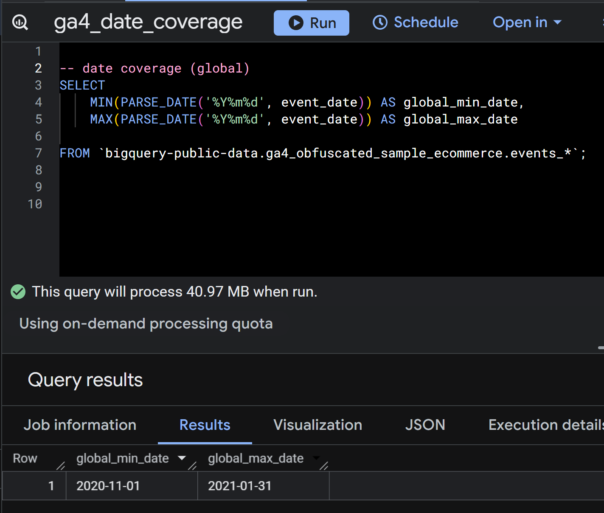

## Key Findings

- The public dataset contains approximately three months of historical data.
- The data is sufficient for KPI prototyping and dashboard development.
- The dataset is limited for:
  - long-term seasonality analysis
  - year-over-year comparison
  - mature cohort analysis
  - long-horizon forecasting

---

# C1 — Core Identifier Null Validation

## Objective

Validate whether core tracking identifiers are complete within the January 2021 sample window.

## Query Reference

```sql
-- C1) null rates for core identifiers (sample window)

SELECT
  COUNT(*) AS total_rows,
  SUM(CASE WHEN event_date IS NULL THEN 1 ELSE 0 END) AS null_event_date,
  SUM(CASE WHEN event_timestamp IS NULL THEN 1 ELSE 0 END) AS null_event_timestamp,
  SUM(CASE WHEN event_name IS NULL THEN 1 ELSE 0 END) AS null_event_name,
  SUM(CASE WHEN user_pseudo_id IS NULL THEN 1 ELSE 0 END) AS null_user_pseudo_id
FROM `bigquery-public-data.ga4_obfuscated_sample_ecommerce.events_*`
WHERE _TABLE_SUFFIX BETWEEN '20210101' AND '20210131';
```

## Result

| total_rows | null_event_date | null_event_timestamp | null_event_name | null_user_pseudo_id |
|---:|---:|---:|---:|---:|
| 1,210,147 | 0 | 0 | 0 | 0 |


## Key Findings

- Core identifiers are fully populated.
- Event sequencing is structurally reliable.
- User-level analysis is feasible.
- No major completeness risk was detected for foundational tracking fields.

---

# C2 — Approximate Duplicate Event Validation

## Objective

Identify potential duplicate event records using an approximate proxy key.

## Proxy Key

```text
user_pseudo_id + event_timestamp + event_name
```

## Query Reference

```sql
-- C2) Approximate duplicate event check using proxy key
-- Proxy key: user_pseudo_id + event_timestamp + event_name

WITH base AS (
  SELECT
    user_pseudo_id,
    event_timestamp,
    event_name
  FROM `bigquery-public-data.ga4_obfuscated_sample_ecommerce.events_*`
  WHERE _TABLE_SUFFIX BETWEEN '20210101' AND '20210131'
),

counts AS (
  SELECT
    COUNT(*) AS row_count,
    COUNT(DISTINCT CONCAT(
      user_pseudo_id,
      '|',
      CAST(event_timestamp AS STRING),
      '|',
      event_name
    )) AS distinct_proxy
  FROM base
)

SELECT
  row_count,
  distinct_proxy,
  row_count - distinct_proxy AS duplicate_proxy_rows
FROM counts;
```

## Result

| row_count | distinct_proxy | duplicate_proxy_rows |
|---:|---:|---:|
| 1,210,147 | 1,210,147 | 0 |

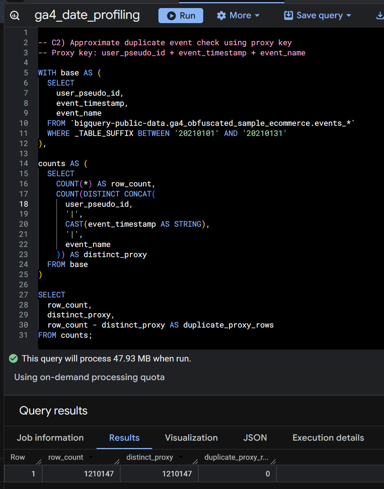

## Key Findings

- No approximate duplicate event patterns were detected.
- Event tracking structure appears stable at the behavioral event level.
- This reduces the risk of inflated event-level KPI calculations.

---

# C3 — Invalid Event Date Validation

## Objective

Validate whether all `event_date` values can be safely parsed using the expected GA4 `YYYYMMDD` format.

## Query Reference

```sql
-- C3) invalid event_date format check

SELECT
  COUNT(*) AS total_rows,
  SUM(CASE WHEN SAFE.PARSE_DATE('%Y%m%d', event_date) IS NULL THEN 1 ELSE 0 END) AS invalid_event_date_rows
FROM `bigquery-public-data.ga4_obfuscated_sample_ecommerce.events_*`
WHERE _TABLE_SUFFIX BETWEEN '20210101' AND '20210131';
```

## Result

| total_rows | invalid_event_date_rows |
|---:|---:|
| 1,210,147 | 0 |

## Key Findings

- All `event_date` values successfully parsed.
- No malformed date patterns were detected.
- Dataset is safe for time-series analysis and date-based aggregation.

---

# D1 — Top Event Distribution Profiling

## Objective

Understand the dominant event types in the January 2021 sample window.

## Query Reference

```sql
-- D1) Top event distribution (sample window)

SELECT
  event_name,
  COUNT(*) AS event_count
FROM `bigquery-public-data.ga4_obfuscated_sample_ecommerce.events_*`
WHERE _TABLE_SUFFIX BETWEEN '20210101' AND '20210131'
GROUP BY event_name
ORDER BY event_count DESC
LIMIT 20;
```


## Key Findings

Top behavioral and ecommerce events include:

- `page_view`
- `user_engagement`
- `scroll`
- `session_start`
- `view_item`
- `add_to_cart`
- `begin_checkout`
- `purchase`

## Analytical Implications

The dataset supports:

- ecommerce funnel analysis
- engagement KPI modeling
- behavioral segmentation
- customer journey analysis

---

# D2 — Purchase Presence & Revenue Validation

## Objective

Validate whether purchase events, revenue values, and valid transaction identifiers exist in the dataset.

## Query Reference

```sql
-- D2) Purchase presence and revenue validation (sample window)

SELECT
  COUNTIF(event_name = 'purchase') AS purchase_events,

  SUM(
    CASE
      WHEN event_name = 'purchase'
      THEN COALESCE(ecommerce.purchase_revenue, 0)
      ELSE 0
    END
  ) AS total_purchase_revenue,

  COUNT(DISTINCT
    CASE
      WHEN event_name = 'purchase'
        AND ecommerce.transaction_id IS NOT NULL
        AND ecommerce.transaction_id != '(not set)'
      THEN ecommerce.transaction_id
    END
  ) AS distinct_valid_purchase_transaction_ids
FROM `bigquery-public-data.ga4_obfuscated_sample_ecommerce.events_*`
WHERE _TABLE_SUFFIX BETWEEN '20210101' AND '20210131';
```

## Result

| Metric | Result |
|---|---:|
| Purchase events | 1,204 |
| Total purchase revenue | 57,350.0 |
| Distinct valid purchase transaction IDs | 894 |


## Key Findings

- Purchase activity exists within the dataset.
- Revenue tracking is populated.
- Valid transaction-level identifiers are available.
- Purchase events exceed distinct valid transaction IDs, indicating possible duplicate or invalid purchase event behavior.

---

# D3 — Item Array Population by Event Type

## Objective

Analyze item-level tracking coverage across GA4 event types.

## Query Reference

```sql
-- D3) explain items sparsity by event type (sample window)

SELECT
  event_name,
  COUNT(*) AS row_count,
  SUM(CASE WHEN ARRAY_LENGTH(items) IS NULL OR ARRAY_LENGTH(items) = 0 THEN 1 ELSE 0 END) AS no_items_row_count,
  SUM(CASE WHEN ARRAY_LENGTH(items) > 0 THEN 1 ELSE 0 END) AS has_items_row_count
FROM `bigquery-public-data.ga4_obfuscated_sample_ecommerce.events_*`
WHERE _TABLE_SUFFIX BETWEEN '20210101' AND '20210131'
GROUP BY event_name
ORDER BY has_items_row_count DESC, row_count DESC
LIMIT 30;
```


## Key Findings

- Ecommerce events consistently contain populated item arrays.
- Behavioral events correctly lack item arrays.
- Partial item population exists for some discovery and promotion events.

## Modeling Implications

Item-level extraction logic should remain event-aware. Product-level modeling should focus on ecommerce-specific events rather than all raw events.

---

# D4 — Daily Event Volume Distribution

## Objective

Validate daily event continuity and identify potential ingestion gaps or abnormal event-volume patterns.

## Query Reference

```sql
-- D4) Daily event volume distribution (sample window)

SELECT
  PARSE_DATE('%Y%m%d', event_date) AS event_dt,
  COUNT(*) AS event_count
FROM `bigquery-public-data.ga4_obfuscated_sample_ecommerce.events_*`
WHERE _TABLE_SUFFIX BETWEEN '20210101' AND '20210131'
GROUP BY event_dt
ORDER BY event_dt;
```

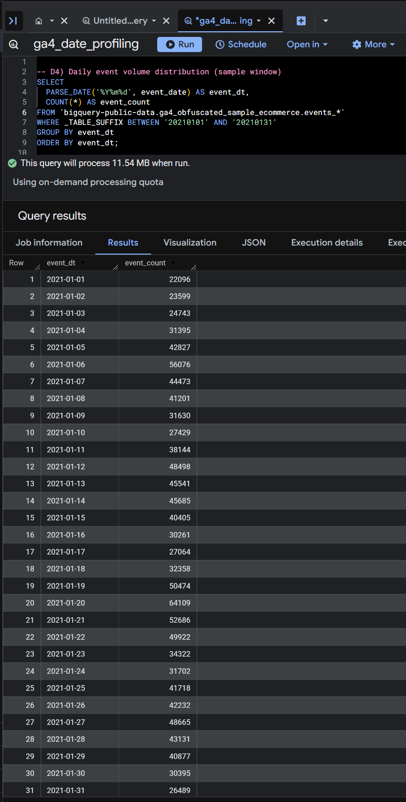

## Key Findings

- No missing event dates detected.
- Event flow remains continuous across January 2021.
- Daily activity levels appear behaviorally plausible.

## Modeling Implications

Dataset is suitable for:

- daily KPI aggregation
- rolling metrics
- time-series dashboarding

---

# D5 — User & Session Volume Profiling

## Objective

Profile event volume, unique users, and unique sessions within the sample window.

## Query Reference

```sql
-- D5) User and session volume profiling (sample window)

SELECT
  COUNT(*) AS total_rows,
  COUNT(DISTINCT user_pseudo_id) AS unique_users,
  COUNT(DISTINCT CONCAT(
    user_pseudo_id,
    '|',
    CAST((
      SELECT value.int_value
      FROM UNNEST(event_params)
      WHERE key = 'ga_session_id'
    ) AS STRING)
  )) AS unique_sessions
FROM `bigquery-public-data.ga4_obfuscated_sample_ecommerce.events_*`
WHERE _TABLE_SUFFIX BETWEEN '20210101' AND '20210131';
```

## Result

| total_rows | unique_users | unique_sessions |
|---:|---:|---:|
| 1,210,147 | 94,790 | 118,380 |

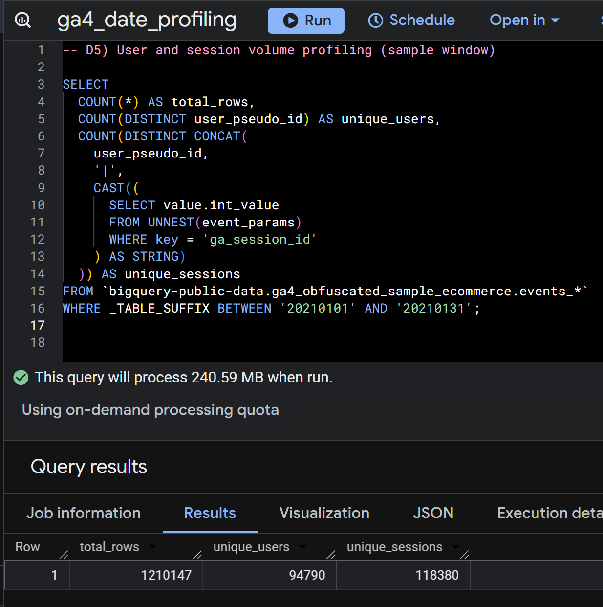

## Key Findings

- Strong behavioral scale detected.
- Session structure appears reliable.
- Session extraction from nested parameters succeeded.

## Modeling Implications

Session-level marts and engagement KPIs are feasible.

---

# D6 — Session ID Availability Validation

## Objective

Validate whether `ga_session_id` is consistently available across event records.

## Query Reference

```sql
-- D6) Session ID availability check (sample window)

WITH base AS (
  SELECT
    (
      SELECT value.int_value
      FROM UNNEST(event_params)
      WHERE key = 'ga_session_id'
    ) AS ga_session_id
  FROM `bigquery-public-data.ga4_obfuscated_sample_ecommerce.events_*`
  WHERE _TABLE_SUFFIX BETWEEN '20210101' AND '20210131'
)

SELECT
  COUNT(*) AS total_rows,

  SUM(
    CASE
      WHEN ga_session_id IS NULL
      THEN 1
      ELSE 0
    END
  ) AS null_ga_session_id_rows,

  SUM(
    CASE
      WHEN ga_session_id IS NOT NULL
      THEN 1
      ELSE 0
    END
  ) AS has_ga_session_id_rows
FROM base;
```

## Result

| total_rows | null_ga_session_id_rows | has_ga_session_id_rows |
|---:|---:|---:|
| 1,210,147 | 0 | 1,210,147 |


## Key Findings

- Session identifiers are fully populated.
- No immediate session completeness risk was identified.
- Dataset is suitable for downstream sessionization logic.

---

# D7 — Event-Level Traffic Source Distribution

## Objective

Profile event-level acquisition parameters extracted from `event_params`.

## Query Reference

```sql
-- D7) Event-level traffic source parameter distribution (sample window)
-- Uses event_params source / medium / campaign instead of user-scoped traffic_source fields

WITH base AS (
  SELECT
    user_pseudo_id,

    (
      SELECT value.string_value
      FROM UNNEST(event_params)
      WHERE key = 'source'
    ) AS source,

    (
      SELECT value.string_value
      FROM UNNEST(event_params)
      WHERE key = 'medium'
    ) AS medium,

    (
      SELECT value.string_value
      FROM UNNEST(event_params)
      WHERE key = 'campaign'
    ) AS campaign_name
  FROM `bigquery-public-data.ga4_obfuscated_sample_ecommerce.events_*`
  WHERE _TABLE_SUFFIX BETWEEN '20210101' AND '20210131'
)

SELECT
  COALESCE(source, '(not set)') AS source,
  COALESCE(medium, '(not set)') AS medium,
  COALESCE(campaign_name, '(not set)') AS campaign_name,
  COUNT(*) AS event_count,
  COUNT(DISTINCT user_pseudo_id) AS unique_users
FROM base
GROUP BY
  source,
  medium,
  campaign_name
ORDER BY event_count DESC
LIMIT 30;
```

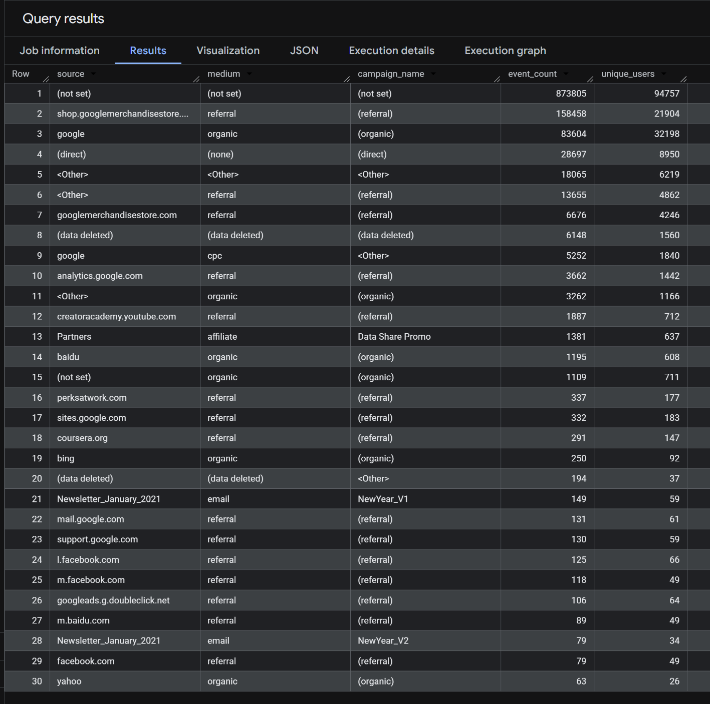

## Key Findings

- Event-level acquisition metadata was successfully extracted.
- Major channel types observed:
  - organic
  - referral
  - email
  - affiliate
  - cpc
- `(not set)` values require downstream normalization logic.

## Modeling Implications

Acquisition modeling should include fallback attribution handling and channel normalization.

---

# D8 — Purchase Transaction Quality Validation

## Objective

Validate purchase transaction quality, including invalid transaction IDs, missing revenue, zero revenue, and negative revenue.

## Query Reference

```sql
-- D8) Purchase transaction quality check

WITH q AS (
  SELECT
    COUNTIF(event_name = 'purchase') AS purchases,

    COUNTIF(
      event_name = 'purchase'
      AND (
        ecommerce.transaction_id IS NULL
        OR ecommerce.transaction_id = '(not set)'
      )
    ) AS missing_or_invalid_txn_id,

    COUNTIF(
      event_name = 'purchase'
      AND ecommerce.purchase_revenue IS NULL
    ) AS missing_revenue,

    COUNTIF(
      event_name = 'purchase'
      AND ecommerce.purchase_revenue = 0
    ) AS zero_revenue,

    COUNTIF(
      event_name = 'purchase'
      AND ecommerce.purchase_revenue < 0
    ) AS negative_revenue
  FROM `bigquery-public-data.ga4_obfuscated_sample_ecommerce.events_*`
  WHERE _TABLE_SUFFIX BETWEEN '20210101' AND '20210131'
)

SELECT
  purchases,
  missing_or_invalid_txn_id,
  ROUND(SAFE_DIVIDE(missing_or_invalid_txn_id, purchases), 4) AS missing_or_invalid_txn_rate,
  missing_revenue,
  ROUND(SAFE_DIVIDE(missing_revenue, purchases), 4) AS missing_rev_rate,
  zero_revenue,
  ROUND(SAFE_DIVIDE(zero_revenue, purchases), 4) AS zero_rev_rate,
  negative_revenue,
  ROUND(SAFE_DIVIDE(negative_revenue, purchases), 4) AS negative_rev_rate
FROM q;
```

## Result

| Metric | Result |
|---|---:|
| Purchase events | 1,204 |
| Missing or invalid transaction IDs | 300 |
| Missing or invalid transaction ID rate | 24.92% |
| Missing purchase revenue | 300 |
| Missing revenue rate | 24.92% |
| Zero revenue purchases | 0 |
| Negative revenue purchases | 0 |


## Key Findings

- 300 purchase events contain missing or invalid transaction IDs.
- The same number of purchase events also have missing revenue.
- No zero or negative purchase revenue values were detected.
- Revenue KPIs require defensive handling.

---

# D9 — Transaction-Level Duplicate & Revenue Validation

## Objective

Validate transaction-level revenue integrity and identify duplicate purchase event risks.

## Query Reference

```sql
-- D9) Transaction-level duplicate and revenue validation

SELECT
  ecommerce.transaction_id,
  COUNT(*) AS purchase_event_rows,
  COUNT(DISTINCT ecommerce.purchase_revenue) AS distinct_revenue_values,
  SUM(ecommerce.purchase_revenue) AS summed_transaction_revenue,
  MAX(ecommerce.purchase_revenue) AS max_transaction_revenue
FROM `bigquery-public-data.ga4_obfuscated_sample_ecommerce.events_*`
WHERE _TABLE_SUFFIX BETWEEN '20210101' AND '20210131'
  AND event_name = 'purchase'
  AND ecommerce.transaction_id IS NOT NULL
  AND ecommerce.transaction_id != '(not set)'
GROUP BY ecommerce.transaction_id
ORDER BY purchase_event_rows DESC, summed_transaction_revenue DESC
LIMIT 30;
```


## Key Findings

- Duplicate purchase event behavior was detected.
- Revenue inflation risk exists if raw purchase rows are summed directly.
- Majority of valid transactions still maintain single-row integrity.

## Recommended Modeling Approach

Future marts should:

- treat valid `transaction_id` as the business grain
- apply transaction-level deduplication
- avoid naïve raw-row revenue summation
- use defensive logic such as `MAX(purchase_revenue)` or row ranking when needed

---

# D10 — Event Parameter Key Frequency Profiling

## Objective

Identify high-value reusable event parameters and event-specific parameters for future staging extraction.

## Query Reference

```sql
-- D10) Event parameter key frequency (sample window)

SELECT
  ep.key AS event_param_key,
  COUNT(*) AS param_occurrence_count,
  COUNT(DISTINCT event_name) AS event_name_count
FROM `bigquery-public-data.ga4_obfuscated_sample_ecommerce.events_*`,
UNNEST(event_params) AS ep
WHERE _TABLE_SUFFIX BETWEEN '20210101' AND '20210131'
GROUP BY ep.key
ORDER BY param_occurrence_count DESC
LIMIT 50;
```

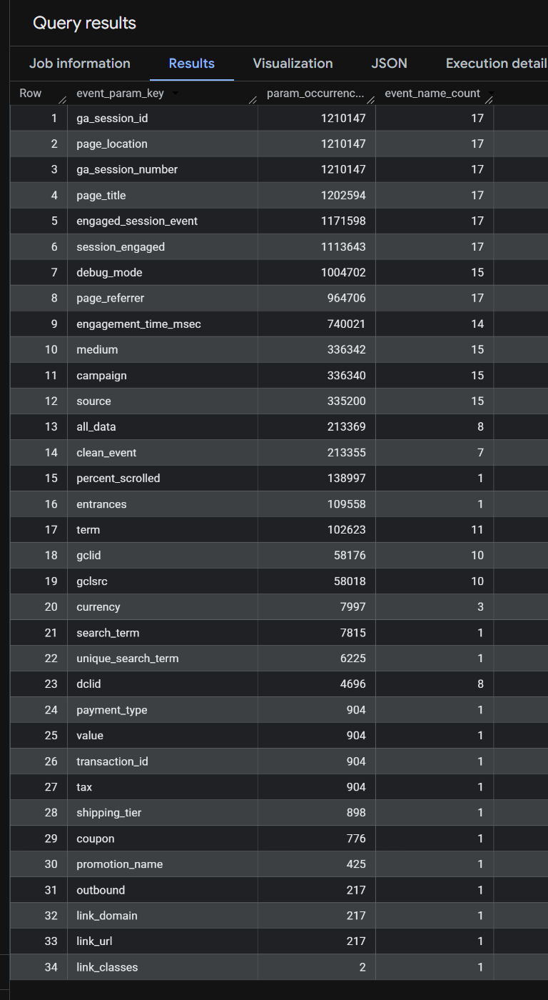

## Key Findings

Common reusable parameters include:

- `ga_session_id`
- `ga_session_number`
- `page_location`
- `page_title`
- `source`
- `medium`
- `campaign`

Event-specific parameters include:

- `transaction_id`
- `payment_type`
- `coupon`
- `search_term`
- `percent_scrolled`

## Modeling Implications

Future staging should selectively extract reusable high-value parameters instead of flattening every event parameter.

---

# D11 — Event Parameter Coverage by Event Type

## Objective

Validate how event parameter coverage differs across event types.

## Query Reference

```sql
-- D11) Event parameter coverage by event type (sample window)

SELECT
  event_name,
  ep.key AS event_param_key,
  COUNT(*) AS param_occurrence_count
FROM `bigquery-public-data.ga4_obfuscated_sample_ecommerce.events_*`,
UNNEST(event_params) AS ep
WHERE _TABLE_SUFFIX BETWEEN '20210101' AND '20210131'
GROUP BY
  event_name,
  ep.key
ORDER BY
  event_name,
  param_occurrence_count DESC;
```

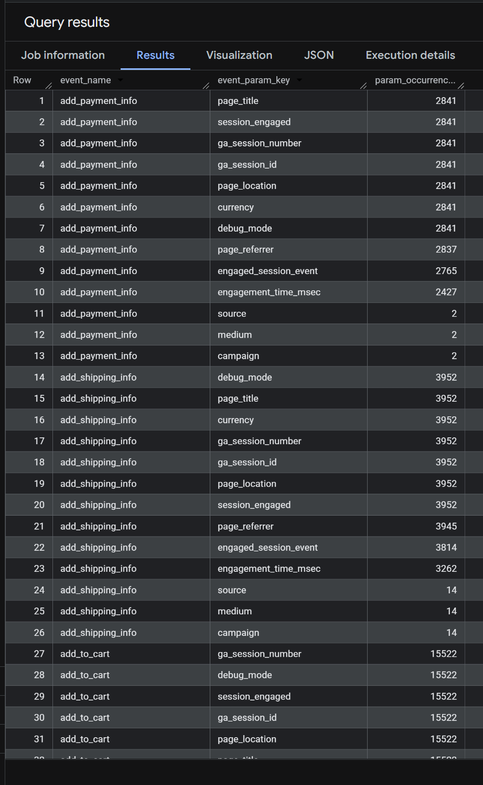

## Key Findings

- Event schemas differ across event categories.
- Commerce events show stable parameter structures.
- Attribution fields are sparse for some ecommerce events.
- Parameter extraction logic must remain event-aware.

## Modeling Implications

Downstream staging should not assume every parameter exists for every event. Extraction logic should be based on event type and business use case.

---

# Phase 1A Summary

## Completed

- [x] Raw structure inspection
- [x] Sample date coverage validation
- [x] Global date coverage validation
- [x] Core null validation
- [x] Approximate duplicate validation
- [x] Invalid date validation
- [x] Event taxonomy profiling
- [x] Purchase presence and revenue validation
- [x] Item array profiling
- [x] Daily volume validation
- [x] User and session volume profiling
- [x] Session ID availability validation
- [x] Event-level traffic source profiling
- [x] Purchase transaction quality validation
- [x] Transaction-level revenue integrity validation
- [x] Event parameter key frequency profiling
- [x] Event parameter coverage profiling

---

# Key Profiling Decisions

## Decision 1 — Use January 2021 as Profiling Window

January 2021 was selected to balance:

- sufficient event scale
- manageable BigQuery scan cost
- realistic profiling coverage

---

## Decision 2 — Build Event-Aware Staging Logic

GA4 event schemas differ significantly by event type. Future extraction logic should remain selective and event-aware.

---

## Decision 3 — Use Composite Session Keys

Session grain should use:

```text
user_pseudo_id + ga_session_id
```

because `ga_session_id` alone should not be assumed globally unique.

---

## Decision 4 — Treat `(not set)` Transaction IDs as Invalid

`transaction_id = '(not set)'` should not be counted as a valid transaction ID.

---

## Decision 5 — Apply Transaction-Level Revenue Deduplication

Revenue aggregation should avoid naïve raw-row summation due to duplicate purchase event patterns.

---

# Known Data Quality Notes

| Area | Issue | Impact |
|---|---|---|
| Historical coverage | Dataset limited to 2020-11-01 through 2021-01-31 | Reduced long-term trend and seasonality analysis |
| Acquisition fields | Frequent `(not set)` values | Requires fallback attribution and channel mapping |
| Revenue completeness | 300 purchase events have missing revenue | Revenue KPI caution required |
| Transaction IDs | 300 purchase events have missing or invalid transaction IDs | Invalid transactions should be excluded or flagged |
| Purchase duplication | Duplicate purchase event behavior detected | Revenue inflation risk if raw rows are summed |

---

# Next Phase — GA4 Staging

## Planned Tasks

- [ ] Create `stg_ga4_events`
- [ ] Extract core event fields:
  - `event_date`
  - `event_timestamp`
  - `event_name`
  - `user_pseudo_id`
- [ ] Extract session fields:
  - `ga_session_id`
  - `ga_session_number`
- [ ] Extract page fields:
  - `page_location`
  - `page_title`
- [ ] Extract acquisition fields:
  - `source`
  - `medium`
  - `campaign`
- [ ] Extract ecommerce fields:
  - `transaction_id`
  - `purchase_revenue`
- [ ] Create composite session key
- [ ] Flag invalid transaction IDs
- [ ] Handle missing purchase revenue
- [ ] Design transaction deduplication logic
- [ ] Validate row counts after staging


# Phase 1B — GA4 Staging View

## Objective

Create a flattened GA4 event-level staging view that converts the nested raw GA4 export into a reusable analytical layer for downstream fact tables, marts, validation checks, and BI-ready KPI modeling.

The staging view preserves the raw event grain:

```text
one row per raw GA4 event
````

## Main SQL File

```text
sql/ga4/02_stg_ga4_events.sql
```

## Target View

```text
commercial-analytics-bq-dbx.commercial_analytics_us.stg_ga4_events
```

## Source Table

```text
bigquery-public-data.ga4_obfuscated_sample_ecommerce.events_*
```

## Sample Window

```text
2021-01-01 to 2021-01-31
```

## Completed

* [x] Created `stg_ga4_events` view in BigQuery
* [x] Preserved event-level grain
* [x] Extracted core event fields
* [x] Extracted session fields from `event_params`
* [x] Created composite `session_key`
* [x] Extracted page and content parameters
* [x] Extracted engagement parameters
* [x] Extracted acquisition parameters
* [x] Preserved raw acquisition fields for debugging
* [x] Extracted selected ecommerce fields
* [x] Added item-array metadata without unnesting items
* [x] Added ecommerce funnel event flags
* [x] Added purchase event flags
* [x] Added data quality flags
* [x] Added event proxy key for duplicate validation

## Key Design Decisions

### Decision 1 — Preserve Event-Level Grain

The staging view keeps one row per raw GA4 event. The `items` array is not unnested in this layer because unnesting would multiply rows and break event-level grain.

Product-level or item-level modeling should be handled in a separate downstream fact table if needed.

### Decision 2 — Use Selective Parameter Extraction

Only high-value GA4 parameters were extracted from `event_params`, including:

* `ga_session_id`
* `ga_session_number`
* `page_location`
* `page_title`
* `page_referrer`
* `engagement_time_msec`
* `session_engaged`
* `source`
* `medium`
* `campaign`
* `search_term`
* `percent_scrolled`
* `coupon`
* `payment_type`

This avoids flattening every GA4 parameter unnecessarily.

### Decision 3 — Build Composite Session Key

Session grain uses:

```text
user_pseudo_id + ga_session_id
```

because `ga_session_id` alone should not be assumed globally unique across users.

### Decision 4 — Normalize Acquisition Nulls Only

Acquisition fields were normalized only for null or blank values:

```text
source
medium
campaign
```

Blank or null values are converted to:

```text
(not set)
```

Business-level channel grouping is intentionally left for the downstream `dim_channel` or mart layer.

### Decision 5 — Flag Data Quality Issues Without Filtering Rows

The staging view adds quality flags but does not remove or deduplicate records.

Important flags include:

* `is_invalid_event_date`
* `is_missing_user_pseudo_id`
* `is_missing_ga_session_id`
* `is_missing_session_key`
* `is_invalid_purchase_transaction_id`
* `is_missing_purchase_revenue`
* `is_zero_purchase_revenue`
* `is_negative_purchase_revenue`

This keeps staging transparent and auditable.

### Decision 6 — Revenue Deduplication Is Deferred

Transaction-level revenue deduplication is not performed in staging.

This is intentional because staging should remain close to the raw event export. Revenue deduplication should happen later in fact or mart logic where the business grain is clearly defined.

## Initial Staging Sanity Check

After creating the staging view, a quick sanity check was executed.

```sql
SELECT
  COUNT(*) AS total_rows,
  MIN(event_date) AS min_event_date,
  MAX(event_date) AS max_event_date,
  COUNT(DISTINCT session_key) AS unique_sessions,
  COUNTIF(is_purchase_event = TRUE) AS purchase_events
FROM `commercial-analytics-bq-dbx.commercial_analytics_us.stg_ga4_events`;
```

## Result

| total_rows | min_event_date | max_event_date | unique_sessions | purchase_events |
| ---------: | -------------- | -------------- | --------------: | --------------: |
|  1,210,147 | 2021-01-01     | 2021-01-31     |         118,380 |           1,204 |

## Key Findings

* The staging view was created successfully.
* Row volume matches the expected January 2021 profiling window.
* Date range matches the intended sample window.
* Session extraction is working.
* Purchase event count matches the profiling result.
* The view is ready for structured validation.

---

# Phase 1C — GA4 Staging Validation

## Objective

Validate that the GA4 staging view correctly preserves raw event volume, date coverage, session logic, event taxonomy, ecommerce flags, acquisition fields, and data quality indicators.

## Main SQL File

```text
sql/validation/ga4/02b_validate_stg_ga4_events.sql
```

## Screenshot Directory

```text
bi/screenshots/ga4/validation/staging/
```

## Screenshot Naming Convention

| Validation Step                                      | Screenshot File                                             |
| ---------------------------------------------------- | ----------------------------------------------------------- |
| V1 — Raw vs staging row count validation             | `ga4_staging_validation_v01_row_count.png`                  |
| V2 — Staging date range validation                   | `ga4_staging_validation_v02_date_range.png`                 |
| V3 — Core field null validation                      | `ga4_staging_validation_v03_core_nulls.png`                 |
| V4 — Session field availability validation           | `ga4_staging_validation_v04_session_availability.png`       |
| V5 — Session volume validation                       | `ga4_staging_validation_v05_session_volume.png`             |
| V6 — Duplicate proxy validation                      | `ga4_staging_validation_v06_duplicate_proxy.png`            |
| V7 — Event distribution validation                   | `ga4_staging_validation_v07_event_distribution.png`         |
| V8 — Ecommerce funnel event validation               | `ga4_staging_validation_v08_ecommerce_funnel_flags.png`     |
| V9 — Purchase quality validation                     | `ga4_staging_validation_v09_purchase_quality.png`           |
| V10 — Valid transaction and revenue validation       | `ga4_staging_validation_v10_valid_transactions_revenue.png` |
| V11 — Transaction duplicate / revenue inflation risk | `ga4_staging_validation_v11_transaction_duplicate_risk.png` |
| V12 — Acquisition field validation                   | `ga4_staging_validation_v12_acquisition_distribution.png`   |
| V13 — Not set acquisition rate                       | `ga4_staging_validation_v13_not_set_acquisition_rate.png`   |
| V14 — Item array validation by event type            | `ga4_staging_validation_v14_item_array_validation.png`      |
| V15 — Engagement field validation                    | `ga4_staging_validation_v15_engagement_validation.png`      |
| V16 — Data quality flag summary                      | `ga4_staging_validation_v16_quality_flag_summary.png`       |
| V17 — Final staging validation status                | `ga4_staging_validation_v17_final_status.png`               |

---

## V1 — Raw vs Staging Row Count Validation

### Objective

Confirm that the staging view preserves the same number of rows as the raw GA4 event source for the January 2021 sample window.

This validates that the staging transformation did not accidentally drop, duplicate, filter, or multiply event rows.

### Query Reference

```sql
WITH raw_count AS (
  SELECT
    COUNT(*) AS raw_row_count
  FROM `bigquery-public-data.ga4_obfuscated_sample_ecommerce.events_*`
  WHERE _TABLE_SUFFIX BETWEEN '20210101' AND '20210131'
),

staging_count AS (
  SELECT
    COUNT(*) AS staging_row_count
  FROM `commercial-analytics-bq-dbx.commercial_analytics_us.stg_ga4_events`
)

SELECT
  raw_row_count,
  staging_row_count,
  raw_row_count - staging_row_count AS row_count_difference,
  CASE
    WHEN raw_row_count = staging_row_count THEN 'PASS'
    ELSE 'FAIL'
  END AS validation_status
FROM raw_count
CROSS JOIN staging_count;
```

### Result

| raw_row_count | staging_row_count | row_count_difference | validation_status |
| ------------: | ----------------: | -------------------: | ----------------- |
|     1,210,147 |         1,210,147 |                    0 | PASS              |


### Key Findings

* Raw GA4 row count and staging row count match exactly.
* No rows were lost during staging.
* No row multiplication occurred during parameter extraction.
* Event-level grain was preserved successfully.

### Status

```text
PASS
```

---
````markdown
---

## V2 — Staging Date Range Validation

### Objective

Validate that the staging view preserves the correct date coverage from the January 2021 GA4 sample window.

This validation confirms that:

- the staging transformation did not accidentally exclude dates
- no unexpected dates were introduced
- daily event continuity remains intact
- the intended sample window was preserved correctly

### Query Reference

```sql
SELECT
  MIN(event_date) AS min_event_date,
  MAX(event_date) AS max_event_date,
  COUNT(DISTINCT event_date) AS distinct_event_dates,
  COUNT(*) AS total_rows
FROM `commercial-analytics-bq-dbx.commercial_analytics_us.stg_ga4_events`;
````

### Result

| min_event_date | max_event_date | distinct_event_dates | total_rows |
| -------------- | -------------- | -------------------: | ---------: |
| 2021-01-01     | 2021-01-31     |                   31 |  1,210,147 |

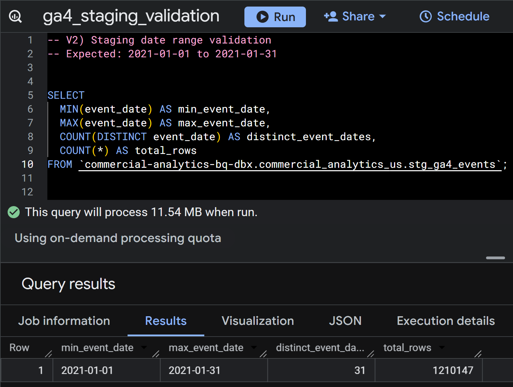

### Key Findings

* The staging view preserved the full intended January 2021 sample window.
* All 31 expected event dates are present.
* No missing or unexpected dates were detected.
* Event continuity remains stable after staging transformation.
* Total row volume remains aligned with earlier profiling and staging sanity checks.

### Validation Implications

This confirms that:

* date parsing logic is functioning correctly
* staging transformations did not filter event dates unintentionally
* the staging layer is safe for:

  * time-series aggregation
  * rolling KPI calculations
  * daily trend analysis
  * downstream session modeling

### Status

```text
PASS
```

---

```
```
````markdown
---

## V3 — Core Field Null Validation in Staging

### Objective

Validate that the most important event-level fields remain fully populated after the GA4 staging transformation.

This check focuses on the core fields required for downstream modeling:

- `event_date`
- `event_timestamp_utc`
- `event_timestamp_raw`
- `event_name`
- `user_pseudo_id`

These fields are foundational for time-series analysis, event sequencing, user-level aggregation, session modeling, and KPI construction.

### Query Reference

```sql
SELECT
  COUNT(*) AS total_rows,

  COUNTIF(event_date IS NULL) AS null_event_date,
  COUNTIF(event_timestamp_utc IS NULL) AS null_event_timestamp_utc,
  COUNTIF(event_timestamp_raw IS NULL) AS null_event_timestamp_raw,
  COUNTIF(event_name IS NULL) AS null_event_name,
  COUNTIF(user_pseudo_id IS NULL) AS null_user_pseudo_id,

  ROUND(SAFE_DIVIDE(COUNTIF(event_date IS NULL), COUNT(*)), 4) AS null_event_date_rate,
  ROUND(SAFE_DIVIDE(COUNTIF(event_timestamp_utc IS NULL), COUNT(*)), 4) AS null_event_timestamp_utc_rate,
  ROUND(SAFE_DIVIDE(COUNTIF(event_name IS NULL), COUNT(*)), 4) AS null_event_name_rate,
  ROUND(SAFE_DIVIDE(COUNTIF(user_pseudo_id IS NULL), COUNT(*)), 4) AS null_user_pseudo_id_rate
FROM `commercial-analytics-bq-dbx.commercial_analytics_us.stg_ga4_events`;
````

### Result

| total_rows | null_event_date | null_event_timestamp_utc | null_event_timestamp_raw | null_event_name | null_user_pseudo_id | null_event_date_rate | null_event_timestamp_utc_rate | null_event_name_rate | null_user_pseudo_id_rate |
| ---------: | --------------: | -----------------------: | -----------------------: | --------------: | ------------------: | -------------------: | ----------------------------: | -------------------: | -----------------------: |
|  1,210,147 |               0 |                        0 |                        0 |               0 |                   0 |                  0.0 |                           0.0 |                  0.0 |                      0.0 |

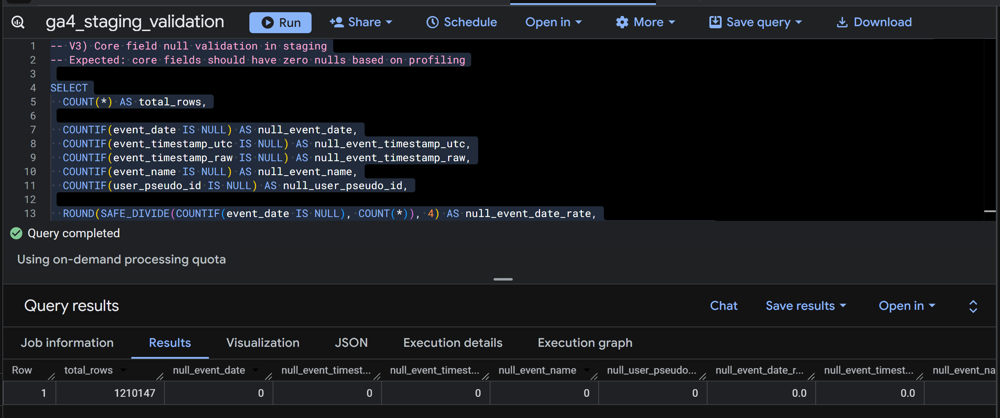

### Key Findings

* No null values were detected in the core staging fields.
* Event date parsing did not introduce invalid or missing dates.
* Event timestamps remained fully populated after transformation.
* Event names are complete across all staged rows.
* `user_pseudo_id` is fully populated, supporting user-level and session-level modeling.

### Validation Implications

This confirms that the staging layer is reliable for:

* daily event aggregation
* event sequencing
* session construction
* user-level behavioral analysis
* downstream fact table development

No remediation is required for core field completeness.

### Status

```text
PASS
```

---

```
```
````markdown
---

## V4 — Session Field Availability Validation

### Objective

Validate that the session-related fields remain fully populated after staging transformation.

This validation focuses on the two most important session identifiers:

- `ga_session_id`
- `session_key`

The purpose of this check is to confirm that session extraction logic is functioning correctly and that downstream session-level modeling can safely rely on these fields.

### Query Reference

```sql
SELECT
  COUNT(*) AS total_rows,

  COUNTIF(ga_session_id IS NULL) AS null_ga_session_id,
  COUNTIF(session_key IS NULL) AS null_session_key,

  COUNTIF(ga_session_id IS NOT NULL) AS populated_ga_session_id,
  COUNTIF(session_key IS NOT NULL) AS populated_session_key,

  ROUND(SAFE_DIVIDE(COUNTIF(ga_session_id IS NULL), COUNT(*)), 4) AS null_ga_session_id_rate,
  ROUND(SAFE_DIVIDE(COUNTIF(session_key IS NULL), COUNT(*)), 4) AS null_session_key_rate
FROM `commercial-analytics-bq-dbx.commercial_analytics_us.stg_ga4_events`;
````

### Result

| total_rows | null_ga_session_id | null_session_key | populated_ga_session_id | populated_session_key | null_ga_session_id_rate | null_session_key_rate |
| ---------: | -----------------: | ---------------: | ----------------------: | --------------------: | ----------------------: | --------------------: |
|  1,210,147 |                  0 |                0 |               1,210,147 |             1,210,147 |                     0.0 |                   0.0 |

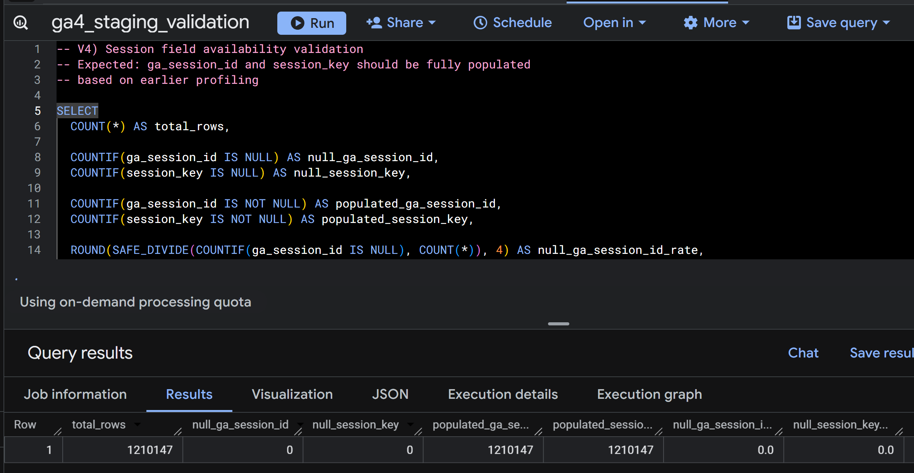

### Key Findings

* All staged events contain a valid `ga_session_id`.
* All staged events contain a valid composite `session_key`.
* No session identifier loss occurred during parameter extraction.
* Session-level grain remains stable after staging transformation.

### Validation Implications

This confirms that the staging layer is reliable for:

* session-level aggregation
* session KPI construction
* session-to-user relationship modeling
* traffic acquisition attribution
* funnel progression analysis
* downstream session fact table generation

The composite session key strategy:

```text
user_pseudo_id + ga_session_id
```

was successfully populated across the full dataset.

### Technical Interpretation

The result also confirms that:

* `event_params` extraction logic worked correctly
* session parameter parsing remained stable
* no unintended null propagation occurred during transformation
* the staging layer preserved session continuity successfully

### Status

```text
PASS
```

---

```
```
````markdown
---

## V5 — Session Volume Validation

### Objective

Validate that the session volume extracted from the staging layer remains stable, internally consistent, and analytically plausible.

This validation focuses on:

- total event volume
- unique user count
- unique session count
- average event activity per session

The goal is to confirm that session extraction logic did not introduce abnormal session inflation or unexpected session sparsity.

### Query Reference

```sql
SELECT
  COUNT(*) AS total_event_rows,
  COUNT(DISTINCT user_pseudo_id) AS unique_users,
  COUNT(DISTINCT session_key) AS unique_sessions,
  ROUND(SAFE_DIVIDE(COUNT(*), COUNT(DISTINCT session_key)), 2) AS avg_events_per_session
FROM `commercial-analytics-bq-dbx.commercial_analytics_us.stg_ga4_events`;
````

### Result

| total_event_rows | unique_users | unique_sessions | avg_events_per_session |
| ---------------: | -----------: | --------------: | ---------------------: |
|        1,210,147 |       94,790 |         118,380 |                  10.22 |


### Key Findings

* The staging layer contains over 1.21 million event rows.
* Approximately 94.8K unique users were identified.
* Approximately 118.4K unique sessions were constructed successfully.
* The average number of events per session is approximately 10.22.

### Validation Interpretation

The session volume distribution appears realistic and internally consistent for ecommerce behavioral analytics.

The results suggest that:

* session extraction logic is functioning correctly
* session inflation is not occurring
* session fragmentation is not occurring
* composite session keys are stable
* downstream session-level aggregation is reliable

### Business Interpretation

An average of approximately 10 events per session is analytically plausible for GA4 ecommerce browsing behavior because sessions commonly include:

* page views
* scroll activity
* session engagement events
* product interactions
* cart interactions
* checkout progression
* purchase activity

This indicates healthy behavioral continuity across the staged dataset.

### Validation Implications

The staging layer is suitable for:

* session KPI modeling
* funnel analysis
* behavioral analytics
* session attribution
* engagement analysis
* downstream fact session table construction

### Status

```text
PASS
```

---

```
```
````markdown
---

## V6 — Duplicate Proxy Validation in Staging

### Objective

Validate that the GA4 staging transformation did not accidentally introduce duplicate event rows.

Because GA4 raw exports do not provide a guaranteed globally unique event identifier, a proxy event key was constructed for duplicate detection using:

```text
user_pseudo_id + event_timestamp_raw + event_name
````

This validation checks whether staging transformations, parameter extraction logic, or event flattening introduced unintended row multiplication.

### Query Reference

```sql
SELECT
  COUNT(*) AS row_count,
  COUNT(DISTINCT event_proxy_key) AS distinct_event_proxy_keys,
  COUNT(*) - COUNT(DISTINCT event_proxy_key) AS duplicate_proxy_rows,
  CASE
    WHEN COUNT(*) = COUNT(DISTINCT event_proxy_key) THEN 'PASS'
    ELSE 'CHECK'
  END AS validation_status
FROM `commercial-analytics-bq-dbx.commercial_analytics_us.stg_ga4_events`;
```

### Result

| row_count | distinct_event_proxy_keys | duplicate_proxy_rows | validation_status |
| --------: | ------------------------: | -------------------: | ----------------- |
| 1,210,147 |                 1,210,147 |                    0 | PASS              |


### Key Findings

* No duplicate proxy rows were detected in the staging layer.
* Event-level grain was preserved successfully.
* Parameter extraction logic did not multiply event rows.
* The staging transformation remained one-to-one with the raw event structure.

### Validation Interpretation

This result is especially important because GA4 datasets contain nested and repeated structures.

Incorrect handling of:

* `UNNEST(event_params)`
* `UNNEST(items)`
* repeated ecommerce arrays

can easily create silent row multiplication.

The validation confirms that:

* no accidental Cartesian expansion occurred
* item arrays were handled safely
* event parameter extraction remained row-safe
* the staging layer preserved raw event integrity

### Technical Implications

This validation significantly reduces downstream risk for:

* revenue inflation
* session inflation
* duplicate funnel events
* distorted conversion metrics
* inaccurate KPI aggregation

The result confirms that downstream fact and mart layers can safely aggregate staged events without hidden duplication introduced during staging.

### Status

```text
PASS
```

---

```
```
````markdown
---

## V7 — Event Distribution Validation

### Objective

Validate that the staging layer preserved the original GA4 event taxonomy and behavioral event distribution after transformation.

This validation checks whether:

- event names were preserved correctly
- event extraction logic remained stable
- no unexpected event inflation occurred
- ecommerce funnel events remain visible
- behavioral event hierarchy remains analytically plausible

The purpose is to confirm that the staging layer accurately reflects the original behavioral structure of the GA4 export.

### Query Reference

```sql
SELECT
  event_name,
  COUNT(*) AS event_count,
  ROUND(SAFE_DIVIDE(COUNT(*), SUM(COUNT(*)) OVER ()), 4) AS event_share
FROM `commercial-analytics-bq-dbx.commercial_analytics_us.stg_ga4_events`
GROUP BY event_name
ORDER BY event_count DESC
LIMIT 30;
````

### Result

| event_name          | event_count | event_share |
| ------------------- | ----------: | ----------: |
| page_view           |     419,004 |      0.3462 |
| user_engagement     |     250,097 |      0.2067 |
| scroll              |     138,997 |      0.1149 |
| session_start       |     116,549 |      0.0963 |
| first_visit         |      88,873 |      0.0734 |
| view_item           |      86,971 |      0.0719 |
| view_promotion      |      53,885 |      0.0445 |
| add_to_cart         |      15,522 |      0.0128 |
| begin_checkout      |      11,034 |      0.0091 |
| select_item         |      10,229 |      0.0085 |
| view_search_results |       7,815 |      0.0065 |
| add_shipping_info   |       3,952 |      0.0033 |
| select_promotion    |       2,948 |      0.0024 |
| add_payment_info    |       2,841 |      0.0023 |
| purchase            |       1,204 |      0.0010 |

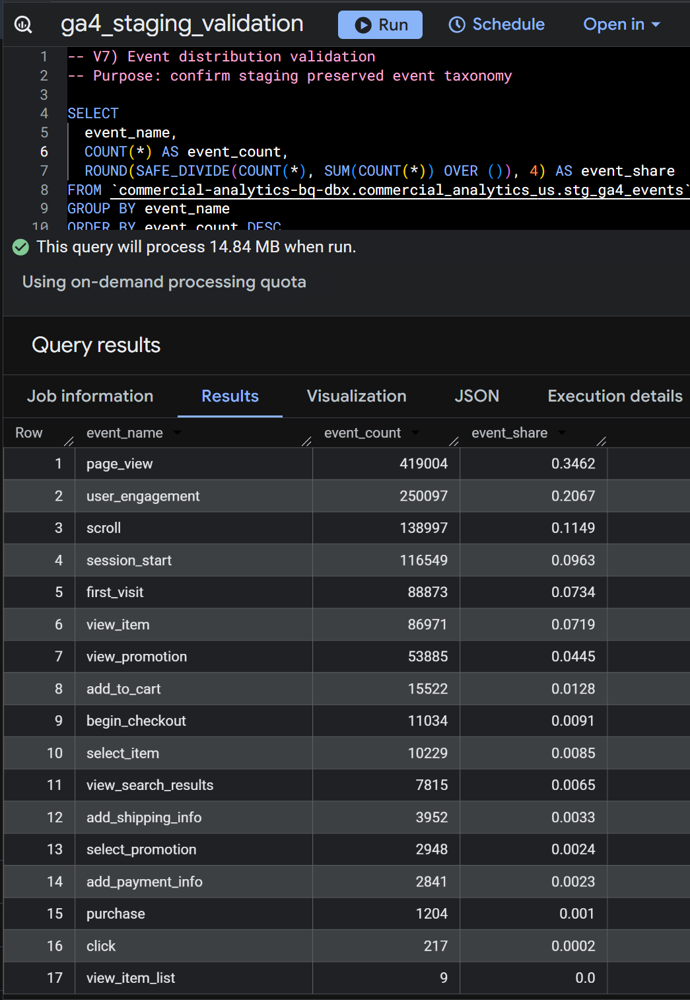

### Key Findings

* Behavioral events dominate the dataset as expected.
* `page_view` is the largest event category, representing approximately 34.6% of all staged events.
* Engagement-related events (`user_engagement`, `scroll`) remain highly represented.
* Session initialization events (`session_start`, `first_visit`) appear at realistic volume levels.
* Ecommerce funnel events remain visible and logically distributed across the conversion funnel.

### Ecommerce Funnel Interpretation

The staged event distribution reflects a realistic ecommerce funnel progression:

```text
view_item
→ add_to_cart
→ begin_checkout
→ add_shipping_info
→ add_payment_info
→ purchase
```

Event counts decrease naturally across the funnel stages, which indicates:

* no major funnel distortion
* no accidental event duplication
* no missing downstream ecommerce events
* stable behavioral continuity

### Validation Interpretation

This validation confirms that:

* event taxonomy was preserved successfully
* staging transformations did not alter event classifications
* event extraction logic remained stable
* event-level grain remains analytically reliable
* downstream behavioral and funnel analytics can safely rely on the staged layer

### Business Interpretation

The distribution also suggests that the sample behaves like a realistic ecommerce environment:

* large browsing activity
* moderate engagement activity
* progressively smaller funnel conversion stages
* relatively low final purchase volume compared to browsing volume

This is consistent with real-world ecommerce user behavior.

### Validation Implications

The staging layer is suitable for:

* funnel analysis
* behavioral analytics
* engagement modeling
* ecommerce KPI tracking
* conversion analysis
* downstream session and channel marts

### Status

```text
PASS
```

---

```
```
````markdown
---

## V8 — Ecommerce Funnel Event Validation

### Objective

Validate that ecommerce funnel events were correctly classified and flagged during the staging transformation process.

This validation focuses on the core ecommerce funnel events:

- `view_item`
- `add_to_cart`
- `begin_checkout`
- `purchase`

The purpose is to confirm that:

- ecommerce funnel event classification logic is working correctly
- item-related events preserve item presence appropriately
- purchase events are correctly identified
- downstream funnel analytics can safely rely on the staging layer

### Query Reference

```sql
SELECT
  event_name,
  COUNT(*) AS event_count,
  COUNTIF(is_ecommerce_funnel_event = TRUE) AS ecommerce_funnel_flagged_rows,
  COUNTIF(has_items = TRUE) AS rows_with_items,
  COUNTIF(is_purchase_event = TRUE) AS purchase_flagged_rows
FROM `commercial-analytics-bq-dbx.commercial_analytics_us.stg_ga4_events`
WHERE event_name IN (
  'view_item',
  'add_to_cart',
  'begin_checkout',
  'purchase'
)
GROUP BY event_name
ORDER BY event_count DESC;
````

### Result

| event_name     | event_count | ecommerce_funnel_flagged_rows | rows_with_items | purchase_flagged_rows |
| -------------- | ----------: | ----------------------------: | --------------: | --------------------: |
| view_item      |      86,971 |                        86,971 |          60,750 |                     0 |
| add_to_cart    |      15,522 |                        15,522 |          15,522 |                     0 |
| begin_checkout |      11,034 |                        11,034 |          11,034 |                     0 |
| purchase       |       1,204 |                         1,204 |           1,204 |                 1,204 |

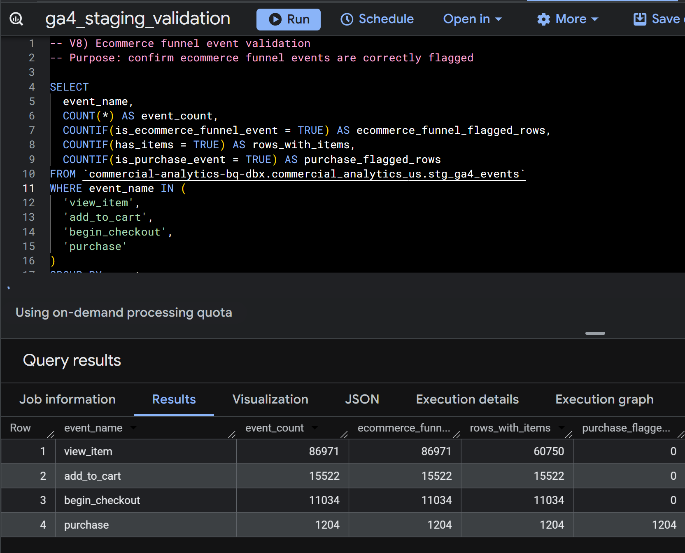

### Key Findings

* All ecommerce funnel events were correctly flagged.
* All `purchase` events were correctly identified by the `is_purchase_event` flag.
* Funnel event classification remained fully consistent across the staged dataset.
* Item presence remains strongly associated with downstream ecommerce funnel stages.

### Funnel Behavior Interpretation

The staged dataset reflects a realistic ecommerce funnel progression:

```text
view_item
→ add_to_cart
→ begin_checkout
→ purchase
```

Event counts decrease naturally across the funnel stages:

| Funnel Stage   | Event Count |
| -------------- | ----------: |
| view_item      |      86,971 |
| add_to_cart    |      15,522 |
| begin_checkout |      11,034 |
| purchase       |       1,204 |

This indicates:

* realistic conversion attrition
* stable ecommerce event continuity
* no major funnel distortion
* no unexpected event inflation

### Item Presence Interpretation

The validation also confirms expected item behavior:

* `add_to_cart`
* `begin_checkout`
* `purchase`

all maintain full item association.

The lower item coverage observed for `view_item` events is analytically plausible because some product-view interactions in GA4 ecommerce datasets may not fully populate item arrays consistently.

### Validation Interpretation

This validation confirms that:

* ecommerce funnel classification logic is functioning correctly
* purchase event identification is reliable
* item metadata survived staging transformation safely
* event-level ecommerce semantics were preserved successfully

### Business Implications

The staging layer is now suitable for:

* ecommerce funnel conversion analysis
* add-to-cart rate modeling
* checkout abandonment analysis
* purchase conversion KPI tracking
* downstream ecommerce mart development

### Technical Implications

This validation significantly reduces downstream risk for:

* missing purchase attribution
* broken funnel sequencing
* incorrect conversion metrics
* item-level aggregation distortion
* purchase-event misclassification

### Status

```text
PASS
```

---

```
```
````markdown
---

## V9 — Purchase Quality Validation

### Objective

Validate purchase-event quality after staging transformation.

This validation checks whether the staged purchase flags correctly capture known ecommerce data quality issues identified during profiling:

- invalid or missing transaction IDs
- missing purchase revenue
- zero purchase revenue
- negative purchase revenue

The purpose is to confirm that purchase-related data quality risks are visible in the staging layer before downstream revenue and conversion modeling.

### Query Reference

```sql
SELECT
  COUNTIF(is_purchase_event = TRUE) AS purchase_events,

  COUNTIF(is_invalid_purchase_transaction_id = TRUE) AS invalid_purchase_transaction_id_events,
  ROUND(
    SAFE_DIVIDE(
      COUNTIF(is_invalid_purchase_transaction_id = TRUE),
      COUNTIF(is_purchase_event = TRUE)
    ),
    4
  ) AS invalid_purchase_transaction_id_rate,

  COUNTIF(is_missing_purchase_revenue = TRUE) AS missing_purchase_revenue_events,
  ROUND(
    SAFE_DIVIDE(
      COUNTIF(is_missing_purchase_revenue = TRUE),
      COUNTIF(is_purchase_event = TRUE)
    ),
    4
  ) AS missing_purchase_revenue_rate,

  COUNTIF(is_zero_purchase_revenue = TRUE) AS zero_purchase_revenue_events,
  COUNTIF(is_negative_purchase_revenue = TRUE) AS negative_purchase_revenue_events
FROM `commercial-analytics-bq-dbx.commercial_analytics_us.stg_ga4_events`;
````

### Result

| purchase_events | invalid_purchase_transaction_id_events | invalid_purchase_transaction_id_rate | missing_purchase_revenue_events | missing_purchase_revenue_rate | zero_purchase_revenue_events | negative_purchase_revenue_events |
| --------------: | -------------------------------------: | -----------------------------------: | ------------------------------: | ----------------------------: | ---------------------------: | -------------------------------: |
|           1,204 |                                    300 |                               0.2492 |                             300 |                        0.2492 |                            0 |                                0 |


### Key Findings

* The staging layer contains 1,204 purchase events.
* 300 purchase events have invalid or missing transaction IDs.
* 300 purchase events have missing purchase revenue.
* Invalid transaction ID rate is 24.92%.
* Missing purchase revenue rate is 24.92%.
* No zero-revenue purchase events were detected.
* No negative-revenue purchase events were detected.

### Validation Interpretation

This confirms that the staging layer correctly preserved and exposed the purchase quality issues identified during raw profiling.

The result is important because purchase events are not all equally reliable for revenue modeling. A meaningful portion of purchase events lack valid transaction and revenue information, so downstream revenue logic must avoid treating every raw purchase event as a valid transaction.

### Modeling Implications

Revenue and transaction models should:

* exclude or separately flag invalid purchase transaction IDs
* avoid counting `(not set)` transaction IDs as valid transactions
* avoid naive raw purchase-row revenue summation
* use transaction-level deduplication in downstream fact or mart logic
* separate purchase-event volume from valid transaction count

### Business Implications

This result means that purchase-event count and valid revenue-generating transaction count are not the same metric.

For reporting, the project should distinguish between:

* purchase events
* valid transactions
* revenue-bearing transactions
* excluded or flagged purchase events

This distinction prevents inflated or misleading ecommerce KPI reporting.

### Status

```text
PASS WITH KNOWN DATA QUALITY ISSUE
```

---

```
```
````markdown
---

## V10 — Valid Transaction and Revenue Validation

### Objective

Validate the relationship between:

- raw purchase event rows
- purchase rows with valid transaction IDs
- distinct valid transactions
- aggregated purchase revenue

The purpose of this validation is to distinguish between:

- raw ecommerce activity
- analytically valid transactions
- reliable revenue-bearing purchase records

This is a critical validation because GA4 purchase events can contain:

- duplicated transaction IDs
- missing transaction IDs
- missing revenue values
- multiple purchase rows linked to the same transaction

### Query Reference

```sql
SELECT
  COUNTIF(is_purchase_event = TRUE) AS purchase_event_rows,

  COUNTIF(
    is_purchase_event = TRUE
    AND transaction_id IS NOT NULL
  ) AS purchase_rows_with_valid_transaction_id,

  COUNT(DISTINCT
    CASE
      WHEN is_purchase_event = TRUE
        AND transaction_id IS NOT NULL
      THEN transaction_id
    END
  ) AS distinct_valid_transaction_ids,

  SUM(
    CASE
      WHEN is_purchase_event = TRUE
      THEN COALESCE(purchase_revenue, 0)
      ELSE 0
    END
  ) AS raw_purchase_revenue_sum
FROM `commercial-analytics-bq-dbx.commercial_analytics_us.stg_ga4_events`;
````

### Result

| purchase_event_rows | purchase_rows_with_valid_transaction_id | distinct_valid_transaction_ids | raw_purchase_revenue_sum |
| ------------------: | --------------------------------------: | -----------------------------: | -----------------------: |
|               1,204 |                                     904 |                            894 |                 57,350.0 |


### Key Findings

* The dataset contains 1,204 raw purchase event rows.
* Only 904 purchase rows contain valid transaction IDs.
* Only 894 distinct valid transaction IDs exist.
* Total raw staged purchase revenue equals 57,350.0.

### Validation Interpretation

This validation confirms that:

* raw purchase-event volume is larger than the number of valid transactions
* some purchase rows contain duplicated transaction IDs
* some purchase rows contain invalid or missing transaction identifiers
* downstream revenue logic must use transaction-level deduplication

### Transaction Integrity Interpretation

The difference between:

```text
purchase_event_rows = 1,204
distinct_valid_transaction_ids = 894
```

indicates that:

* not every purchase row represents a unique transaction
* some transaction IDs appear multiple times
* purchase-event count alone is not a reliable transaction KPI

This is a common ecommerce analytics issue and must be handled carefully in downstream fact modeling.

### Revenue Interpretation

The staged revenue total:

```text
57,350.0
```

represents raw purchase-event revenue aggregation.

However, because duplicate or repeated transaction rows may exist, downstream revenue marts should:

* deduplicate valid transaction IDs
* aggregate revenue at transaction grain
* avoid naive row-level revenue summation

### Business Implications

This validation is extremely important for executive KPI integrity.

Without transaction-level deduplication, the project risks:

* inflated revenue reporting
* overstated conversion metrics
* distorted AOV calculations
* inaccurate transaction KPIs

The validation confirms that transaction-quality logic must remain part of downstream modeling.

### Modeling Implications

Future fact and mart layers should:

* build transaction-grain revenue logic
* separate purchase events from valid transactions
* exclude invalid transaction IDs
* define clear “valid transaction” KPI logic
* implement transaction deduplication safeguards

### Validation Outcome

The staging layer successfully preserved transaction-quality visibility and exposed known ecommerce transaction inconsistencies correctly.

### Status

```text
PASS WITH KNOWN TRANSACTION QUALITY CONSTRAINTS
```

---

```
```
````markdown
---

## V11 — Transaction Duplicate & Revenue Inflation Risk Validation

### Objective

Identify transaction IDs that appear across multiple purchase-event rows and evaluate potential revenue inflation risk.

This validation is critical because duplicate purchase-event rows can cause:

- overstated revenue
- inflated transaction counts
- distorted AOV metrics
- incorrect ecommerce KPIs

The goal is to confirm whether downstream transaction-level deduplication will be required before revenue aggregation.

### Query Reference

```sql
SELECT
  transaction_id,
  COUNT(*) AS purchase_event_rows,
  COUNT(DISTINCT purchase_revenue) AS distinct_revenue_values,
  SUM(purchase_revenue) AS summed_transaction_revenue,
  MAX(purchase_revenue) AS max_transaction_revenue,
  SUM(purchase_revenue) - MAX(purchase_revenue) AS possible_revenue_overstatement
FROM `commercial-analytics-bq-dbx.commercial_analytics_us.stg_ga4_events`
WHERE is_purchase_event = TRUE
  AND transaction_id IS NOT NULL
GROUP BY transaction_id
HAVING COUNT(*) > 1
ORDER BY purchase_event_rows DESC, possible_revenue_overstatement DESC
LIMIT 50;
````

### Result

The validation identified multiple transaction IDs appearing across more than one purchase-event row.

Example duplicated transactions:

| transaction_id | purchase_event_rows | summed_transaction_revenue | max_transaction_revenue | possible_revenue_overstatement |
| -------------- | ------------------: | -------------------------: | ----------------------: | -----------------------------: |
| 145915         |                   2 |                      168.0 |                    84.0 |                           84.0 |
| 22807          |                   2 |                      166.0 |                    83.0 |                           83.0 |
| 594908         |                   2 |                      187.0 |                   113.0 |                           74.0 |
| 87482          |                   2 |                      140.0 |                    70.0 |                           70.0 |
| 468655         |                   2 |                      110.0 |                    55.0 |                           55.0 |

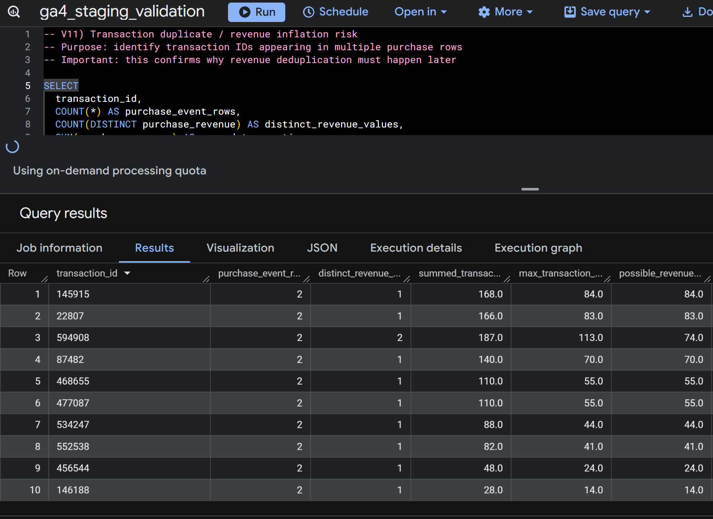

### Key Findings

* Multiple transaction IDs appear across duplicated purchase-event rows.
* Some duplicated transactions repeat the exact same revenue value.
* Some duplicated transactions contain different revenue values across rows.
* Raw revenue aggregation can materially overstate actual transaction revenue.

### Validation Interpretation

This validation confirms that raw purchase-event rows cannot safely be treated as transaction-grain records.

The following risk pattern was identified:

```text
same transaction_id
→ multiple purchase rows
→ repeated or conflicting revenue values
→ possible revenue inflation
```

Example:

```text
transaction_id = 145915
summed_transaction_revenue = 168
max_transaction_revenue = 84
possible_overstatement = 84
```

This indicates that naive revenue summation would double-count revenue for this transaction.

### Revenue Integrity Implications

The validation confirms that downstream modeling must implement transaction-level deduplication before calculating:

* total revenue
* average order value (AOV)
* transaction counts
* conversion value metrics
* channel revenue attribution

Without deduplication, executive KPIs would become materially overstated.

### Technical Interpretation

The duplicated transaction behavior may originate from:

* repeated purchase-event firing
* GA4 ecommerce export behavior
* multi-row transaction recording
* partial transaction updates
* duplicate client-side event tracking

This is a known real-world ecommerce analytics issue and not necessarily a staging transformation failure.

### Modeling Implications

Future fact and mart layers should:

* aggregate revenue at transaction grain
* deduplicate transaction IDs
* define a trusted transaction-revenue selection strategy
* avoid direct purchase-row summation
* isolate valid canonical transaction records

Potential downstream strategies include:

```text
MAX(purchase_revenue)
```

or:

```text
ROW_NUMBER() OVER(PARTITION BY transaction_id ...)
```

to isolate a single canonical transaction row.

### Business Implications

This validation protects the project from one of the most dangerous ecommerce analytics failures:

```text
silent revenue inflation
```

By surfacing the issue early in staging validation, the project ensures:

* trustworthy revenue KPIs
* reliable executive reporting
* accurate funnel monetization analysis
* defensible downstream business metrics

### Status

```text
PASS WITH CONFIRMED REVENUE DEDUPLICATION REQUIREMENT
```

---

```
```
````markdown
---

## V12 — Acquisition Field Validation

### Objective

Inspect the normalized acquisition fields in the GA4 staging layer.

This validation reviews the distribution of:

- `source`
- `medium`
- `campaign`

The purpose is to confirm that acquisition parameters were successfully extracted from `event_params`, normalized into usable fields, and preserved for downstream channel and attribution modeling.

### Query Reference

```sql
SELECT
  source,
  medium,
  campaign,
  COUNT(*) AS event_count,
  COUNT(DISTINCT user_pseudo_id) AS unique_users,
  COUNT(DISTINCT session_key) AS unique_sessions
FROM `commercial-analytics-bq-dbx.commercial_analytics_us.stg_ga4_events`
GROUP BY
  source,
  medium,
  campaign
ORDER BY event_count DESC
LIMIT 50;
````

### Result

The staged acquisition fields show a mix of unattributed, organic, referral, direct, CPC, affiliate, and email traffic patterns.

Top observed acquisition combinations include:

| source                           | medium           | campaign         | event_count | unique_users | unique_sessions |
| -------------------------------- | ---------------- | ---------------- | ----------: | -----------: | --------------: |
| `(not set)`                      | `(not set)`      | `(not set)`      |     873,805 |       94,757 |         118,330 |
| `shop.googlemerchandisestore...` | `referral`       | `(referral)`     |     158,458 |       21,904 |          29,224 |
| `google`                         | `organic`        | `(organic)`      |      83,604 |       32,198 |          35,183 |
| `(direct)`                       | `(none)`         | `(direct)`       |      28,697 |        8,950 |           9,400 |
| `<Other>`                        | `<Other>`        | `<Other>`        |      18,065 |        6,219 |           6,293 |
| `<Other>`                        | `referral`       | `(referral)`     |      13,655 |        4,862 |           5,282 |
| `googlemerchandisestore.com`     | `referral`       | `(referral)`     |       6,676 |        4,246 |           4,769 |
| `(data deleted)`                 | `(data deleted)` | `(data deleted)` |       6,148 |        1,560 |           1,755 |
| `google`                         | `cpc`            | `<Other>`        |       5,252 |        1,840 |           1,850 |
| `analytics.google.com`           | `referral`       | `(referral)`     |       3,662 |        1,442 |           1,772 |

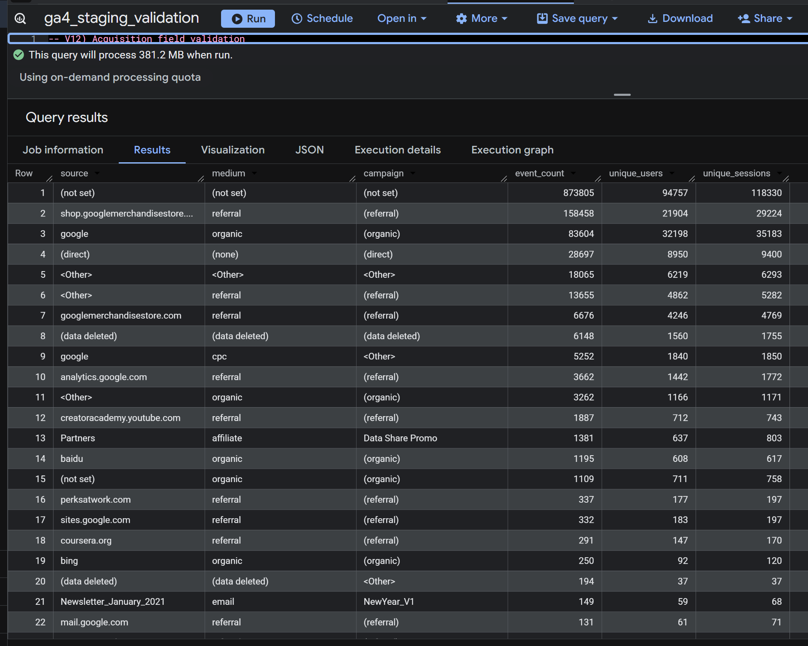

### Key Findings

* Acquisition fields were successfully extracted and normalized in the staging layer.
* The largest acquisition bucket is `(not set) / (not set) / (not set)`.
* Referral and organic traffic sources are clearly visible.
* Direct traffic is represented by `(direct) / (none) / (direct)`.
* Paid traffic appears through `google / cpc`.
* Email traffic appears through newsletter-related campaigns.
* Affiliate traffic appears through `Partners / affiliate`.

### Validation Interpretation

The acquisition extraction logic is technically working, but attribution sparsity is significant.

The large `(not set)` bucket indicates that many events do not carry event-level acquisition parameters. This is not a staging failure; it reflects the structure and sparsity of event-level GA4 acquisition data.

### Modeling Implications

Downstream acquisition modeling should not rely blindly on raw event-level source, medium, and campaign values.

Future channel modeling should:

* preserve `(not set)` as a valid attribution state
* define fallback channel logic
* group low-volume values such as `<Other>`
* handle `(data deleted)` explicitly
* map direct, organic, referral, paid, email, and affiliate traffic consistently
* build business channel grouping in `dim_channel` or mart logic, not inside staging

### Business Implications

This validation confirms that acquisition data can support channel analysis, but with clear caveats.

For executive reporting, the project should avoid overclaiming channel attribution precision because a large share of events is unattributed at the event level.

### Status

```text
PASS WITH ATTRIBUTION SPARSITY NOTE
```

---

```
```

````markdown
---

## V13 — “Not Set” Acquisition Rate Validation

### Objective

Quantify acquisition attribution sparsity after staging normalization.

This validation measures how frequently the normalized acquisition dimensions contain:

```text
(not set)
````

for:

* `source`
* `medium`
* `campaign`

The purpose is to understand the completeness and analytical reliability of event-level attribution data before downstream channel modeling.

### Query Reference

```sql
SELECT
  COUNT(*) AS total_rows,

  COUNTIF(source = '(not set)') AS not_set_source_rows,
  ROUND(SAFE_DIVIDE(COUNTIF(source = '(not set)'), COUNT(*)), 4) AS not_set_source_rate,

  COUNTIF(medium = '(not set)') AS not_set_medium_rows,
  ROUND(SAFE_DIVIDE(COUNTIF(medium = '(not set)'), COUNT(*)), 4) AS not_set_medium_rate,

  COUNTIF(campaign = '(not set)') AS not_set_campaign_rows,
  ROUND(SAFE_DIVIDE(COUNTIF(campaign = '(not set)'), COUNT(*)), 4) AS not_set_campaign_rate
FROM `commercial-analytics-bq-dbx.commercial_analytics_us.stg_ga4_events`;
```

### Result

| total_rows | not_set_source_rows | not_set_source_rate | not_set_medium_rows | not_set_medium_rate | not_set_campaign_rows | not_set_campaign_rate |
| ---------: | ------------------: | ------------------: | ------------------: | ------------------: | --------------------: | --------------------: |
|  1,210,147 |             874,947 |              0.7230 |             873,805 |              0.7221 |               873,807 |                0.7221 |


### Key Findings

* Approximately 72% of staged events contain `(not set)` acquisition values.
* Attribution sparsity is consistent across:

  * source
  * medium
  * campaign
* The staging normalization logic behaved consistently across all acquisition fields.
* The issue originates from raw GA4 event-level attribution availability rather than staging transformation errors.

### Validation Interpretation

This validation confirms that:

* acquisition parameter extraction logic is functioning correctly
* staging normalization preserved missing attribution states consistently
* event-level acquisition data is highly sparse in the GA4 sample dataset

The large `(not set)` share is expected because many GA4 events do not carry explicit acquisition metadata at event grain.

### Business Interpretation

This result is extremely important for realistic analytics interpretation.

Without acknowledging attribution sparsity, downstream dashboards could produce misleading channel insights.

The validation confirms that:

* raw event-level attribution coverage is incomplete
* not every event can be reliably tied to a marketing source
* attribution-aware KPI logic must be carefully designed

### Modeling Implications

Future channel and attribution models should:

* preserve `(not set)` as a valid business category
* avoid silently dropping unattributed traffic
* build explicit “Unknown / Unattributed” channel groups
* aggregate acquisition logic at session level where appropriate
* separate attribution completeness from channel performance

### Executive Reporting Implications

For executive dashboards:

* unattributed traffic should remain visible
* attribution sparsity should be documented transparently
* channel KPIs should include methodology notes
* comparisons across channels should account for missing attribution coverage

### Technical Interpretation

This validation also confirms that normalization logic behaved consistently:

```text
NULL acquisition values
→ normalized to '(not set)'
```

This prevents downstream BI inconsistencies caused by mixed NULL handling.

### Status

```text
PASS WITH HIGH ATTRIBUTION SPARSITY OBSERVED
```

---

```
```
````markdown
---

## V14 — Item Array Validation by Event Type

### Objective

Validate item-array coverage by event type in the GA4 staging layer.

This validation confirms that:

- item metadata remains event-aware
- the `items` array was not unnested in the staging layer
- ecommerce events preserve item presence where expected
- behavioral events correctly remain without item-array metadata

This is important because unnesting `items` in an event-level staging table would multiply rows and break the intended event grain.

### Query Reference

```sql
SELECT
  event_name,
  COUNT(*) AS event_rows,
  COUNTIF(has_items = TRUE) AS rows_with_items,
  COUNTIF(has_items = FALSE) AS rows_without_items,
  ROUND(SAFE_DIVIDE(COUNTIF(has_items = TRUE), COUNT(*)), 4) AS item_coverage_rate
FROM `commercial-analytics-bq-dbx.commercial_analytics_us.stg_ga4_events`
GROUP BY event_name
ORDER BY rows_with_items DESC, event_rows DESC
LIMIT 30;
````

### Result

| event_name       | event_rows | rows_with_items | rows_without_items | item_coverage_rate |
| ---------------- | ---------: | --------------: | -----------------: | -----------------: |
| view_item        |     86,971 |          60,750 |             26,221 |             0.6985 |
| view_promotion   |     53,885 |          40,500 |             13,385 |             0.7516 |
| add_to_cart      |     15,522 |          15,522 |                  0 |             1.0000 |
| begin_checkout   |     11,034 |          11,034 |                  0 |             1.0000 |
| select_item      |     10,229 |          10,229 |                  0 |             1.0000 |
| select_promotion |      2,948 |           2,682 |                266 |             0.9098 |
| purchase         |      1,204 |           1,204 |                  0 |             1.0000 |
| view_item_list   |          9 |               1 |                  8 |             0.1111 |
| page_view        |    419,004 |               0 |            419,004 |             0.0000 |
| user_engagement  |    250,097 |               0 |            250,097 |             0.0000 |
| scroll           |    138,997 |               0 |            138,997 |             0.0000 |
| session_start    |    116,549 |               0 |            116,549 |             0.0000 |
| first_visit      |     88,873 |               0 |             88,873 |             0.0000 |

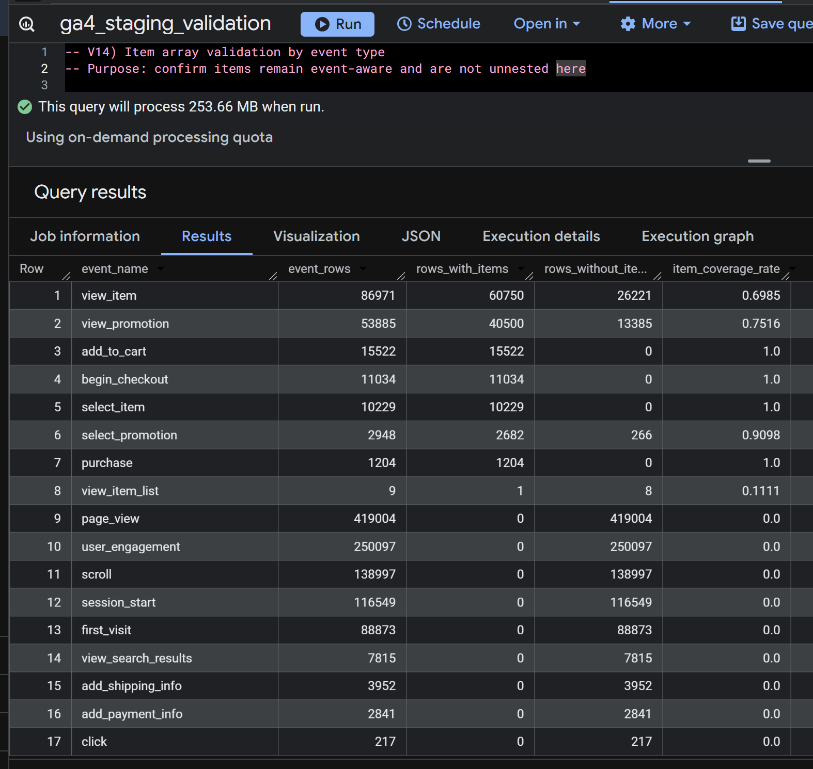

### Key Findings

* Core ecommerce events such as `add_to_cart`, `begin_checkout`, and `purchase` have full item coverage.
* `view_item` has partial item coverage, with approximately 69.85% of rows containing item metadata.
* `view_promotion` and `select_promotion` also show partial item coverage.
* Behavioral events such as `page_view`, `user_engagement`, `scroll`, `session_start`, and `first_visit` correctly contain no item metadata.
* The staging layer preserved item-array metadata without multiplying event rows.

### Validation Interpretation

This confirms that the staging design is correct.

The staging view intentionally keeps item metadata at event level using:

```text
item_array_length
has_items
```

instead of unnesting the `items` array.

That is the right call. If `items` had been unnested in this staging layer, the row count would have been inflated and earlier row-count and duplicate-proxy validations would likely fail.

### Modeling Implications

Product-level or item-level analysis should not be performed directly from this event-level staging view.

If product-level analytics are needed later, the project should create a separate downstream table such as:

```text
fact_ga4_items
```

or:

```text
fact_product_events
```

with a clearly documented item-level grain.

### Business Implications

The dataset supports ecommerce product interaction analysis, but the modeling layer must respect grain separation:

* event-level staging for behavioral/session analytics
* item-level fact table for product analytics
* transaction-level fact table for revenue analytics

Mixing these grains in one table would create inflated KPIs and unreliable reporting.

### Status

```text
PASS
```

---

```
```
````markdown
---

## V15 — Engagement Field Validation

### Objective

Validate engagement-related fields in the GA4 staging layer.

This validation confirms that:

- `session_engaged_raw` was parsed correctly
- boolean conversion into `is_session_engaged` behaves as expected
- `engagement_time_msec` is available where engagement signals exist
- engagement metadata distribution remains logically consistent after staging normalization

This is important because engagement fields are frequently used later for:

- session-quality KPIs
- engaged-session metrics
- behavioral segmentation
- funnel quality analysis
- retention and interaction analytics

### Query Reference

```sql
SELECT
  session_engaged_raw,
  is_session_engaged,
  COUNT(*) AS event_count,
  COUNTIF(engagement_time_msec IS NOT NULL) AS rows_with_engagement_time,
  ROUND(
    SAFE_DIVIDE(
      COUNTIF(engagement_time_msec IS NOT NULL),
      COUNT(*)
    ),
    4
  ) AS engagement_time_coverage_rate
FROM `commercial-analytics-bq-dbx.commercial_analytics_us.stg_ga4_events`
GROUP BY
  session_engaged_raw,
  is_session_engaged
ORDER BY event_count DESC;
````

### Result

| session_engaged_raw | is_session_engaged | event_count | rows_with_engagement_time | engagement_time_coverage_rate |
| ------------------- | ------------------ | ----------: | ------------------------: | ----------------------------: |
| 1                   | TRUE               |     996,282 |                   738,993 |                        0.7418 |
| 0                   | FALSE              |     117,361 |                     1,028 |                        0.0088 |
| NULL                | NULL               |      96,504 |                         0 |                        0.0000 |


### Key Findings

* The majority of events are associated with engaged sessions (`996,282` rows).
* Engagement-time metadata is strongly concentrated within engaged sessions.
* Non-engaged sessions (`0`) contain almost no engagement time values.
* Rows with NULL engagement fields contain no engagement-time metadata.
* Boolean normalization from raw engagement values to `is_session_engaged` behaves consistently.

### Validation Interpretation

This validation confirms that engagement parsing logic in the staging layer is working correctly.

The transformation successfully converted:

```text
session_engaged_raw
```

into:

```text
is_session_engaged
```

without introducing inconsistencies.

The relationship between:

* engaged sessions
* engagement time
* engagement metadata sparsity

also behaves logically and aligns with expected GA4 export behavior.

### Behavioral Interpretation

The results indicate that:

* engaged sessions contain meaningful interaction activity
* non-engaged sessions have minimal measurable engagement
* some events naturally lack engagement metadata entirely

This is expected because GA4 engagement metrics are event-dependent and not uniformly attached to every event type.

### Modeling Implications

The validated fields can safely support downstream modeling for:

* engaged-session KPIs
* behavioral quality metrics
* session scoring
* retention analysis
* engagement segmentation
* funnel-quality reporting

However:

```text
engagement_time_msec
```

should not be interpreted as universally available across all event categories.

Future marts should therefore:

* aggregate engagement carefully
* avoid assuming complete event-level coverage
* distinguish between engagement-capable and non-engagement event types

### Business Implications

The dataset now supports trustworthy engagement-oriented analytics, including:

* engaged-session rate
* average engagement per session
* session-quality monitoring
* behavioral depth analysis
* interaction-quality segmentation

This significantly improves the analytical usefulness of the GA4 behavioral layer.

### Status

```text
PASS
```

---

```
```
````markdown
---

## V16 — Data Quality Flag Summary

### Objective

Create a compact summary of staging-level data quality flags.

This validation provides a high-level quality overview across the most important fields and flags created in the GA4 staging layer.

The purpose is to confirm whether any critical data quality problems exist after staging transformation, especially around:

- event dates
- user identifiers
- session identifiers
- session keys
- purchase transaction IDs
- purchase revenue values

### Query Reference

```sql
SELECT
  COUNT(*) AS total_rows,

  COUNTIF(is_invalid_event_date = TRUE) AS invalid_event_date_rows,
  COUNTIF(is_missing_user_pseudo_id = TRUE) AS missing_user_pseudo_id_rows,
  COUNTIF(is_missing_ga_session_id = TRUE) AS missing_ga_session_id_rows,
  COUNTIF(is_missing_session_key = TRUE) AS missing_session_key_rows,

  COUNTIF(is_invalid_purchase_transaction_id = TRUE) AS invalid_purchase_transaction_id_rows,
  COUNTIF(is_missing_purchase_revenue = TRUE) AS missing_purchase_revenue_rows,
  COUNTIF(is_zero_purchase_revenue = TRUE) AS zero_purchase_revenue_rows,
  COUNTIF(is_negative_purchase_revenue = TRUE) AS negative_purchase_revenue_rows
FROM `commercial-analytics-bq-dbx.commercial_analytics_us.stg_ga4_events`;
````

### Result

| total_rows | invalid_event_date_rows | missing_user_pseudo_id_rows | missing_ga_session_id_rows | missing_session_key_rows | invalid_purchase_transaction_id_rows | missing_purchase_revenue_rows | zero_purchase_revenue_rows | negative_purchase_revenue_rows |
| ---------: | ----------------------: | --------------------------: | -------------------------: | -----------------------: | -----------------------------------: | ----------------------------: | -------------------------: | -----------------------------: |
|  1,210,147 |                       0 |                           0 |                          0 |                        0 |                                  300 |                           300 |                          0 |                              0 |


### Key Findings

* No invalid event dates were detected.
* No missing user identifiers were detected.
* No missing session IDs were detected.
* No missing session keys were detected.
* 300 purchase rows have invalid transaction IDs.
* 300 purchase rows have missing purchase revenue.
* No zero-revenue purchase rows were detected.
* No negative-revenue purchase rows were detected.

### Validation Interpretation

The core behavioral and session fields are clean after staging transformation.

The only material data quality issue remains concentrated in purchase-related fields:

```text
invalid transaction IDs = 300
missing purchase revenue = 300
```

This confirms that the staging layer is structurally reliable, while purchase revenue modeling still requires defensive downstream logic.

### Modeling Implications

The staging layer is safe for:

* event-level analysis
* session-level modeling
* behavioral analytics
* funnel analysis
* engagement analysis

However, revenue and transaction models must still:

* exclude or flag invalid transaction IDs
* handle missing revenue explicitly
* deduplicate valid transaction IDs downstream
* avoid treating raw purchase rows as trusted transaction grain

### Business Implications

This validation protects the project from misleading ecommerce reporting.

Without these flags, dashboards could incorrectly treat all purchase events as valid transactions, which would create:

* inflated conversion metrics
* unreliable revenue totals
* distorted AOV
* weak executive reporting credibility

### Status

```text
PASS WITH PURCHASE QUALITY FLAGS OBSERVED
```

---

```
```
````markdown
---

## V17 — Final Staging Validation Status

### Objective

Create a final high-level validation summary for the GA4 staging layer.

This validation consolidates the most critical staging quality checks into a single PASS/CHECK status that can be referenced later during:

- mart construction
- KPI development
- dashboard implementation
- executive reporting
- future QA reviews

The goal is to confirm whether the staging layer is structurally reliable and ready for downstream analytical modeling.

### Query Reference

```sql
WITH checks AS (
  SELECT
    COUNT(*) AS total_rows,
    COUNTIF(event_date IS NULL) AS null_event_date,
    COUNTIF(event_timestamp_raw IS NULL) AS null_event_timestamp_raw,
    COUNTIF(event_name IS NULL) AS null_event_name,
    COUNTIF(user_pseudo_id IS NULL) AS null_user_pseudo_id,
    COUNTIF(ga_session_id IS NULL) AS null_ga_session_id,
    COUNTIF(session_key IS NULL) AS null_session_key,
    COUNT(*) - COUNT(DISTINCT event_proxy_key) AS duplicate_proxy_rows,
    COUNTIF(is_negative_purchase_revenue = TRUE) AS negative_purchase_revenue_rows
  FROM `commercial-analytics-bq-dbx.commercial_analytics_us.stg_ga4_events`
)

SELECT
  total_rows,

  CASE
    WHEN null_event_date = 0
      AND null_event_timestamp_raw = 0
      AND null_event_name = 0
      AND null_user_pseudo_id = 0
      AND null_ga_session_id = 0
      AND null_session_key = 0
      AND duplicate_proxy_rows = 0
      AND negative_purchase_revenue_rows = 0
    THEN 'PASS'
    ELSE 'CHECK'
  END AS staging_validation_status,

  null_event_date,
  null_event_timestamp_raw,
  null_event_name,
  null_user_pseudo_id,
  null_ga_session_id,
  null_session_key,
  duplicate_proxy_rows,
  negative_purchase_revenue_rows
FROM checks;
````

### Result

| total_rows | staging_validation_status | null_event_date | null_event_timestamp_raw | null_event_name | null_user_pseudo_id | null_ga_session_id | null_session_key | duplicate_proxy_rows | negative_purchase_revenue_rows |
| ---------: | ------------------------- | --------------: | -----------------------: | --------------: | ------------------: | -----------------: | ---------------: | -------------------: | -----------------------------: |
|  1,210,147 | PASS                      |               0 |                        0 |               0 |                   0 |                  0 |                0 |                    0 |                              0 |

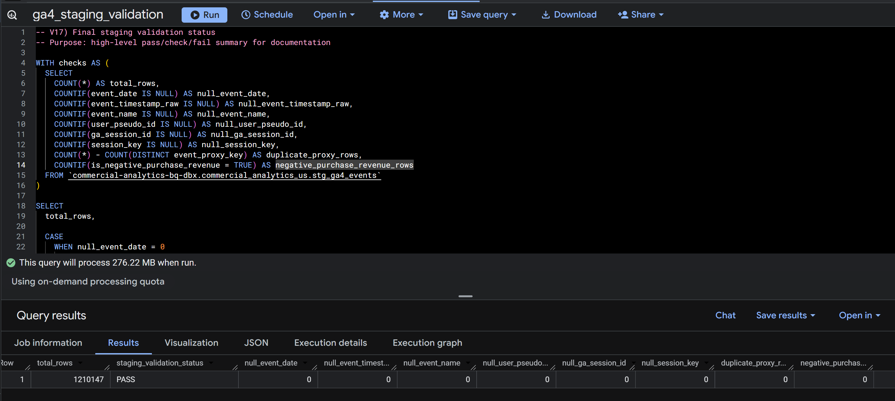

### Key Findings

* No critical null issues exist in core event fields.
* No missing session identifiers were detected.
* No duplicate proxy rows were detected.
* No negative purchase revenue values were detected.
* The staging layer successfully passed all structural validation conditions.

### Validation Interpretation

The GA4 staging layer is structurally stable and analytically reliable.

Core event-level integrity has been preserved during normalization and flattening.

This confirms that:

* raw GA4 grain preservation was successful
* staging transformations did not introduce structural corruption
* session construction logic is reliable
* event uniqueness logic behaves correctly
* downstream analytical modeling can proceed safely

### Remaining Known Observations

Although the final validation status is:

```text
PASS
```

earlier validations identified expected ecommerce-specific quality characteristics:

* invalid purchase transaction IDs
* missing purchase revenue values
* duplicate transaction appearances requiring later deduplication

These are considered known behavioral properties of the GA4 export rather than staging transformation failures.

Therefore:

* staging quality = PASS
* ecommerce modeling still requires defensive transaction logic downstream

### Modeling Implications

The staging layer is now approved for downstream development, including:

* session marts
* channel marts
* executive KPI marts
* ecommerce funnel modeling
* A/B testing preparation
* behavioral analytics
* BI dashboard construction

Future layers should continue to apply:

* transaction deduplication
* revenue normalization
* valid purchase filtering

where appropriate.

### Final Staging Conclusion

The GA4 staging layer successfully transformed nested raw export data into a reusable analytical foundation while preserving:

* event grain
* session integrity
* behavioral consistency
* acquisition metadata
* engagement metadata
* ecommerce event taxonomy

The layer is now production-ready for downstream analytical modeling.

### Status

```text
FINAL STAGING VALIDATION STATUS: PASS
```

---

```
```


# Phase 1B — Olist Ingestion

## Planned Tasks

- [ ] Load Olist CSVs into Databricks
- [ ] Clean data types
- [ ] Create curated Olist datasets
- [ ] Export transformed datasets into BigQuery
- [ ] Store Olist screenshots in `bi/screenshots/olist/`

---

# Phase 2 — Data Quality

## Planned Tasks

- [ ] Validate duplicates
- [ ] Validate primary and foreign keys
- [ ] Validate NULL patterns
- [ ] Validate date coverage
- [ ] Document data quality issues

---

# Phase 3 — Modeling

## Planned Tasks

- [ ] Create dimensional models
- [ ] Build fact tables
- [ ] Create commercial marts
- [ ] Validate KPI logic
- [ ] Document grain and assumptions

---

# Phase 4 — Integration

## Planned Tasks

- [ ] Integrate GA4 behavioral data with commercial modeling layer
- [ ] Integrate Olist transactional data
- [ ] Document source limitations and join assumptions
- [ ] Build acquisition-to-revenue analytical logic where appropriate

---

# Phase 5 — KPI Layer

## Planned Tasks

- [ ] Define conversion KPIs
- [ ] Define revenue KPIs
- [ ] Define AOV logic
- [ ] Define engagement KPIs
- [ ] Create executive KPI layer

---

# Phase 6 — BI Layer

## Planned Tasks

- [ ] Build Executive dashboard
- [ ] Build Funnel dashboard
- [ ] Build Acquisition dashboard
- [ ] Export dashboard screenshots
- [ ] Store dashboard screenshots in `bi/screenshots/dashboards/`

---

# Phase 7 — A/B Testing Layer

## Planned Tasks

- [ ] Define experiment framework
- [ ] Build assignment logic
- [ ] Calculate treatment vs control KPIs
- [ ] Evaluate absolute and relative lift
- [ ] Make ship / no-ship recommendation

---

# Phase 8 — Final Packaging

## Planned Tasks

- [ ] Final README
- [ ] Architecture diagram
- [ ] Data dictionary
- [ ] Business recommendation summary
- [ ] Final dashboard screenshots
- [ ] Final project review checklist

